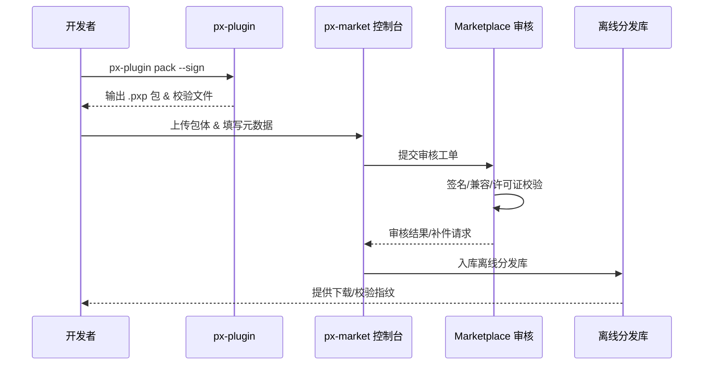

scn_id: SCN-DEV-PLUGIN-OFFLINE-MARKETPLACE-001
title: 离线包送审与 Marketplace 入库
status: Draft
version: v0.1.0
owners:
  - name: Ivy Chen
    role: Marketplace Operations Lead
    contact: marketplace@artisan-cloud.com
  - name: Michael Hu
    role: Plugin Tech Lead
    contact: tech@artisan-cloud.com
domains: [dev]
layers: [ops, marketplace, security]
repos:
  - key: powerx-plugin
    scope: plugin-ecosystem
    responsibility: `px-plugin pack` 离线包生成、签名、依赖与元数据打包
  - key: powerx-marketplace
    scope: marketplace
    responsibility: 离线包上传入口、版本登记、审核流程编排
  - key: powerx
    scope: security
    responsibility: 签名校验、许可证验证、审计记录与告警
related_usecases:
  - doc_id: UC-DEV-PLUGIN-OFFLINE-MARKETPLACE-001
    layer: marketplace
    domain: dev
last_reviewed_at: 2025-11-20

---

# Executive Summary

该子场景保障在弱网或隔离环境中运营的团队仍可向 Marketplace 提交插件版本。开发者使用 `px-plugin pack` 生成含签名与依赖的 `.pxp` 离线包，Marketplace 管理员通过 `px-market` 控制台上传并登记元数据，由审核系统校验签名、兼容矩阵与许可证信息。目标是离线包校验成功率 ≥ 99%，补件率 < 5%，并在 2 个工作日内完成审核入库，为后续租户导入与线上发布打好基础。

# Scope & Guardrails

- **In Scope**：离线包生成、签名与校验、补件流程、Marketplace 入库登记、审核工单、告警与审计。
- **Out of Scope**：插件本地调试、生产灰度、在线实时发布、Marketplace 商业定价与结算。
- **Environment & Flags**：`plugin-offline-package`、`marketplace-offline-upload` Feature Flag；依赖签名服务、许可证服务、离线分发库与 Marketplace 审核系统。

# Participants & Responsibilities

| Scope | Repository | Layer | 责任与交付物 | Owners |
|-------|------------|-------|--------------|--------|
| plugin-ecosystem | powerx-plugin | ops | 离线包打包脚本、签名与校验文件、版本说明与依赖清单 | Michael Hu（Plugin Tech Lead / tech@artisan-cloud.com） |
| marketplace | powerx-marketplace | marketplace | 离线上传界面、元数据登记、审核工单与补件管理 | Ivy Chen（Marketplace Operations Lead / marketplace@artisan-cloud.com） |
| security | powerx | security | 签名验证、兼容矩阵校验、许可证与审计告警 | Grace Lin（Security & Compliance Lead / compliance@artisan-cloud.com） |

# End-to-End Flow

1. **Stage 1 – 包体生成与签名**：开发者执行 `px-plugin pack`，生成 `.pxp` 包、签名、依赖与版本说明。
2. **Stage 2 – 离线上传与登记**：Marketplace 管理员在 `px-market` 控制台上传离线包、填写元数据并绑定版本。
3. **Stage 3 – 校验与审核**：审核系统验证签名、兼容矩阵与许可证，必要时生成补件任务并通知开发者。
4. **Stage 4 – 入库与分发**：审核通过后入库 Marketplace，生成版本记录并同步到内网分发库供租户下载。

# Key Interactions & Contracts

- **APIs / Events**：`px-plugin pack`、`POST /marketplace/offline/upload`、`POST /marketplace/review/offline`、`EVENT marketplace.offline.review.status`。
- **Configs / Schemas**：`config/publish/offline_package.json`、`config/marketplace/offline_upload.yaml`、`docs/standards/powerx-plugin/publish/Offline_Package_Checklist.md`。
- **Security / Compliance**：强制签名与许可证校验；补件流程需记录审计；离线包指纹需同步到内网分发库，保留至少 180 天。

# Usecase Links

- `UC-DEV-PLUGIN-OFFLINE-MARKETPLACE-001` — 离线包送审与 Marketplace 入库。

# Acceptance Criteria

1. 离线包签名验证通过率 ≥ 99%，兼容矩阵与许可证校验覆盖率 100%。
2. 补件率 < 5%，补件响应 ≤ 1 个工作日，审计日志记录操作人、时间与原因。
3. 审核入库 SLA ≤ 2 个工作日，离线分发库可在 30 分钟内提供下载与指纹校验。

# Telemetry & Ops

- 指标：`marketplace.offline.upload_success_rate`、`marketplace.offline.review_sla_hours`、`marketplace.offline.rework_rate`。
- 告警阈值：签名失败率 >1%、审核超 SLA > 4 小时、补件率 >5%。
- 观测来源：Marketplace 审核日志、签名服务记录、离线分发库访问日志、`workflow-metrics.mjs` 离线模式上报。

# Open Issues & Follow-ups

| 风险/事项 | 影响范围 | 负责人 | ETA |
|-----------|----------|--------|-----|
| 部分企业内网无法访问签名服务，需提供离线验证脚本 | 隔离环境审核 | Michael Hu | 2025-12-19 |
| 审核补件流程缺少模板化邮件，沟通成本高 | 审核效率 | Ivy Chen | 2025-12-16 |
| 许可证校验规则尚未覆盖欧盟数据合规要求 | 国际市场 | Grace Lin | 2025-12-28 |

# Appendix

- `docs/meta/scenarios/powerx/plugin-ecosystem/plugin-lifecycle/plugin-publish-and-release/primary.md`
- `config/publish/offline_package.json`
- `docs/standards/powerx-plugin/publish/Offline_Package_Checklist.md`
