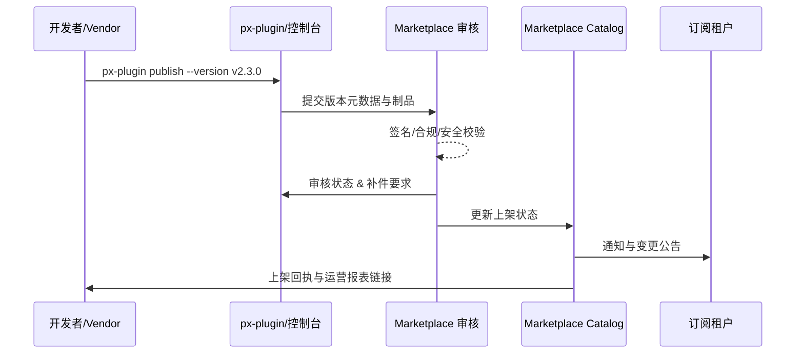

scn_id: SCN-DEV-PLUGIN-ONLINE-PUBLISH-001
title: 在线发布与 Marketplace 即时上架
status: Draft
version: v0.1.0
owners:
  - name: Ivy Chen
    role: Marketplace Operations Lead
    contact: marketplace@artisan-cloud.com
  - name: Alex Wei
    role: Release Automation Engineer
    contact: automation@artisan-cloud.com
domains: [dev]
layers: [ops, marketplace]
repos:
  - key: powerx-plugin
    scope: plugin-ecosystem
    responsibility: `px-plugin publish` 命令、版本说明/定价模板、通知集成
  - key: powerx-marketplace
    scope: marketplace
    responsibility: 上架申请、审核编排、通知与运营报表、订阅同步
  - key: powerx
    scope: ops
    responsibility: 发布记录、版本对比、审计日志与通知管道
related_usecases:
  - doc_id: UC-DEV-PLUGIN-ONLINE-PUBLISH-001
    layer: marketplace
    domain: dev
last_reviewed_at: 2025-11-20

---

# Executive Summary

该子场景面向希望通过在线渠道直接将插件发布到 Marketplace 的供应商。开发者使用 `px-plugin publish` 或 PowerXPlugin 管理界面提交版本、更新日志、定价与支持策略，Marketplace 审核流程自动校验合规、签名与安全扫描，通过后即时上架并通知订阅租户。目标是在线发布成功率 ≥ 99%，审核 SLA ≤ 2 个工作日，确保版本与元数据同步且上线过程可追踪。

# Scope & Guardrails

- **In Scope**：在线发布命令、元数据填写、自动审核、版本对比、通知与报表、在线上架状态同步。
- **Out of Scope**：离线包上传、生产灰度部署、Marketplace 收费与结算策略、第三方渠道分发。
- **Environment & Flags**：`plugin-online-publish`、`marketplace-review-v2` Feature Flag；依赖 Marketplace 审核系统、签名与安全扫描服务、通知中心。

# Participants & Responsibilities

| Scope | Repository | Layer | 责任与交付物 | Owners |
|-------|------------|-------|--------------|--------|
| plugin-ecosystem | powerx-plugin | ops | `px-plugin publish` 命令、版本 metadata 校验、通知触发 | Alex Wei（Release Automation Engineer / automation@artisan-cloud.com） |
| marketplace | powerx-marketplace | marketplace | 审核流程、上架状态同步、订阅通知、运营报表 | Ivy Chen（Marketplace Operations Lead / marketplace@artisan-cloud.com） |
| ops | powerx | ops | 发布记录、版本差异比对、审计日志、告警与回退按钮 | Matrix Ops（Platform Ops Lead / ops@artisan-cloud.com） |

# End-to-End Flow

1. **Stage 1 – 发布提交**：开发者通过 CLI 或控制台填写更新日志、定价、支持策略并提交上架申请。
2. **Stage 2 – 自动校验**：系统校验签名、兼容矩阵、安全扫描与商业合规项，生成审核任务。
3. **Stage 3 – 审核与回执**：审核员补充人工检查、确认资料，系统记录结论并向开发者/运营发送通知。
4. **Stage 4 – 上架与触达**：插件在 Marketplace 即时上线，触发订阅租户通知、变更公告与初始运营报表。

# Key Interactions & Contracts

- **APIs / Events**：`px-plugin publish`、`POST /marketplace/online/apply`、`POST /marketplace/review/decision`、`EVENT marketplace.listing.status`、`EVENT marketplace.subscription.notify`。
- **Configs / Schemas**：`config/marketplace/online_publish.yaml`、`config/publish/metadata_template.json`、`docs/standards/marketplace/review/Online_Publish_Checklist.md`。
- **Security / Compliance**：发布需通过签名验证、合规声明；审核日志与版本 diff 保留 ≥180 天；敏感元数据加密存储。

# Usecase Links

- `UC-DEV-PLUGIN-ONLINE-PUBLISH-001` — 在线发布与 Marketplace 即时上架。

# Acceptance Criteria

1. 在线发布成功率 ≥ 99%，审核 SLA ≤ 2 个工作日，补件响应 ≤ 1 个工作日。
2. 版本元数据与制品同步一致，订阅通知覆盖率 100%，通知延迟 ≤ 5 分钟。
3. 审计日志记录提交人、版本、审核人、决策与签名指纹，保留期限 ≥ 180 天。

# Telemetry & Ops

- 指标：`marketplace.online.publish_success_rate`、`marketplace.online.review_sla_hours`、`marketplace.notification.delivery_latency`。
- 告警阈值：成功率 <99%、审核超 SLA、通知延迟 >5 分钟或失败率 >2%。
- 观测来源：Marketplace 上架日志、通知中心指标、`workflow-metrics.mjs` 在线发布管道。

# Open Issues & Follow-ups

| 风险/事项 | 影响范围 | 负责人 | ETA |
|-----------|----------|--------|-----|
| 定价与商业政策需要区域化模板 | 国际 Marketplace | Ivy Chen | 2025-12-30 |
| CLI 发布缺乏差异化提示，用户易忽略必填项 | 发布效率 | Alex Wei | 2025-12-18 |
| 审核回执未绑定发布计划，需自动建链 | 发布可追溯性 | Matrix Ops | 2025-12-22 |

# Appendix

- `docs/meta/scenarios/powerx/plugin-ecosystem/plugin-lifecycle/plugin-publish-and-release/primary.md`
- `config/marketplace/online_publish.yaml`
- `docs/standards/marketplace/review/Online_Publish_Checklist.md`
