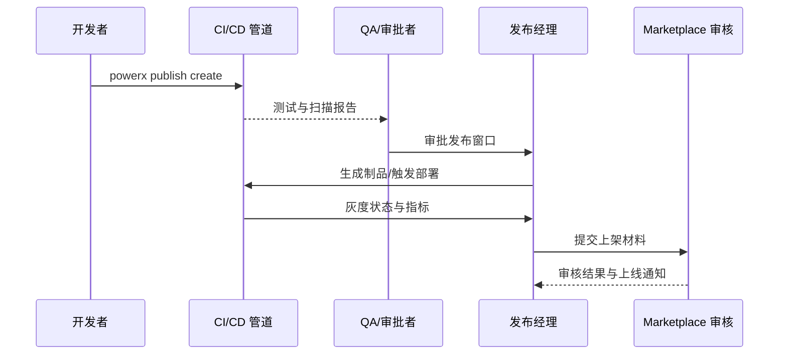

scn_id: SCN-DEV-PLUGIN-PUBLISH-001
title: 插件发布与上架主场景
status: Draft
version: v0.1.0
owners:
  - name: Matrix Ops
    role: Platform Ops Lead
    contact: ops@artisan-cloud.com
  - name: Ivy Chen
    role: Marketplace Operations Lead
    contact: marketplace@artisan-cloud.com
  - name: Grace Lin
    role: Security & Compliance Lead
    contact: compliance@artisan-cloud.com
domains: [dev]
layers: [service, ops, security, marketplace]
repos:
  - key: powerx
    scope: core-platform
    responsibility: 发布流水线、审批编排、指标采集、灰度与回滚自动化
  - key: powerx-plugin
    scope: plugin-ecosystem
    responsibility: 插件制品构建、离线包模板、版本元数据与签名管理
  - key: powerx-marketplace
    scope: marketplace
    responsibility: Marketplace 审核流程、元数据同步、订阅通知与运营报表
related_usecases:
  - doc_id: UC-OPS-PLUGIN-RELEASE-APPROVAL-001
    layer: ops
    domain: ops
  - doc_id: UC-OPS-PLUGIN-OFFLINE-IMPORT-001
    layer: ops
    domain: ops
  - doc_id: UC-OPS-PLUGIN-CICD-CANARY-001
    layer: ops
    domain: ops
  - doc_id: UC-OPS-PLUGIN-MARKETPLACE-LISTING-001
    layer: marketplace
    domain: ops
last_reviewed_at: 2025-11-20

---

# Executive Summary

该主场景串联插件从测试验证、审批签核、离线包发放、生产灰度到 Marketplace 上架的全链路，确保不同交付通道共享统一的版本、签名与审计基线。目标是在 24 小时内完成测试与审批闭环、10 分钟内完成隔离环境导入、灰度阶段能在 5 分钟内触发回滚，并让 Marketplace 审核在 3 个工作日内完成，上线过程全程可追踪、可回滚且满足合规要求。

# Scope & Guardrails

- **In Scope**：测试租户验证与质量门禁、发布审批与窗口管理、制品签名与离线包生成、生产租户灰度发布、Marketplace 审核与上架同步。
- **Out of Scope**：源码开发与调试、生产环境运行期的动态启停/升级、Marketplace 计费与结算策略、第三方渠道分发。
- **Environment & Flags**：`plugin-release-pipeline`、`plugin-offline-distribution`、`plugin-gray-observability`、`marketplace-review-v2`；依赖 CI/CD 平台、制品仓库、签名服务、监控/日志平台、Marketplace 管理系统与合规审计库。

# Participants & Responsibilities

| Scope | Repository | Layer | 责任与交付物 | Owners |
|-------|------------|-------|--------------|--------|
| core-platform | powerx | service | 发布流水线模板、审批编排、灰度与回滚自动化、指标采集 | Matrix Ops（Platform Ops Lead / ops@artisan-cloud.com） |
| plugin-ecosystem | powerx-plugin | ops | 制品构建、离线包模板、版本元数据与签名策略 | Michael Hu（Plugin Tech Lead / tech@artisan-cloud.com） |
| marketplace | powerx-marketplace | marketplace | Marketplace 审核流程、元数据同步、订阅通知与初始报表 | Ivy Chen（Marketplace Operations Lead / marketplace@artisan-cloud.com） |
| security | powerx | security | 签名证书托管、审批合规策略、审计日志与风控规则 | Grace Lin（Security & Compliance Lead / compliance@artisan-cloud.com） |

# End-to-End Flow

1. **Stage 1 – 测试租户验证与质量门禁**：开发者提交发布版本，流水线部署至测试租户并执行自动化测试、安全扫描、质量门禁与审批。
2. **Stage 2 – 多通道制品交付**：系统生成签名制品与离线包，发布经理审核元数据，向在线与离线渠道同步版本信息与校验材料。
3. **Stage 3 – 生产灰度与可观测**：CI/CD 推送至生产租户灰度分组，实时采集指标、日志与反馈，并依据预设策略决定扩容或回滚。
4. **Stage 4 – Marketplace 审核与上架**：通过合规审核后同步 Marketplace 元数据、开启订阅通知并产出运营报表，与发布记录建立关联。

# Key Interactions & Contracts

- **APIs / Events**：`powerx publish create`、`POST /internal/publish/approval`、`powerx publish deploy --strategy canary`、`powerx plugin import --offline`、`POST /marketplace/listing/apply`、`EVENT publish.gray.alert`.
- **Configs / Schemas**：`pipeline/plugin-release.yml`、`config/publish/offline_package.json`、`config/publish/approval_flows.yaml`、`docs/standards/powerx-plugin/integration/04_security_and_compliance/Plugin_Security_Checklist.md`.
- **Security / Compliance**：制品签名与证书轮换、审批人多因子验证、审计日志 ≥ 180 天保留、Marketplace 元数据与发布版本一致性校验。

# Usecase Links

- `UC-OPS-PLUGIN-RELEASE-APPROVAL-001` — 测试租户验证与审批闭环。
- `UC-OPS-PLUGIN-OFFLINE-IMPORT-001` — 离线包生成与隔离环境导入。
- `UC-OPS-PLUGIN-CICD-CANARY-001` — 灰度发布与自动回滚。
- `UC-OPS-PLUGIN-MARKETPLACE-LISTING-001` — Marketplace 审核与上架同步。

# Acceptance Criteria

1. 测试租户流水线通过率 ≥90%，审批在 24 小时内完成并生成发布计划与回滚预案。
2. 制品签名、离线包与在线渠道保持一致，离线导入成功率 ≥98%，失败自动回滚并产出审计日志。
3. 灰度阶段可实时观测指标，异常 5 分钟内触发回滚并通知相关人，扩容至全量后 SLA 无下降。
4. Marketplace 审核 SLA ≤3 个工作日，上架信息与发布记录一致，订阅通知与初始报表自动生成。

# Telemetry & Ops

- 指标：`publish.pipeline.success_rate`、`publish.approval.lead_time_hours`、`publish.offline.import_success_rate`、`publish.gray.error_rate`、`marketplace.listing.sla_hours`.
- 告警阈值：流水线阻断连续 >2 次、审批超时 >24 小时、灰度错误率 >5%、离线导入失败率 >5%、Marketplace 审核超 SLA。
- 观测来源：CI/CD 遥测、`workflow-metrics.mjs`、监控仪表盘、审计数据库、Marketplace 审核日志。

# Open Issues & Follow-ups

| 风险/事项 | 影响范围 | 负责人 | ETA |
|-----------|----------|--------|-----|
| 离线包依赖签名与证书更新节奏较慢，需要自动轮换与告警 | 隔离环境发布 | Michael Hu | 2025-12-15 |
| 灰度指标对接第三方监控尚未统一，需补充标准化看板模板 | 生产可观测性 | Matrix Ops | 2025-12-10 |
| Marketplace 审核材料模板需国际化版本 | 国际租户上线 | Ivy Chen | 2025-12-20 |

# Appendix

- `docs/meta/scenarios/powerx/plugin-ecosystem/plugin-lifecycle/plugin-publish-and-release/primary.md`
- `docs/standards/powerx-plugin/integration/04_security_and_compliance/Plugin_Security_Checklist.md`
- `pipeline/plugin-release.yml`
