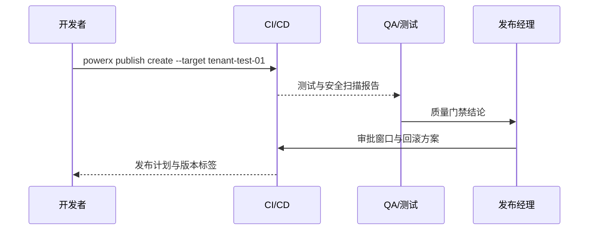

scn_id: SCN-DEV-PLUGIN-RELEASE-APPROVAL-001
title: 测试租户验证与发布审批
status: Draft
version: v0.1.0
owners:
  - name: Matrix Ops
    role: Platform Ops Lead
    contact: ops@artisan-cloud.com
  - name: Linda Zhou
    role: QA Lead
    contact: qa@artisan-cloud.com
domains: [dev]
layers: [service, ops, security]
repos:
  - key: powerx
    scope: core-platform
    responsibility: 发布流水线编排、测试触发、审批与回滚计划生成
  - key: powerx-plugin
    scope: plugin-ecosystem
    responsibility: 发布产物上传、测试数据准备、版本说明维护
  - key: powerx
    scope: security
    responsibility: 安全扫描策略、证书校验、审批合规校验
related_usecases:
  - doc_id: UC-DEV-PLUGIN-RELEASE-APPROVAL-001
    layer: ops
    domain: ops
last_reviewed_at: 2025-11-20

---

# Executive Summary

该子场景覆盖插件版本提交后在测试租户执行自动化验证并完成发布审批的全过程。开发者通过 `powerx publish create` 触发流水线，CI/CD 在测试租户部署、回归测试、静态与安全扫描后输出报告，由 QA 与发布经理联合审批上线窗口并生成生产发布计划。目标是在 24 小时内完成验证、审批与回滚方案编排，确保未经测试的变更无法进入生产。

# Scope & Guardrails

- **In Scope**：制品上传、测试租户部署、自动化测试与安全扫描、审批流配置、发布计划生成、回滚联系人登记、审计日志。
- **Out of Scope**：生产灰度与全量发布、离线包生成、Marketplace 上架、运行期监控策略。
- **Environment & Flags**：`plugin-release-pipeline`、`publish-approval-guard`、`security-scan-v2`；依赖 CI/CD 平台、测试租户资源池、质量门禁规则、审计服务。

# Participants & Responsibilities

| Scope | Repository | Layer | 责任与交付物 | Owners |
|-------|------------|-------|--------------|--------|
| core-platform | powerx | service | 流水线模板、部署编排、报告聚合、审批状态机、回滚计划生成 | Matrix Ops（Platform Ops Lead / ops@artisan-cloud.com） |
| plugin-ecosystem | powerx-plugin | ops | 构建产物与版本说明、测试数据准备、变更日志维护 | Michael Hu（Plugin Tech Lead / tech@artisan-cloud.com） |
| qa | powerx | security | 自动化测试覆盖策略、安全扫描与许可证校验、审计留痕 | Linda Zhou（QA Lead / qa@artisan-cloud.com） |

# End-to-End Flow

1. **Stage 1 – 发布申请与制品上传**：开发者使用 CLI 上传版本产物、说明与目标测试租户。
2. **Stage 2 – 自动化验证**：流水线部署到测试租户并执行回归测试、安全扫描与覆盖率统计。
3. **Stage 3 – 审批与变更审查**：QA 审核报告，发布经理确认变更、审批上线窗口与回滚联系人。
4. **Stage 4 – 发布计划落地**：生成生产发布计划、锁定版本标签、同步审计日志并准备灰度策略。

# Key Interactions & Contracts

- **APIs / Events**：`powerx publish create`、`POST /internal/publish/test-run`、`POST /internal/publish/approval`、`EVENT publish.pipeline.blocked`.
- **Configs / Schemas**：`pipeline/plugin-release.yml`、`config/publish/quality_gates.yaml`、`config/publish/approval_matrix.yaml`.
- **Security / Compliance**：上传制品需签名校验；审批人需 MFA；审计日志记录提交人、审批链、测试报告链接并保留 ≥180 天。

# Usecase Links

- `UC-DEV-PLUGIN-RELEASE-APPROVAL-001` — 测试租户验证与审批闭环。

# Acceptance Criteria

1. 回归测试覆盖率 ≥90%，高危漏洞为 0，流水线阻断需通知提交者与 QA。
2. 审批完成时间 ≤24 小时，发布计划包含回滚策略、窗口、联系人与依赖列表。
3. 未通过测试或审批的构建无法锁定版本标签，审计日志完整记录变更与结论。

# Telemetry & Ops

- 指标：`publish.test.pass_rate`、`publish.coverage.percent`、`publish.approval.lead_time_hours`、`publish.pipeline.block_total`.
- 告警阈值：测试失败率 >5% 或连续两次阻断、审批超时 >24 小时、质量门禁配置缺失。
- 观测来源：CI/CD 遥测、测试报告、审计数据库、`workflow-metrics.mjs`。

# Open Issues & Follow-ups

| 风险/事项 | 影响范围 | 负责人 | ETA |
|-----------|----------|--------|-----|
| 跨语言回归脚本维护成本高，需要统一模板与数据集 | 自动化测试效率 | Linda Zhou | 2025-12-05 |
| 审批窗口与生产变更日历尚未联动，需对接变更管理系统 | 变更协调 | Matrix Ops | 2025-12-12 |

# Appendix

- `docs/meta/scenarios/powerx/plugin-ecosystem/plugin-lifecycle/plugin-publish-and-release/primary.md#子场景-a`
- `pipeline/plugin-release.yml`
- `config/publish/approval_matrix.yaml`
