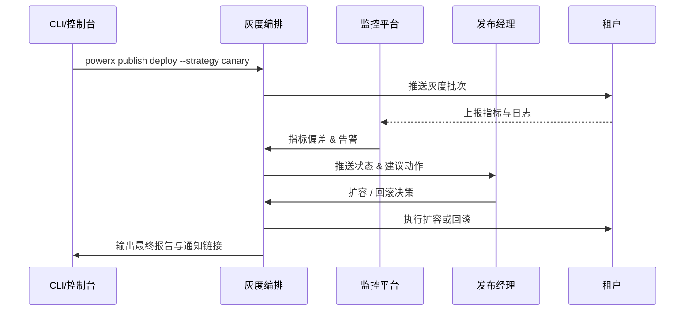

doc_id: UC-DEV-PLUGIN-CICD-CANARY-001
scn_id: SCN-DEV-PLUGIN-PUBLISH-001
title: CI/CD 灰度发布生产租户
status: Draft
version: v0.1.0
repo_key: powerx
scope: powerx
layer: ops
domain: dev
scenario_title: "插件发布与上架主场景"
owners:
  - name: Matrix Ops
    role: Platform Ops Lead
    contact: ops@artisan-cloud.com
  - name: Alex Wei
    role: Release Automation Engineer
    contact: automation@artisan-cloud.com
contributors: []
linked_requirements:
  - SCN-DEV-PLUGIN-CICD-CANARY-001
code_refs:
  - repo: powerx
    path: internal/publish/pipeline/canary_orchestrator.go
    description: 灰度编排状态机、阶段控制、失败重试
  - repo: powerx
    path: internal/publish/telemetry/metrics.go
    description: 灰度指标采集、阈值计算、告警触发
  - repo: powerx
    path: internal/publish/rollback/manager.go
    description: 回滚策略决策、执行脚本与审计集成
  - repo: powerx
    path: packages/cli/src/commands/publish/deploy.ts
    description: CLI 部署命令、参数解析、状态跟踪
feature_flags:
  - publish-canary-orchestrator
  - plugin-gray-observability
  - rollback-automation
optional: false
last_reviewed_at: 2025-11-20

---

# Usecase Overview

- **业务目标**：让发布经理借助 CI/CD 管道在生产租户按灰度策略安全上线插件，30 分钟内完成验证与扩容，并在异常 5 分钟内自动回滚。
- **成功度量**：灰度阶段核心指标偏差 < 5%；灰度到全量用时 ≤ 30 分钟；回滚触发后 5 分钟内恢复旧版本；部署成功率 ≥ 98%。
- **场景关联**：支撑主场景 Stage 3，确保测试审批后的版本能够以可观测、可回滚的方式扩散到生产租户。

> 通过标准化灰度编排、监控与回滚机制，保障新版本上线过程中对租户业务的影响可控、可度量。

# Context & Assumptions

- **前置条件**
  - Feature Flag `publish-canary-orchestrator`、`plugin-gray-observability`、`rollback-automation` 已启用。
  - 发布计划已由审批子场景生成，包含灰度租户列表、窗口、回滚联系人。
  - 监控、日志、告警渠道配置完成，可关联租户与插件版本。
  - CLI/控制台具备触发部署、查看状态与执行回滚的权限。
- **输入/输出**
  - 输入：发布计划 ID、目标插件版本、灰度策略参数（比例、批次、阈值）、通知模板。
  - 输出：灰度/全量部署状态、指标报告、回滚执行记录、租户通知、审计日志链接。
- **边界**
  - 不处理离线包导入与 Marketplace 上架。
  - 不覆盖插件内部业务验证脚本，仅关注发布编排、观察与回滚。

# Solution Blueprint

## 体系分解

| 层 | 主要组件/模块 | 责任 | 代码入口 |
|----|---------------|------|---------|
| 灰度编排层 | `internal/publish/pipeline/canary_orchestrator.go` | 阶段控制、批次扩容、失败重试、状态持久化 | `services/publish/pipeline` |
| 观测与告警层 | `internal/publish/telemetry/metrics.go` | 指标采集、阈值判断、告警推送、报表生成 | `services/publish/telemetry` |
| 回滚执行层 | `internal/publish/rollback/manager.go` | 回滚策略评估、执行脚本、审计留痕 | `services/publish/rollback` |
| CLI/控制台层 | `packages/cli/src/commands/publish/deploy.ts` | 触发灰度/全量、展示实时状态、人工干预 | `packages/cli` |
| 通知与沟通层 | `internal/notify/publish/broadcast.go` | 发布通知、变更日志推送、租户确认 | `services/notify/publish` |

## 流程与时序

1. **Step 1 – 灰度初始化**：校验发布计划，锁定目标租户、指标阈值与回滚脚本；预热监控看板。
2. **Step 2 – 部署到灰度组**：CI/CD 将插件推送至首批租户，执行健康检查并启动指标采集。
3. **Step 3 – 观测与决策**：持续对比灰度与基线指标，若达标则进入下一批；异常时触发自动回滚或等待人工指令。
4. **Step 4 – 全量扩容与归档**：达到终态后扩容至 100%，生成变更日志、归档审计与运营报表。

# Contracts & Interfaces

- **Inbound APIs / Events**
  - `powerx publish deploy --strategy canary` — 触发灰度发布。
  - `POST /internal/publish/phase/{canary,full}` — 流水线推进阶段。
  - `POST /internal/publish/rollback` — 执行回滚操作。
- **Outbound 调用**
  - `POST /internal/monitoring/query`、`POST /internal/monitoring/alert` — 拉取/推送监控指标。
  - `POST /internal/notify/publish` — 下发租户通知与变更日志。
  - `POST /internal/compliance/audit` — 记录操作与结果。
- **配置与脚本**
  - `config/publish/canary_strategy.yaml` — 灰度批次、阈值、超时策略。
  - `config/monitoring/publish_dashboards.json` — 监控看板与指标映射。
  - `scripts/workflows/publish-canary-smoke.mjs` — 快速验证脚本。

# Implementation Checklist

| 项目 | 描述 | 完成状态 | 负责人 |
|------|------|----------|--------|
| 灰度编排 | 支持多批次策略、失败重试、阶段可视化 | [ ] | Matrix Ops |
| 指标采集 | 对接监控平台、偏差计算、阈值配置化 | [ ] | Alex Wei |
| 自动回滚 | 支持批次回滚、全量回滚、审计同步 | [ ] | Matrix Ops |
| 通知与报表 | 灰度状态通知、变更日志、运营报表 | [ ] | Alex Wei |
| CLI/Console | 实时状态展示、人工接管与审批令牌 | [ ] | Michael Hu |

# Testing Strategy

- **单元**：编排状态机、批次调度、回滚决策、指标阈值计算。
- **集成**：运行 `scripts/workflows/publish-canary-smoke.mjs`，覆盖成功与异常两条路径。
- **端到端**：复现 meta 文档用例 C-1/C-2，验证扩容成功与异常回滚。
- **非功能**：并发部署多个插件、长时间灰度监控、网络抖动下的重试与恢复。

# Observability & Ops

- **指标**：`publish.gray.duration_minutes`、`publish.gray.error_rate`、`publish.gray.rollback_total`、`publish.full.deployment_minutes`。
- **日志**：记录批次、租户、版本、指标偏差、回滚原因；敏感信息脱敏后写入审计。
- **告警**：灰度错误率 >5%、指标缺失 >5 分钟、回滚失败、扩容超时 >30 分钟触发 P1。
- **Dashboards**：Publish Canary Dashboard、Rollback Drill 仪表盘、`workflow-metrics.mjs`。

# Rollback & Failure Handling

- **回滚步骤**：按批次逐级回滚；若观察指标持续异常，执行全量回滚并恢复旧版本制品。
- **补救措施**：自动生成复盘报告、通知发布经理与相关团队、触发审批重新计划上线。
- **数据修复**：运行 `scripts/workflows/publish-canary-reconcile.mjs` 对齐管道记录、指标与审计日志。

# Follow-ups & Risks

| 风险/事项 | 影响 | 缓解方案 | 负责人 | ETA |
|-----------|------|----------|--------|-----|
| 第三方监控指标命名不统一 | 灰度观测准确性 | 建立指标映射表并同步配置模板 | Alex Wei | 2025-12-14 |
| 回滚脚本缺乏多租户并发支持 | 回滚效率 | 扩展脚本、增加并发控制与幂等校验 | Matrix Ops | 2025-12-22 |
| 人工接管流程缺少审批整合 | 风控合规 | 与审批系统集成多因子校验与审计 | Grace Lin | 2026-01-05 |

# References & Links

- 场景文档：`docs/scenarios/plugin-lifecycle/SCN-DEV-PLUGIN-CICD-CANARY-001.md`
- 主场景：`docs/scenarios/plugin-lifecycle/SCN-DEV-PLUGIN-PUBLISH-001.md`
- Meta 设计：`docs/meta/scenarios/powerx/plugin-ecosystem/plugin-lifecycle/plugin-publish-and-release/primary.md`
- 配置文件：`config/publish/canary_strategy.yaml`、`config/monitoring/publish_dashboards.json`
