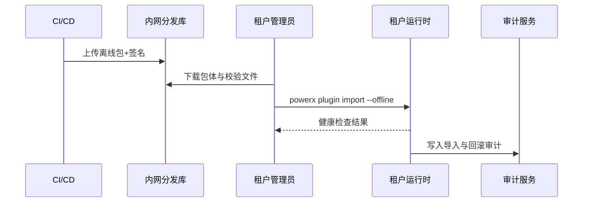

doc_id: UC-DEV-PLUGIN-OFFLINE-IMPORT-001
scn_id: SCN-DEV-PLUGIN-PUBLISH-001
title: 离线包生成与隔离环境导入
status: Draft
version: v0.1.0
repo_key: powerx
scope: powerx
layer: ops
domain: dev
scenario_title: "插件发布与上架主场景"
owners:
  - name: Matrix Ops
    role: Platform Ops Lead
    contact: ops@artisan-cloud.com
  - name: Erin Xu
    role: Enterprise Tenant Admin Lead
    contact: admin@artisan-cloud.com
contributors: []
linked_requirements:
  - SCN-DEV-PLUGIN-OFFLINE-IMPORT-001
code_refs:
  - repo: powerx
    path: internal/publish/offline/package_builder.go
    description: 离线包生成、依赖打包、校验文件输出
  - repo: powerx
    path: internal/publish/offline/import_controller.go
    description: 导入编排、签名校验、版本兼容性检查
  - repo: powerx
    path: internal/security/cert/signature_validator.go
    description: 证书指纹校验、吊销列表验证、结果落库
  - repo: powerx
    path: internal/audit/offline/import_audit.go
    description: 导入行为审计、回滚记录、告警联动
  - repo: powerx
    path: packages/cli/src/commands/plugin/import.ts
    description: CLI 离线导入命令、参数解析、健康检查触发
feature_flags:
  - plugin-offline-distribution
  - plugin-signature-guard
  - offline-import-healthcheck
optional: false
last_reviewed_at: 2025-11-20

---

# Usecase Overview

- **业务目标**：为隔离或弱网租户提供标准化的离线包生成、导入与审计能力，保证 10 分钟内完成导入并可自动回滚。
- **成功度量**：导入成功率 ≥ 98%；生成包与导入全程签名校验通过率 ≥ 99%；健康检查用时 ≤ 3 分钟；失败场景自动回滚率 100%。
- **场景关联**：支撑主场景 Stage 2，确保线上发布的制品可同步交付到离线通道且具备审计能力。

> 通过可追踪的离线发布流程，保障隔离租户在无外网环境中仍可按标准上线插件，并满足合规要求。

# Context & Assumptions

- **前置条件**
  - `plugin-offline-distribution`、`plugin-signature-guard`、`offline-import-healthcheck` Feature Flag 已启用。
  - CI/CD 已生成可用的构建制品，并记录版本与依赖元数据。
  - 内网分发库可访问，管理员具备下载权限，租户具备导入授权。
  - 签名证书有效且未过期，许可证服务可在内网校验。
- **输入/输出**
  - 输入：构建制品 ID、目标租户、许可证信息、校验策略、健康检查脚本。
  - 输出：离线包（制品、依赖、校验文件）、导入状态、健康检查报告、审计日志。
- **边界**
  - 不覆盖在线推送或 Marketplace 上架流程。
  - 不处理租户自定义的额外部署脚本或业务数据迁移。

# Solution Blueprint

## 体系分解

| 层 | 主要组件/模块 | 责任 | 代码入口 |
|----|---------------|------|---------|
| 制品打包层 | `internal/publish/offline/package_builder.go` | 聚合制品、依赖、版本元数据并生成签名 | `services/publish/offline` |
| 导入编排层 | `internal/publish/offline/import_controller.go` | 解压部署、版本兼容校验、回滚管理 | `services/publish/offline` |
| 安全校验层 | `internal/security/cert/signature_validator.go` | 证书指纹校验、许可证验证、吊销列表查询 | `services/security/cert` |
| 审计记录层 | `internal/audit/offline/import_audit.go` | 记录导入人、时间、指纹、结果，联动告警 | `services/audit/offline` |
| CLI/控制台层 | `packages/cli/src/commands/plugin/import.ts` | 触发导入、展示进度、收集健康检查结果 | `packages/cli` |

## 流程与时序

1. **Step 1 – 离线包生成**：CI/CD 调用离线打包模块，生成制品、依赖、校验文件与签名，上传内网分发库。
2. **Step 2 – 管理员准备导入**：下载离线包、校验签名指纹、确认许可证状态与目标租户资源。
3. **Step 3 – 导入与健康检查**：执行 `powerx plugin import --offline`，系统完成解压部署、运行健康检查脚本，生成结果。
4. **Step 4 – 启用与审计**：导入成功后启用新版本并记录审计日志；失败则自动回滚、发送告警并保留记录。

# Contracts & Interfaces

- **Inbound APIs / Events**
  - `powerx publish package --offline` — 生成离线包。
  - `powerx plugin import --offline` — 执行离线导入。
- **Outbound 调用**
  - `POST /internal/offline/signature/verify` — 校验签名与证书指纹。
  - `POST /internal/license/validate` — 校验许可证状态。
  - `POST /internal/audit/offline` — 写入审计、触发告警。
  - `EVENT plugin.offline.rollback` — 回滚事件通知。
- **配置与脚本**
  - `config/publish/offline_package.json` — 打包配置、校验规则。
  - `config/plugins/offline/dependencies.yaml` — 依赖清单与版本映射。
  - `scripts/healthcheck/offline-import.mjs` — 导入后健康检查与报告。

# Implementation Checklist

| 项目 | 描述 | 完成状态 | 负责人 |
|------|------|----------|--------|
| 离线包生成 | 支持增量打包、依赖校验、签名文件输出 | [ ] | Matrix Ops |
| 签名与许可证校验 | 校验指纹、吊销列表、许可证状态 | [ ] | Grace Lin |
| 导入编排 | 解压部署、版本兼容校验、失败回滚 | [ ] | Matrix Ops |
| 健康检查 | 标准化脚本模板、返回结构化报告 | [ ] | Erin Xu |
| 审计与告警 | 导入/回滚审计、告警配置、报表同步 | [ ] | Grace Lin |

# Testing Strategy

- **单元**：打包模块、签名校验、许可证检查、回滚流程。
- **集成**：执行 `scripts/healthcheck/offline-import.mjs`，覆盖成功、签名失败、依赖缺失、健康检查超时。
- **端到端**：模拟隔离租户执行离线导入，验证回滚与审计链路；复现 meta 文档用例 B-1/B-2。
- **非功能**：大包体积下载、断点续传、低带宽导入、日志留存与并发导入。

# Observability & Ops

- **指标**：`publish.offline.package_generated_total`、`publish.offline.import_success_rate`、`publish.offline.healthcheck_duration_ms`、`publish.offline.rollback_total`。
- **日志**：记录导入人、租户、版本、签名指纹、依赖校验与健康检查结果；敏感字段脱敏存储。
- **告警**：签名校验失败、许可证校验失败、健康检查超时、回滚连续触发 > 2 次。
- **Dashboards**：Offline Publish Dashboard、License Validation Monitor、`workflow-metrics.mjs`。

# Rollback & Failure Handling

- **回滚步骤**：回滚至上一版本、恢复旧配置、释放临时资源；记录回滚指纹与执行人。
- **补救措施**：提供失败报告下载、通知发布经理与租户管理员、开启人工审查通道。
- **数据修复**：运行 `scripts/workflows/offline-import-reconcile.mjs` 对齐导入记录、审计与许可证状态。

# Follow-ups & Risks

| 风险/事项 | 影响 | 缓解方案 | 负责人 | ETA |
|-----------|------|----------|--------|-----|
| 大体积包下载耗时长 | 导入效率 | 引入断点续传、提供增量包方案 | Matrix Ops | 2025-12-18 |
| 健康检查脚本不统一 | 启用验收 | 发布标准脚本库与校验工具 | Erin Xu | 2025-12-08 |
| 证书与许可证管理缺乏轮换提醒 | 合规风险 | 建立证书轮换告警、自动续签流程 | Grace Lin | 2025-12-20 |

# References & Links

- 场景文档：`docs/scenarios/plugin-lifecycle/SCN-DEV-PLUGIN-OFFLINE-IMPORT-001.md`
- 主场景：`docs/scenarios/plugin-lifecycle/SCN-DEV-PLUGIN-PUBLISH-001.md`
- Meta 设计：`docs/meta/scenarios/powerx/plugin-ecosystem/plugin-lifecycle/plugin-publish-and-release/primary.md`
- 配置文件：`config/publish/offline_package.json`、`config/plugins/offline/dependencies.yaml`
