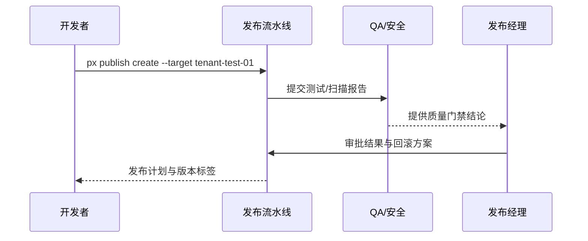

doc_id: UC-DEV-PLUGIN-RELEASE-APPROVAL-001
scn_id: SCN-DEV-PLUGIN-PUBLISH-001
title: 测试租户验证与发布审批
status: Draft
version: v0.1.0
repo_key: powerx
scope: powerx
layer: ops
domain: dev
scenario_title: "插件发布与上架主场景"
owners:
  - name: Matrix Ops
    role: Platform Ops Lead
    contact: ops@artisan-cloud.com
  - name: Linda Zhou
    role: QA Lead
    contact: qa@artisan-cloud.com
contributors: []
linked_requirements:
  - SCN-DEV-PLUGIN-RELEASE-APPROVAL-001
code_refs:
  - repo: powerx
    path: internal/publish/pipeline/test_runner.go
    description: 测试租户部署、自动化测试触发与质量门禁聚合
  - repo: powerx
    path: internal/publish/pipeline/approval_flow.go
    description: 审批状态机、窗口管理、回滚计划生成
  - repo: powerx
    path: internal/security/scan/report_collector.go
    description: 安全扫描结果汇总、许可证校验、审计写入
  - repo: powerx
    path: packages/cli/src/commands/publish/create.ts
    description: 发布申请 CLI、制品上传、测试租户配置
feature_flags:
  - plugin-release-pipeline
  - publish-approval-guard
  - security-scan-v2
optional: false
last_reviewed_at: 2025-11-20

---

# Usecase Overview

- **业务目标**：在插件进入生产前，于测试租户完成自动化验证、质量门禁与审批，生成可执行的生产发布计划和回滚预案。
- **成功度量**：测试覆盖率 ≥90%；审批完成时间 ≤24 小时；阻断通知响应时间 ≤30 分钟；发布计划包含回滚策略与责任人覆盖率 100%。
- **场景关联**：对应主场景 Stage 1，为后续灰度、离线导入和 Marketplace 上架提供可信制品与审批依据。

> 借助标准化测试租户与审批流程，提前暴露风险、为生产发布提供完整的质量凭证与回滚方案。

# Context & Assumptions

- **前置条件**
  - Feature Flag `plugin-release-pipeline`、`publish-approval-guard`、`security-scan-v2` 已启用。
  - 测试租户具备与生产一致的关键配置、数据集与监控埋点。
  - 发布申请提交了制品、版本说明、变更影响、回滚联系人与窗口建议。
  - QA、发布经理、安全合规负责人已在审批系统登记并具备审批权限。
- **输入/输出**
  - 输入：构建制品包、目标测试租户、自动化测试套件、审批责任人列表、回滚策略。
  - 输出：测试/扫描报告、质量门禁结果、审批结论、生产发布计划（含回滚方案）、审计日志链接。
- **边界**
  - 不涉及生产灰度或全量部署。
  - 不包含离线包生成与 Marketplace 审核流程。

# Solution Blueprint

## 体系分解

| 层 | 主要组件/模块 | 责任 | 代码入口 |
|----|---------------|------|---------|
| 流水线编排层 | `internal/publish/pipeline/test_runner.go` | 部署制品到测试租户、运行自动化测试与质量门禁 | `services/publish/pipeline` |
| 审批状态层 | `internal/publish/pipeline/approval_flow.go` | 审批状态机、窗口管理、回滚计划与通知生成 | `services/publish/pipeline` |
| 安全合规层 | `internal/security/scan/report_collector.go` | 聚合安全扫描、许可证校验、签名验证并写入审计 | `services/security/scan` |
| CLI/控制台层 | `packages/cli/src/commands/publish/create.ts` | 发布申请、制品上传、测试租户选择与状态查看 | `packages/cli` |
| 审计记录层 | `internal/audit/publish/log_writer.go` | 记录提交人、审批链、测试结果、阻断原因 | `services/audit/publish` |

## 流程与时序

1. **Step 1 – 发布申请**：开发者通过 `px publish create` 上传制品并指定测试租户与审批窗口。
2. **Step 2 – 自动化验证**：流水线部署到测试租户，执行回归测试、覆盖率统计与安全扫描，聚合质量门禁结果。
3. **Step 3 – 审批与回滚计划**：QA、发布经理、安全合规依次审核，确认变更范围、窗口、回滚联系人与演练结果。
4. **Step 4 – 计划落地与审计**：审批通过后锁定版本标签、输出生产发布计划，写入审计日志并通知相关责任人。

# Contracts & Interfaces

- **Inbound APIs / Events**
  - `px publish create` — 提交发布申请与制品元数据。
  - `POST /internal/publish/test-run` — 触发测试租户部署与测试执行。
  - `POST /internal/publish/approval` — 审批动作，记录结论与窗口信息。
- **Outbound 调用**
  - `POST /internal/security/scan` — 调用安全扫描、许可证校验。
  - `POST /internal/notify/publish` — 推送阻断或通过通知、回滚联系人提醒。
  - `POST /internal/audit/publish` — 写入审计日志，保留测试报告链接。
- **配置与脚本**
  - `pipeline/plugin-release.yml` — 发布流水线模板与阶段配置。
  - `config/publish/quality_gates.yaml` — 测试覆盖率、缺陷阈值、阻断规则。
  - `config/publish/approval_matrix.yaml` — 审批角色、窗口策略、升级路径。

# Implementation Checklist

| 项目 | 描述 | 完成状态 | 负责人 |
|------|------|----------|--------|
| 流水线模板 | 支持多租户部署、测试与扫描并发、质量门禁聚合 | [ ] | Matrix Ops |
| 质量门禁 | 配置覆盖率、漏洞阈值、阻断策略与重试机制 | [ ] | Linda Zhou |
| 审批工作流 | 实现多级审批、窗口管理、回滚计划生成与通知 | [ ] | Matrix Ops |
| 通知与审计 | 阻断/审批结果通知、审计日志落库、报告归档 | [ ] | Grace Lin |
| CLI/控制台 | 状态可视化、审批人管理、触发重试/撤回流程 | [ ] | Michael Hu |

# Testing Strategy

- **单元测试**：覆盖测试触发器、质量门禁判定、审批状态机、通知模块。
- **集成测试**：运行 `pipeline/plugin-release.yml` 的 dry-run，覆盖成功与阻断分支；验证与安全扫描、审计服务的交互。
- **端到端验证**：复现 meta 用例 A-1/A-2，确认阻断处理、审批 SLA、发布计划输出与审计日志。
- **非功能测试**：长流程审批、并发发布申请、审计日志留存与对账。

# Observability & Ops

- **指标**：`publish.test.pass_rate`、`publish.coverage.percent`、`publish.approval.lead_time_hours`、`publish.pipeline.block_total`。
- **日志**：记录制品版本、提交人、测试结果、审批链、阻断原因；敏感信息脱敏并保留 ≥180 天。
- **告警**：测试失败率 >5%、审批超时 >24 小时、阻断连续发生、审计写入失败。
- **Dashboards**：Release Quality Gate Dashboard、Approval SLA 面板、`workflow-metrics.mjs` 数据视图。

# Rollback & Failure Handling

- **回滚步骤**：阻断或驳回时回滚到上一稳定版本、撤销版本标签、恢复旧计划并通知相关团队。
- **补救措施**：允许重新上传制品、追加测试报告、调整审批窗口；提供临时豁免审批的审计记录。
- **数据修复**：运行 `scripts/workflows/publish-approval-reconcile.mjs` 对齐测试报告、审批结论与审计日志。

# Follow-ups & Risks

| 风险/事项 | 影响 | 缓解方案 | 负责人 | ETA |
|-----------|------|----------|--------|-----|
| 跨语言回归脚本维护成本高 | 自动化测试效率 | 建立统一脚本模板与数据集 | Linda Zhou | 2025-12-05 |
| 审批窗口未与变更日历联动 | 生产变更冲突 | 集成变更管理系统同步窗口 | Matrix Ops | 2025-12-12 |
| 阻断通知缺乏升级通道 | 响应延迟 | 配置多渠道提醒与升级策略 | Grace Lin | 2025-12-08 |

# References & Links

- 场景文档：`docs/scenarios/plugin-lifecycle/SCN-DEV-PLUGIN-RELEASE-APPROVAL-001.md`
- 主场景：`docs/scenarios/plugin-lifecycle/SCN-DEV-PLUGIN-PUBLISH-001.md`
- Meta 设计：`docs/meta/scenarios/powerx/plugin-ecosystem/plugin-lifecycle/plugin-publish-and-release/primary.md`
- 配置文件：`pipeline/plugin-release.yml`、`config/publish/quality_gates.yaml`、`config/publish/approval_matrix.yaml`
