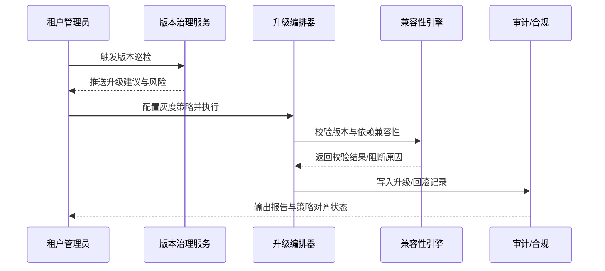

scn_id: SCN-DEV-PLUGIN-VERSION-COMPAT-001
title: 插件版本与兼容性管理主场景
status: Draft
version: v0.1.0
owners:
  - name: Matrix Ops
    role: Platform Ops Lead
    contact: ops@artisan-cloud.com
  - name: Grace Lin
    role: Security & Compliance Lead
    contact: compliance@artisan-cloud.com
  - name: Leo Wang
    role: Vendor Success Manager
    contact: vendor@artisan-cloud.com
domains: [dev]
layers: [service, ops, security]
repos:
  - key: powerx
    scope: core-platform
    responsibility: 版本治理服务、灰度升级编排、兼容性校验引擎、审计与报告
  - key: powerx-plugin
    scope: plugin-ecosystem
    responsibility: 插件 Manifest 工具、升级脚本、兼容矩阵维护、CLI 支持
related_usecases:
  - doc_id: UC-DEV-PLUGIN-VERSION-DETECT-001
    layer: service
    domain: dev
  - doc_id: UC-DEV-PLUGIN-VERSION-GRAY-001
    layer: ops
    domain: dev
  - doc_id: UC-DEV-PLUGIN-VERSION-COMPAT-BLOCK-001
    layer: security
    domain: dev
  - doc_id: UC-DEV-PLUGIN-VERSION-MULTI-TENANT-001
    layer: ops
    domain: dev
last_reviewed_at: 2025-11-20

---

# Executive Summary

该主场景梳理 PowerX 插件在运行期的版本感知、升级策略、兼容校验与跨租户治理全链路。平台需提供统一的版本态势视图、自动生成升级建议、支持策略化灰度与快速回滚，并在安装/升级前就阻断不兼容操作。最终目标是让租户管理员能够在可观测、可追溯的流程下持续获得新能力，同时满足安全与合规要求。

# Scope & Guardrails

- **In Scope**：版本扫描与告警、升级与回滚策略配置、灰度发布编排、兼容性校验与例外审批、跨租户版本对齐、版本变更审计与报告。
- **Out of Scope**：插件源码开发与调试、离线包生成和导入、Marketplace 审核与上架、宿主侧运行时性能调优。
- **Environment & Flags**：`plugin-version-governance`、`plugin-upgrade-policy`、`plugin-compat-guard`、`plugin-multi-tenant-sync`；依赖版本治理服务、制品与版本仓库、监控/日志平台、审批系统、审计数据库。

# Participants & Responsibilities

| Scope | Repository | Layer | 责任与交付物 | Owners |
|-------|------------|-------|--------------|--------|
| core-platform | powerx | service/ops | 版本扫描、升级策略引擎、灰度编排、回滚自动化、跨租户治理 | Matrix Ops（Platform Ops Lead / ops@artisan-cloud.com） |
| security | powerx | security | 兼容性校验规则、例外审批策略、审计日志与合规报告 | Grace Lin（Security & Compliance Lead / compliance@artisan-cloud.com） |
| plugin-ecosystem | powerx-plugin | ops | Manifest 工具、版本矩阵维护、CLI/控制台操作指引、变更日志模板 | Leo Wang（Vendor Success Manager / vendor@artisan-cloud.com） |

# End-to-End Flow

1. **Stage 1 – 全域版本巡检与洞察**：版本治理服务周期性扫描租户插件版本，生成升级建议与风险提示。
2. **Stage 2 – 策略化灰度升级与回滚**：管理员配置灰度策略，系统按批次升级并实时监控，异常时快速回滚。
3. **Stage 3 – 兼容性校验与阻断**：安装/升级前调用兼容性引擎，阻断不兼容操作，支持受控例外。
4. **Stage 4 – 跨租户一致性与审计**：集团视角对齐多租户版本，输出合规报告并沉淀变更追溯。

# Key Interactions & Contracts

- **APIs / Events**：`powerx version scan`、`POST /internal/version/governance/scan`、`powerx plugin upgrade --strategy policy`、`POST /internal/version/upgrade/rollback`、`POST /internal/version/compat/check`、`EVENT plugin.version.alert`.
- **Configs / Schemas**：`config/version/governance_rules.yaml`、`config/version/upgrade_policies.yaml`、`config/version/compat_matrix.yaml`、`docs/standards/powerx-plugin/release/Versioning_Guidelines.md`.
- **Security / Compliance**：兼容性阻断默认启用；例外审批需多因子校验并记录审批号；版本与回滚操作保留 ≥ 365 天审计记录；跨租户策略需遵循租户隔离与权限控制。

# Usecase Links

- `UC-DEV-PLUGIN-VERSION-DETECT-001` — 版本扫描与升级建议生成。
- `UC-DEV-PLUGIN-VERSION-GRAY-001` — 策略化灰度升级与快速回滚。
- `UC-DEV-PLUGIN-VERSION-COMPAT-BLOCK-001` — 兼容性校验与阻断。
- `UC-DEV-PLUGIN-VERSION-MULTI-TENANT-001` — 跨租户版本一致性治理（可选）。

# Acceptance Criteria

1. 版本扫描覆盖率 ≥99%，升级建议在 5 分钟内更新，并附带可追溯的变更日志。
2. 灰度升级支持策略化批次与自动回滚，回滚耗时 <3 分钟，升级成功率 ≥98%。
3. 兼容性校验准确率 ≥98%，阻断报告包含冲突项、解决建议与例外流程。
4. 版本与兼容性变更全程审计，跨租户策略执行结果可按租户/插件维度追溯。

# Telemetry & Ops

- 指标：`version.scan.coverage_rate`、`version.upgrade.success_rate`、`version.rollback.duration_ms`、`version.compat.block_total`、`version.policy.drift_total`。
- 告警阈值：扫描失败连续 3 次、升级成功率低于 95%、回滚耗时 >180 秒、兼容性矩阵过期、跨租户偏差未在 SLA 内处理。
- 观测来源：版本治理服务监控、CI/CD telemetry、`workflow-metrics.mjs`、审计报告仪表盘。

# Open Issues & Follow-ups

| 风险/事项 | 影响范围 | 负责人 | ETA |
|-----------|----------|--------|-----|
| 兼容矩阵更新滞后导致误判需强化自动同步 | 兼容性准确性 | Leo Wang | 2025-12-12 |
| 灰度监控指标需与第三方观测平台统一命名 | 升级可观测性 | Matrix Ops | 2025-12-18 |
| 例外审批缺乏模板，影响审批 SLA | 合规效率 | Grace Lin | 2025-12-10 |

# Appendix

- `docs/meta/scenarios/powerx/plugin-ecosystem/plugin-lifecycle/plugin-version-and-compatibility/primary.md`
- `docs/standards/powerx-plugin/release/Versioning_Guidelines.md`
- `config/version/compat_matrix.yaml`
