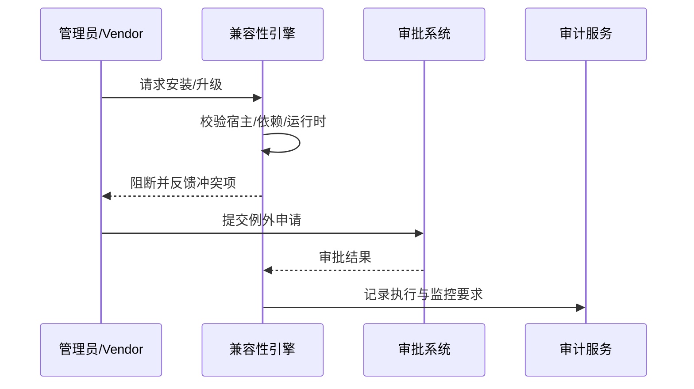

scn_id: SCN-DEV-PLUGIN-VERSION-COMPAT-BLOCK-001
title: 兼容性校验与阻断机制
status: Draft
version: v0.1.0
owners:
  - name: Grace Lin
    role: Security & Compliance Lead
    contact: compliance@artisan-cloud.com
  - name: Matrix Ops
    role: Platform Ops Lead
    contact: ops@artisan-cloud.com
domains: [dev]
layers: [security, ops]
repos:
  - key: powerx
    scope: core-platform
    responsibility: 兼容性引擎、例外审批流程、审计与风险报告
  - key: powerx-plugin
    scope: plugin-ecosystem
    responsibility: 兼容矩阵维护、Manifest 校验脚本、CLI 反馈模板
related_usecases:
  - doc_id: UC-DEV-PLUGIN-VERSION-COMPAT-BLOCK-001
    layer: security
    domain: dev
last_reviewed_at: 2025-11-20

---

# Executive Summary

该子场景确保在插件安装或升级前执行兼容性校验，阻断与宿主、依赖或运行时不匹配的操作。系统需提供冲突明细、解决建议及受控例外流程，防止生产故障并满足合规要求。

# Scope & Guardrails

- **In Scope**：兼容性矩阵加载、Manifest 校验、依赖冲突检测、报告生成、例外审批、风险审计。
- **Out of Scope**：版本扫描与升级建议、灰度执行、跨租户策略、离线包导入。
- **Environment & Flags**：`plugin-compat-guard`、`plugin-compat-exception`；依赖兼容矩阵仓库、审批系统、审计数据库、通知服务。

# Participants & Responsibilities

| Scope | Repository | Layer | 责任与交付物 | Owners |
|-------|------------|-------|--------------|--------|
| security | powerx | security | 兼容性规则、风险评分、阻断策略、例外审批与审计 | Grace Lin（Security & Compliance Lead / compliance@artisan-cloud.com） |
| core-platform | powerx | ops | 校验引擎、安装/升级前钩子、CLI 与控制台反馈、审批集成 | Matrix Ops（Platform Ops Lead / ops@artisan-cloud.com） |
| plugin-ecosystem | powerx-plugin | ops | Manifest/依赖声明模板、兼容矩阵维护、测试工具 | Leo Wang（Vendor Success Manager / vendor@artisan-cloud.com） |

# End-to-End Flow

1. **Stage 1 – 加载兼容矩阵**：安装/升级请求前加载宿主版本、依赖插件、运行时的矩阵数据。
2. **Stage 2 – 校验与风险评估**：校验 Manifest 声明、API 变更、数据库迁移等，生成风险报告。
3. **Stage 3 – 阻断与反馈**：若发现不兼容，阻断请求并提供解决建议；支持提交例外申请。
4. **Stage 4 – 例外审批与受控执行**：审批通过后执行受控安装，附加监控要求并记录审计。

# Key Interactions & Contracts

- **APIs / Events**：`POST /internal/version/compat/check`、`EVENT plugin.compat.blocked`、`POST /internal/version/compat/exception`、`POST /internal/version/compat/approve`.
- **Configs / Schemas**：`config/version/compat_matrix.yaml`、`config/version/exception_workflow.yaml`、`docs/standards/powerx-plugin/release/Compatibility_Checklist.md`.
- **Security / Compliance**：兼容矩阵缺失时强制阻断；例外审批需多因子验证并附带风险说明；所有例外执行需附加监控并记录审计 ≥ 365 天。

# Usecase Links

- `UC-DEV-PLUGIN-VERSION-COMPAT-BLOCK-001` — 兼容性校验与阻断机制。

# Acceptance Criteria

1. 兼容性校验准确率 ≥98%，缺失矩阵时默认阻断并提示补录；报告包含冲突项、参考指南与替代版本。
2. 例外审批 SLA ≤24 小时，审批通过后强制附加监控策略并记录审批号。
3. 所有阻断/例外操作写入审计日志，可按插件、宿主版本、审批人维度检索。

# Telemetry & Ops

- 指标：`version.compat.check_total`、`version.compat.block_total`、`version.compat.exception_approved_total`、`version.compat.matrix_staleness_hours`。
- 告警阈值：兼容矩阵更新超期、阻断率异常升高、例外执行缺少监控、审计写入失败。
- 观测来源：兼容性引擎日志、审批系统、`workflow-metrics.mjs`、合规仪表盘。

# Open Issues & Follow-ups

| 风险/事项 | 影响范围 | 负责人 | ETA |
|-----------|----------|--------|-----|
| 部分插件缺少运行时兼容声明需强制补齐 | 校验准确性 | Leo Wang | 2025-12-05 |
| 例外审批流程需对接企业 IAM 提供细粒度权限 | 合规性 | Grace Lin | 2025-12-18 |

# Appendix

- `docs/meta/scenarios/powerx/plugin-ecosystem/plugin-lifecycle/plugin-version-and-compatibility/primary.md#子场景-c`
- `config/version/compat_matrix.yaml`
- `docs/standards/powerx-plugin/release/Compatibility_Checklist.md`
