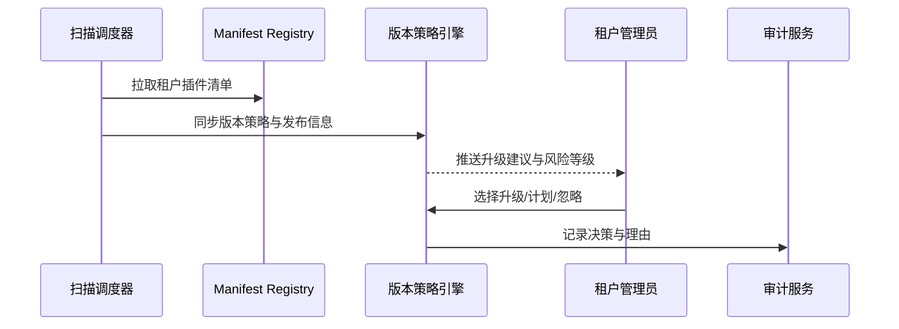

scn_id: SCN-DEV-PLUGIN-VERSION-DETECT-001
title: 自动检测并提示可升级版本
status: Draft
version: v0.1.0
owners:
  - name: Matrix Ops
    role: Platform Ops Lead
    contact: ops@artisan-cloud.com
  - name: Leo Wang
    role: Vendor Success Manager
    contact: vendor@artisan-cloud.com
domains: [dev]
layers: [service, ops]
repos:
  - key: powerx
    scope: core-platform
    responsibility: 版本扫描任务、策略引擎、通知与审计
  - key: powerx-plugin
    scope: plugin-ecosystem
    responsibility: Manifest 管理、变更日志生成、CLI 支持
related_usecases:
  - doc_id: UC-DEV-PLUGIN-VERSION-DETECT-001
    layer: service
    domain: dev
last_reviewed_at: 2025-11-20

---

# Executive Summary

该子场景负责自动巡检租户内插件版本，识别可用补丁与风险，并通过控制台/通知推送升级建议。流程需整合插件 Manifest、发布日志与平台策略，确保管理员在 5 分钟内收到可执行的升级指引并留下审计记录。

# Scope & Guardrails

- **In Scope**：版本扫描任务调度、Manifest 汇总、升级策略计算、风险分级、通知推送、审计记录。
- **Out of Scope**：升级执行与回滚（另见灰度场景）、兼容性阻断、跨租户策略执行、离线包分发。
- **Environment & Flags**：`plugin-version-governance`、`plugin-upgrade-policy`；依赖版本仓库、Manifest 注册中心、通知服务、审计数据库。

# Participants & Responsibilities

| Scope | Repository | Layer | 责任与交付物 | Owners |
|-------|------------|-------|--------------|--------|
| core-platform | powerx | service | 版本扫描调度、升级建议计算、策略配置、通知与审计 | Matrix Ops（Platform Ops Lead / ops@artisan-cloud.com） |
| plugin-ecosystem | powerx-plugin | ops | 维护兼容矩阵、变更日志模板、CLI 查询命令、Vendor 数据同步 | Leo Wang（Vendor Success Manager / vendor@artisan-cloud.com） |

# End-to-End Flow

1. **Stage 1 – 数据采集与扫描**：定时任务拉取租户 Manifest、发布信息与策略数据。
2. **Stage 2 – 风险评估与推荐**：计算版本差异、LTS/安全补丁优先级，生成升级建议。
3. **Stage 3 – 通知与呈现**：控制台面板/通知中心展示升级卡片，附带变更日志与影响分析。
4. **Stage 4 – 决策与审计**：管理员选择升级、计划或忽略，系统记录操作与理由。

# Key Interactions & Contracts

- **APIs / Events**：`px version scan`、`POST /internal/version/governance/scan`、`EVENT plugin.version.alert`、`POST /internal/version/governance/decision`.
- **Configs / Schemas**：`config/version/governance_rules.yaml`、`config/version/notification_templates.yaml`、`docs/standards/powerx-plugin/release/Versioning_Guidelines.md`.
- **Security / Compliance**：扫描结果涉及租户插件信息需遵守租户隔离；管理员操作需审计，通知中隐藏敏感依赖信息。

# Usecase Links

- `UC-DEV-PLUGIN-VERSION-DETECT-001` — 版本扫描与升级建议生成。

# Acceptance Criteria

1. 版本扫描覆盖率 ≥99%，异常重试 <=3 分钟完成；安全补丁建议优先级正确率 ≥98%。
2. 升级建议在扫描完成后 5 分钟内推送，变更日志与兼容矩阵链接可用。
3. 管理员决策全部记录审计日志，包括忽略原因与计划时间。

# Telemetry & Ops

- 指标：`version.scan.coverage_rate`、`version.scan.failure_total`、`version.recommendation.push_latency_ms`、`version.recommendation.accept_rate`。
- 告警阈值：扫描失败连续 3 次、推荐延迟 >5 分钟、安全补丁未采纳超过 SLA。
- 观测来源：版本治理服务日志、通知服务、`workflow-metrics.mjs`、审计仪表盘。

# Open Issues & Follow-ups

| 风险/事项 | 影响范围 | 负责人 | ETA |
|-----------|----------|--------|-----|
| Manifest 数据质量不稳定影响扫描准确性 | 升级建议准确度 | Leo Wang | 2025-12-08 |
| 安全补丁优先级算法需纳入 CVSS 等权重 | 风险识别能力 | Matrix Ops | 2025-12-15 |

# Appendix

- `docs/meta/scenarios/powerx/plugin-ecosystem/plugin-lifecycle/plugin-version-and-compatibility/primary.md#子场景-a`
- `config/version/governance_rules.yaml`
- `docs/standards/powerx-plugin/release/Versioning_Guidelines.md`
