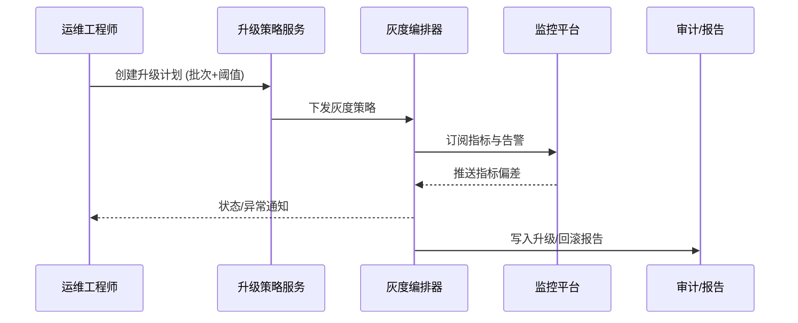

scn_id: SCN-DEV-PLUGIN-VERSION-GRAY-001
title: 策略化灰度升级与快速回滚
status: Draft
version: v0.1.0
owners:
  - name: Matrix Ops
    role: Platform Ops Lead
    contact: ops@artisan-cloud.com
  - name: Alex Wei
    role: Release Automation Engineer
    contact: automation@artisan-cloud.com
domains: [dev]
layers: [ops]
repos:
  - key: powerx
    scope: core-platform
    responsibility: 升级策略引擎、灰度编排、监控集成、回滚自动化
related_usecases:
  - doc_id: UC-DEV-PLUGIN-VERSION-GRAY-001
    layer: ops
    domain: dev
last_reviewed_at: 2025-11-20

---

# Executive Summary

该子场景通过策略化灰度与自动回滚机制帮助运维工程师在可控风险下升级插件。流程涵盖灰度计划配置、批次执行、指标观测与异常处理，确保升级成功率并在异常时 3 分钟内恢复。

# Scope & Guardrails

- **In Scope**：升级计划与策略配置、灰度批次执行、监控指标绑定、自动暂停/回滚、升级总结报告。
- **Out of Scope**：版本扫描与推荐、兼容性阻断、跨租户策略执行、离线包导入。
- **Environment & Flags**：`plugin-upgrade-policy`、`plugin-gray-orchestrator`、`plugin-upgrade-rollback`；依赖 CI/CD 管道、监控平台、日志系统、审计服务。

# Participants & Responsibilities

| Scope | Repository | Layer | 责任与交付物 | Owners |
|-------|------------|-------|--------------|--------|
| core-platform | powerx | ops | 灰度策略与批次编排、监控阈值、回滚自动化、升级报告 | Matrix Ops（Platform Ops Lead / ops@artisan-cloud.com） |
| ops automation | powerx | ops | 指标映射、告警配置、CLI/控制台操作、复盘模板 | Alex Wei（Release Automation Engineer / automation@artisan-cloud.com） |

# End-to-End Flow

1. **Stage 1 – 灰度计划设计**：管理员创建升级计划，配置批次比例、窗口、监控指标与回滚策略。
2. **Stage 2 – 灰度执行与观测**：系统按批次升级实例，实时监控 KPI 并记录日志。
3. **Stage 3 – 异常响应与回滚**：当指标越阈或人工暂停时自动回滚，并通知相关责任人。
4. **Stage 4 – 总结与归档**：升级完成后生成报告，沉淀监控结果、回滚演练与审批信息。

# Key Interactions & Contracts

- **APIs / Events**：`px plugin upgrade --strategy policy`、`POST /internal/version/upgrade/plan`、`POST /internal/version/upgrade/rollback`、`EVENT plugin.version.gray.alert`。
- **Configs / Schemas**：`config/version/upgrade_policies.yaml`、`config/monitoring/version_upgrade_dashboards.json`、`docs/standards/powerx-plugin/release/Upgrade_Playbook.md`。
- **Security / Compliance**：升级与回滚需审计落库；关键操作需审批令牌；升级包签名校验不可跳过；记录批次、租户、指标与责任人。

# Usecase Links

- `UC-DEV-PLUGIN-VERSION-GRAY-001` — 策略化灰度升级与快速回滚。

# Acceptance Criteria

1. 支持自定义批次与监控阈值，并可在执行中动态调整；升级成功率 ≥98%。
2. 指标异常或人工暂停后 3 分钟内完成回滚，回滚日志完整。
3. 升级完成后自动生成报告，包含批次、指标、回滚记录与审批链。

# Telemetry & Ops

- 指标：`version.upgrade.success_rate`、`version.upgrade.batch_duration_minutes`、`version.rollback.duration_ms`、`version.upgrade.alert_total`。
- 告警阈值：灰度错误率 >5%、回滚失败、监控数据缺失 >5 分钟、批次超时 >30 分钟。
- 观测来源：CI/CD 遥测、监控平台、`workflow-metrics.mjs`、审计报表。

# Open Issues & Follow-ups

| 风险/事项 | 影响范围 | 负责人 | ETA |
|-----------|----------|--------|-----|
| 第三方监控指标命名不统一导致阈值难统一 | 升级可观测性 | Alex Wei | 2025-12-14 |
| 回滚脚本缺乏多租户并发支持 | 回滚效率 | Matrix Ops | 2025-12-20 |

# Appendix

- `docs/meta/scenarios/powerx/plugin-ecosystem/plugin-lifecycle/plugin-version-and-compatibility/primary.md#子场景-b`
- `config/version/upgrade_policies.yaml`
- `docs/standards/powerx-plugin/release/Upgrade_Playbook.md`
