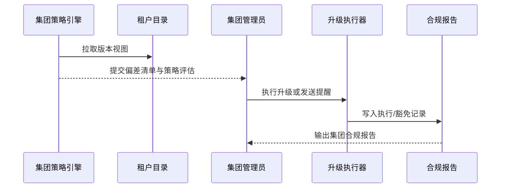

scn_id: SCN-DEV-PLUGIN-VERSION-MULTI-TENANT-001
title: 跨租户版本一致性治理
status: Draft
version: v0.1.0
optional: true
owners:
  - name: Matrix Ops
    role: Platform Ops Lead
    contact: ops@artisan-cloud.com
  - name: Erin Xu
    role: Enterprise Tenant Admin Lead
    contact: admin@artisan-cloud.com
domains: [dev]
layers: [ops]
repos:
  - key: powerx
    scope: core-platform
    responsibility: 多租户版本视图、策略引擎、任务编排、合规报告
related_usecases:
  - doc_id: UC-DEV-PLUGIN-VERSION-MULTI-TENANT-001
    layer: ops
    domain: dev
last_reviewed_at: 2025-11-20

---

# Executive Summary

该子场景面向集团或多租户运营，提供插件版本偏差检测、策略化对齐与集团合规报告能力。系统需在 10 分钟内识别偏差租户，执行自动或半自动升级，并保留策略执行与通知记录。

# Scope & Guardrails

- **In Scope**：跨租户版本汇总、策略配置、偏差检测、任务编排、通知与报告。
- **Out of Scope**：单租户灰度升级细节、兼容性例外审批、离线导入。
- **Environment & Flags**：`plugin-multi-tenant-sync`、`plugin-version-governance`；依赖租户目录、版本治理服务、通知/审计系统、集团策略配置。

# Participants & Responsibilities

| Scope | Repository | Layer | 责任与交付物 | Owners |
|-------|------------|-------|--------------|--------|
| core-platform | powerx | ops | 跨租户版本视图、策略执行器、偏差检测、报告导出 | Matrix Ops（Platform Ops Lead / ops@artisan-cloud.com） |
| tenant governance | powerx | ops | 集团策略配置、通知模板、升级任务协调 | Erin Xu（Enterprise Tenant Admin Lead / admin@artisan-cloud.com） |

# End-to-End Flow

1. **Stage 1 – 版本汇总与偏差检测**：汇总集团租户的插件版本，计算与策略基线的差异。
2. **Stage 2 – 策略评估与冲突检查**：评估策略冲突或被豁免租户，生成待执行列表。
3. **Stage 3 – 升级执行与通知**：对偏差租户发起升级任务或发送提醒，跟踪执行进度。
4. **Stage 4 – 合规报告与复盘**：完成后输出集团报告，记录策略命中、执行结果与未解决项。

# Key Interactions & Contracts

- **APIs / Events**：`POST /internal/version/governance/snapshot`、`POST /internal/version/policy/enforce`、`EVENT plugin.version.policy.alert`、`POST /internal/version/policy/report`.
- **Configs / Schemas**：`config/version/policy_profiles.yaml`、`config/version/multi_tenant_baselines.yaml`、`docs/standards/powerx-plugin/release/Group_Governance_Guide.md`.
- **Security / Compliance**：策略执行需尊重租户隔离与授权；跨租户视图仅授权人员可见；报告保留 ≥365 天；冲突策略需人工确认。

# Usecase Links

- `UC-DEV-PLUGIN-VERSION-MULTI-TENANT-001` — 跨租户版本一致性治理。

# Acceptance Criteria

1. 偏差检测延迟 <10 分钟，策略执行日志包含租户、插件、目标版本与责任人。
2. 支持策略冲突模拟并提供人工决策入口，冲突报告准确率 ≥98%。
3. 合规报告可按插件、租户、策略维度导出，并记录未完成项与后续计划。

# Telemetry & Ops

- 指标：`version.policy.drift_total`、`version.policy.enforced_total`、`version.policy.conflict_total`、`version.policy.compliance_rate`.
- 告警阈值：策略执行失败、偏差未在 SLA 内关闭、冲突率异常升高、报告生成失败。
- 观测来源：版本治理服务日志、策略执行器、`workflow-metrics.mjs`、集团合规仪表盘。

# Open Issues & Follow-ups

| 风险/事项 | 影响范围 | 负责人 | ETA |
|-----------|----------|--------|-----|
| 多策略冲突处理需要更细粒度模拟与提醒 | 策略执行效率 | Matrix Ops | 2025-12-22 |
| 集团管理员通知流程需对接外部协同系统 | 协作效率 | Erin Xu | 2025-12-18 |

# Appendix

- `docs/meta/scenarios/powerx/plugin-ecosystem/plugin-lifecycle/plugin-version-and-compatibility/primary.md#子场景-d`
- `config/version/multi_tenant_baselines.yaml`
- `docs/standards/powerx-plugin/release/Group_Governance_Guide.md`
