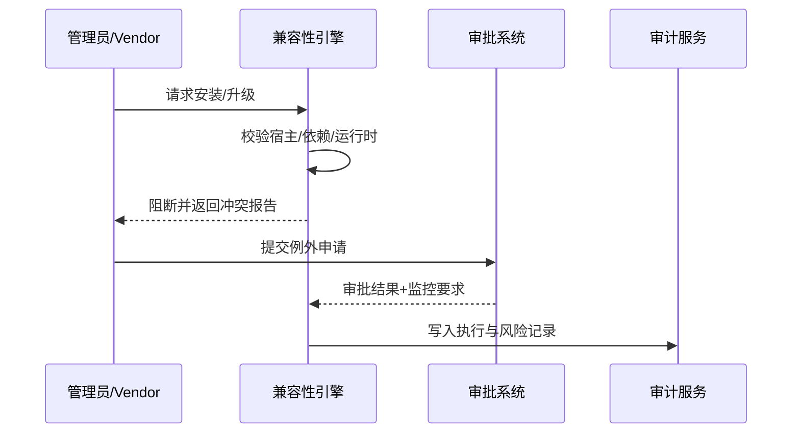

doc_id: UC-DEV-PLUGIN-VERSION-COMPAT-BLOCK-001
scn_id: SCN-DEV-PLUGIN-VERSION-COMPAT-001
title: 兼容性校验与阻断机制
status: Draft
version: v0.1.0
repo_key: powerx
scope: powerx
layer: security
domain: dev
scenario_title: "插件版本与兼容性管理主场景"
owners:
  - name: Grace Lin
    role: Security & Compliance Lead
    contact: compliance@artisan-cloud.com
  - name: Matrix Ops
    role: Platform Ops Lead
    contact: ops@artisan-cloud.com
contributors: []
linked_requirements:
  - SCN-DEV-PLUGIN-VERSION-COMPAT-BLOCK-001
code_refs:
  - repo: powerx
    path: internal/version/compat/engine.go
    description: 兼容性规则解析、矩阵加载、风险评分引擎
  - repo: powerx
    path: internal/version/compat/validator.go
    description: Manifest/依赖校验器、阻断判定、错误报告
  - repo: powerx
    path: internal/version/compat/exception_workflow.go
    description: 例外审批编排、MFA 校验、执行授权
  - repo: powerx
    path: internal/audit/version/compat_log_writer.go
    description: 阻断/例外审计写入、风险标签、检索索引
  - repo: powerx
    path: packages/cli/src/commands/plugin/install.ts
    description: CLI 安装钩子、兼容性反馈、例外申请入口
feature_flags:
  - plugin-compat-guard
  - plugin-compat-exception
optional: false
last_reviewed_at: 2025-11-20

---

# Usecase Overview

- **业务目标**：在插件安装或升级前执行一致的兼容性校验，阻断与宿主、依赖或运行时不匹配的操作，并提供例外审批与风险追溯能力。
- **成功度量**：兼容性匹配准确率 ≥98%；例外审批 SLA ≤24 小时；阻断后 100% 写入审计并附带冲突明细；审批通过实例附加监控策略覆盖率 ≥95%。
- **场景关联**：支撑主场景 Stage 3，与灰度升级/版本检测场景协同，确保发布前即识别兼容性风险。

> 通过兼容性防线，可在发布前阻断高风险安装，减少运行期故障，并为例外场景提供受控执行轨迹。

# Context & Assumptions

- **前置条件**
  - Feature Flag `plugin-compat-guard`、`plugin-compat-exception` 已启用。
  - 兼容性矩阵与插件 Manifest 在版本治理服务中保持最新，并通过 CI/CD 自动更新。
  - 审批系统支持多因子认证与审批号追踪，具备通知渠道。
  - 安全团队定义了风险级别、审批模板与附加监控策略。
- **输入/输出**
  - 输入：安装/升级请求、插件 Manifest、宿主版本、依赖列表、审批上下文。
  - 输出：兼容性报告、阻断反馈、例外审批决定、审计记录、附加监控策略。
- **边界**
  - 不处理升级执行/回滚流程（由灰度场景负责）。
  - 不覆盖离线包导入、跨租户策略、Marketplace 审核。

# Solution Blueprint

## 体系分解

| 层 | 主要组件/模块 | 责任 | 代码入口 |
|----|---------------|------|---------|
| 兼容性引擎层 | `internal/version/compat/engine.go` | 加载矩阵、合并策略、风险评分 | `services/version/compat` |
| 校验与阻断层 | `internal/version/compat/validator.go` | Manifest 校验、冲突识别、阻断反馈 | `services/version/compat` |
| 例外审批层 | `internal/version/compat/exception_workflow.go` | 审批流程、MFA 校验、执行授权 | `services/version/compat` |
| 审计与合规层 | `internal/audit/version/compat_log_writer.go` | 阻断/例外记录、风险标签、报表对接 | `services/audit/version` |
| CLI/控制台层 | `packages/cli/src/commands/plugin/install.ts` | 承载提示、例外申请入口、审批结果同步 | `packages/cli` |

## 流程与时序

1. **Step 1 – 请求接入**：管理员通过 CLI/控制台触发安装或升级请求，系统装载插件与宿主信息。
2. **Step 2 – 兼容性校验**：兼容性引擎加载矩阵，校验宿主版本、依赖插件、运行时与数据库迁移脚本，并生成风险评分。
3. **Step 3 – 阻断与反馈**：若检测到冲突，立即阻断并返回详细报告、解决建议与例外申请入口。
4. **Step 4 – 例外审批与受控执行**：审批通过后执行受控安装，附加监控策略并记录审计；若被拒绝，维持阻断状态并通知相关人。

# Contracts & Interfaces

- **Inbound APIs / Events**
  - `POST /internal/version/compat/check` — 校验请求，包含插件版本、宿主、依赖列表。
  - `POST /internal/version/compat/exception` — 提交例外申请，附带风险说明。
- **Outbound 调用**
  - `POST /internal/security/scan/context` — 获取安全策略、敏感组件信息。
  - `POST /internal/notify/publish` — 推送阻断或审批通知给管理员、审批人。
  - `POST /internal/audit/version` — 写入阻断、审批、执行结果。
- **配置与脚本**
  - `config/version/compat_matrix.yaml` — 兼容矩阵、权重、过期策略。
  - `config/version/exception_workflow.yaml` — 审批链、SLA、附加监控策略。
  - `docs/standards/powerx-plugin/release/Compatibility_Checklist.md` — 校验项与例外要求。

# Implementation Checklist

| 项目 | 描述 | 完成状态 | 负责人 |
|------|------|----------|--------|
| 兼容矩阵同步 | 与 Vendor 仓库、CI/CD 对接，保证矩阵及时更新 | [ ] | Leo Wang |
| 校验引擎增强 | 支持宿主、依赖、运行时、数据迁移多维度校验 | [ ] | Matrix Ops |
| 例外审批 | 集成审批系统、MFA 校验、审批号追踪 | [ ] | Grace Lin |
| 审计报表 | 生成阻断/例外报表、风险标签、检索查询 | [ ] | Grace Lin |
| CLI/控制台体验 | 优化冲突提示、例外申请入口、帮助链接 | [ ] | Leo Wang |

# Testing Strategy

- **单元**：校验规则、矩阵解析、例外审批状态机、审计日志写入。
- **集成**：模拟安装请求，覆盖兼容、冲突和例外审批路径；对接审批系统与审计服务。
- **端到端**：复现主场景用例 C-1/C-2，验证阻断报告、例外执行与监控策略。
- **非功能**：矩阵大规模校验性能、审批系统延迟、日志查询压力测试。

# Observability & Ops

- **指标**：`version.compat.check_total`、`version.compat.block_total`、`version.compat.exception_request_total`、`version.compat.exception_approved_total`、`version.compat.matrix_staleness_hours`。
- **日志**：记录插件版本、宿主、依赖、风险级别、审批号、执行人；敏感信息脱敏；保留 ≥365 天。
- **告警**：兼容矩阵过期、阻断率骤增、审批 SLA 超时、例外执行缺少监控策略。
- **Dashboards**：Compatibility Guard Dashboard、Exception Workflow Monitor、`workflow-metrics.mjs`。

# Rollback & Failure Handling

- **回滚步骤**：保持旧版本运行，撤销未完成的安装请求，恢复审批队列与监控策略。
- **补救措施**：提供冲突报告下载、手动触发重新校验、支持人工审批并附带风险说明。
- **数据修复**：运行 `scripts/workflows/version-compat-reconcile.mjs` 对齐阻断记录、审批状态与审计日志。

# Follow-ups & Risks

| 风险/事项 | 影响 | 缓解方案 | 负责人 | ETA |
|-----------|------|----------|--------|-----|
| 部分插件缺少运行时兼容声明 | 校验准确性 | 与 Vendor 建立模板并强制校验 | Leo Wang | 2025-12-05 |
| 例外审批缺乏细粒度权限控制 | 合规风险 | 与 IAM 对接审批角色与最小权限 | Grace Lin | 2025-12-18 |
| 阻断报告可读性不足影响决策 | 运维效率 | 优化冲突分组、提供解决指南链接 | Matrix Ops | 2025-12-12 |

# References & Links

- 场景文档：`docs/scenarios/plugin-lifecycle/SCN-DEV-PLUGIN-VERSION-COMPAT-BLOCK-001.md`
- 主场景：`docs/scenarios/plugin-lifecycle/SCN-DEV-PLUGIN-VERSION-COMPAT-001.md`
- 标准：`docs/standards/powerx-plugin/release/Compatibility_Checklist.md`
- 配置：`config/version/compat_matrix.yaml`、`config/version/exception_workflow.yaml`
