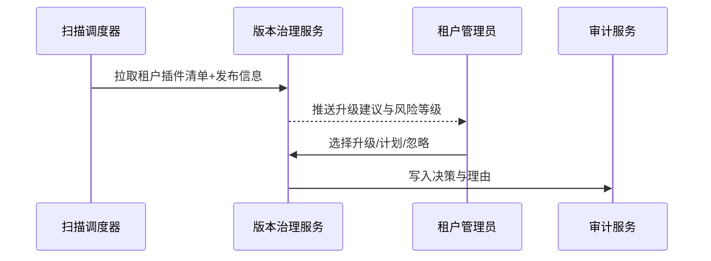

doc_id: UC-DEV-PLUGIN-VERSION-DETECT-001
scn_id: SCN-DEV-PLUGIN-VERSION-COMPAT-001
title: 自动检测并提示可升级版本
status: Draft
version: v0.1.0
repo_key: powerx
scope: powerx
layer: service
domain: dev
scenario_title: "插件版本与兼容性管理主场景"
owners:
  - name: Matrix Ops
    role: Platform Ops Lead
    contact: ops@artisan-cloud.com
  - name: Leo Wang
    role: Vendor Success Manager
    contact: vendor@artisan-cloud.com
contributors: []
linked_requirements:
  - SCN-DEV-PLUGIN-VERSION-DETECT-001
code_refs:
  - repo: powerx
    path: internal/version/governance/scanner.go
    description: 租户插件 Manifest 扫描、版本差异计算、补偿任务
  - repo: powerx
    path: internal/version/governance/recommender.go
    description: 升级策略评估、风险分级、建议生成
  - repo: powerx
    path: internal/version/governance/notifier.go
    description: 升级通知推送、控制台面板渲染、决策写入
  - repo: powerx
    path: internal/audit/version/governance_log_writer.go
    description: 扫描结果、管理员决策、忽略原因的审计落库
  - repo: powerx
    path: packages/cli/src/commands/version/scan.ts
    description: CLI 触发扫描、查看建议、导出报告
feature_flags:
  - plugin-version-governance
  - plugin-upgrade-policy
optional: false
last_reviewed_at: 2025-11-20

---

# Usecase Overview

- **业务目标**：为租户管理员提供实时插件版本态势，自动识别可用补丁与风险并推送升级建议，支持立即执行、计划任务或忽略并留下审计轨迹。
- **成功度量**：扫描覆盖率 ≥99%；升级建议推送延迟 ≤5 分钟；安全补丁高优先级识别准确率 ≥98%；管理员决策审计记录覆盖率 100%。
- **场景关联**：支撑主场景 Stage 1，并为灰度升级与兼容性阻断场景提供可靠输入。

> 通过自动化版本治理，租户管理员可以在统一面板上掌握插件健康状态，缩短补丁响应时间并提升合规性。

# Context & Assumptions

- **前置条件**
  - Feature Flag `plugin-version-governance`、`plugin-upgrade-policy` 已启用。
  - 租户插件 Manifest、发布日志、兼容矩阵在治理服务中保持最新，并支持差量同步。
  - 通知服务可向控制台、邮件、IM 渠道发送提醒；审计库可记录管理员决策。
  - Vendor 通过 CI/CD 提交变更日志、风险信息与兼容矩阵。
- **输入/输出**
  - 输入：租户插件 Manifest、最新发布列表、策略配置（LTS、安全补丁、强制级别）。
  - 输出：升级建议、风险等级、变更日志链接、管理员决策与审计记录。
- **边界**
  - 不负责实际升级执行、灰度策略与回滚。
  - 不处理离线包生成或 Marketplace 上架。

# Solution Blueprint

## 体系分解

| 层 | 主要组件/模块 | 责任 | 代码入口 |
|----|---------------|------|---------|
| 数据采集层 | `internal/version/governance/scanner.go` | 拉取租户清单、发布信息、补偿扫描 | `services/version/governance` |
| 策略评估层 | `internal/version/governance/recommender.go` | 计算版本差异、策略匹配、风险/优先级输出 | `services/version/governance` |
| 呈现与通知层 | `internal/version/governance/notifier.go` | 控制台面板、通知推送、交互记录 | `services/version/governance` |
| 审计层 | `internal/audit/version/governance_log_writer.go` | 保存扫描结果、管理员决策、忽略理由 | `services/audit/version` |
| CLI/工具层 | `packages/cli/src/commands/version/scan.ts` | 手动触发扫描、导出报告、脚本集成 | `packages/cli` |

## 流程与时序

1. **Step 1 – 扫描启动**：定时任务或管理员/CLI 触发扫描，加载租户 Manifest 与最新发布信息。
2. **Step 2 – 策略评估**：对比版本差异，应用 LTS、安全补丁、例外策略，计算风险等级与推荐动作。
3. **Step 3 – 通知与呈现**：在控制台生成升级卡片并推送通知，附带变更日志、兼容矩阵与影响分析。
4. **Step 4 – 决策与审计**：管理员选择立即升级、计划或忽略；系统记录决策、理由与后续动作。

# Contracts & Interfaces

- **Inbound APIs / Events**
  - `px version scan` — CLI 触发扫描并输出报告。
  - `POST /internal/version/governance/scan` — 调度器调用执行扫描任务。
  - `POST /internal/version/governance/decision` — 管理员操作结果写入（升级、计划、忽略）。
- **Outbound 调用**
  - `POST /internal/notify/version` — 向控制台/IM/邮件推送升级提醒。
  - `POST /internal/audit/version` — 写入审计日志、记录决策与理由。
  - `POST /internal/version/catalog` — 获取最新发布版本、变更日志、兼容矩阵。
- **配置与脚本**
  - `config/version/governance_rules.yaml` — 策略参数、优先级、SLA。
  - `config/version/notification_templates.yaml` — 控制台卡片与通知模板。
  - `scripts/workflows/version-scan-smoke.mjs` — 扫描流程冒烟脚本。

# Implementation Checklist

| 项目 | 描述 | 完成状态 | 负责人 |
|------|------|----------|--------|
| Manifest 聚合 | 接入租户目录与插件注册表、确保数据一致性 | [ ] | Matrix Ops |
| 策略引擎 | 支持 LTS、安全补丁、例外策略、权重配置 | [ ] | Matrix Ops |
| 通知与面板 | 控制台卡片、IM/邮件通知、变更日志链接 | [ ] | Leo Wang |
| 审计记录 | 记录扫描结果、决策、忽略原因与 SLA | [ ] | Grace Lin |
| CLI/脚本 | 提供 `px version scan` 命令、报告导出 | [ ] | Leo Wang |

# Testing Strategy

- **单元**：版本差异计算、策略匹配、风险评分、通知模板渲染。
- **集成**：运行 `scripts/workflows/version-scan-smoke.mjs` 验证成功扫描、补偿重试、安全补丁优先级。
- **端到端**：复现主场景子用例 A，检查扫描结果、通知延迟、决策审计。
- **非功能**：大租户数据量扫描性能、通知高并发、审计写入压力。

# Observability & Ops

- **指标**：`version.scan.coverage_rate`、`version.scan.failure_total`、`version.recommendation.push_latency_ms`、`version.recommendation.accept_rate`、`version.recommendation.ignore_total`。
- **日志**：记录租户、插件、当前/目标版本、风险等级、决策；敏感信息脱敏；存储 ≥365 天。
- **告警**：扫描失败连续 3 次、建议推送延迟 >5 分钟、安全补丁建议未处理超 SLA。
- **Dashboards**：Version Governance Overview、Recommendation Adoption Charts、`workflow-metrics.mjs`。

# Rollback & Failure Handling

- **回滚步骤**：针对扫描模块回滚到上一版本、关闭新策略并恢复旧规则；重新触发全量扫描。
- **补救措施**：提供补偿扫描、手动同步接口、向管理员推送状态更新。
- **数据修复**：运行 `scripts/workflows/version-scan-reconcile.mjs` 对齐扫描结果、通知状态与审计记录。

# Follow-ups & Risks

| 风险/事项 | 影响 | 缓解方案 | 负责人 | ETA |
|-----------|------|----------|--------|-----|
| Manifest 数据质量不稳定 | 升级建议准确性 | 引入校验与回退机制 | Leo Wang | 2025-12-08 |
| 安全补丁权重需引入 CVSS 指数 | 风险识别能力 | 扩展策略引擎支持更多权重 | Matrix Ops | 2025-12-15 |
| 通知过多导致管理员疲劳 | 采纳率下降 | 支持批量聚合与优先级筛选 | Matrix Ops | 2025-12-20 |

# References & Links

- 场景文档：`docs/scenarios/plugin-lifecycle/SCN-DEV-PLUGIN-VERSION-DETECT-001.md`
- 主场景：`docs/scenarios/plugin-lifecycle/SCN-DEV-PLUGIN-VERSION-COMPAT-001.md`
- 标准：`docs/standards/powerx-plugin/release/Versioning_Guidelines.md`
- 配置：`config/version/governance_rules.yaml`、`config/version/notification_templates.yaml`
