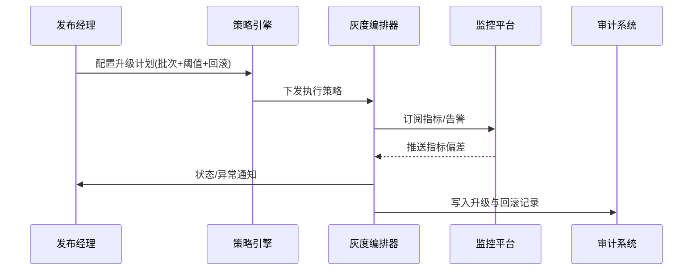

doc_id: UC-DEV-PLUGIN-VERSION-GRAY-001
scn_id: SCN-DEV-PLUGIN-VERSION-COMPAT-001
title: 策略化灰度升级与快速回滚
status: Draft
version: v0.1.0
repo_key: powerx
scope: powerx
layer: ops
domain: dev
scenario_title: "插件版本与兼容性管理主场景"
owners:
  - name: Matrix Ops
    role: Platform Ops Lead
    contact: ops@artisan-cloud.com
  - name: Alex Wei
    role: Release Automation Engineer
    contact: automation@artisan-cloud.com
contributors: []
linked_requirements:
  - SCN-DEV-PLUGIN-VERSION-GRAY-001
code_refs:
  - repo: powerx
    path: internal/version/upgrade/policy_engine.go
    description: 灰度策略解析、批次计划生成、阈值定义
  - repo: powerx
    path: internal/version/upgrade/orchestrator.go
    description: 升级批次执行、监控绑定、异常自动暂停
  - repo: powerx
    path: internal/version/upgrade/rollback_manager.go
    description: 回滚决策、执行脚本、审计同步
  - repo: powerx
    path: internal/version/upgrade/report_builder.go
    description: 升级总结报告、指标汇总、复盘模板
  - repo: powerx
    path: packages/cli/src/commands/version/upgrade.ts
    description: CLI 升级命令、状态追踪、人工接管入口
feature_flags:
  - plugin-upgrade-policy
  - plugin-gray-orchestrator
  - plugin-upgrade-rollback
optional: false
last_reviewed_at: 2025-11-20

---

# Usecase Overview

- **业务目标**：让运维团队根据策略化灰度流程升级插件，实时监控关键指标并在异常时自动或一键回滚，确保生产风险可控。
- **成功度量**：升级成功率 ≥98%；回滚触发后 3 分钟内恢复旧版本；灰度批次执行成功率 ≥95%；升级报告生成时间 ≤10 分钟。
- **场景关联**：支撑主场景 Stage 2，与版本扫描输出、兼容性校验协同形成完整发布链路。

> 通过可配置的灰度策略与回滚机制，发布经理可以在生产环境以最小风险完成插件版本升级。

# Context & Assumptions

- **前置条件**
  - Feature Flag `plugin-upgrade-policy`、`plugin-gray-orchestrator`、`plugin-upgrade-rollback` 已启用。
  - CI/CD 管道可提供已签名制品，监控平台、日志系统、告警渠道配置完毕。
  - 版本治理服务已生成升级建议并提供变更日志、兼容矩阵。
  - 运维团队对目标租户拥有升级与回滚权限，审批链已完成。
- **输入/输出**
  - 输入：升级计划（批次、时间窗口、指标阈值、回滚策略）、插件制品、监控模板。
  - 输出：升级执行状态、监控指标、回滚记录、升级总结报告、审计日志。
- **边界**
  - 不覆盖版本扫描、兼容性阻断或离线导入流程。
  - 不负责 Marketplace 上架与跨租户策略执行。

# Solution Blueprint

## 体系分解

| 层 | 主要组件/模块 | 责任 | 代码入口 |
|----|---------------|------|---------|
| 策略引擎层 | `internal/version/upgrade/policy_engine.go` | 解析灰度策略、生成批次计划、计算阈值 | `services/version/upgrade` |
| 编排执行层 | `internal/version/upgrade/orchestrator.go` | 执行批次升级、绑定监控、异常暂停与重试 | `services/version/upgrade` |
| 回滚管理层 | `internal/version/upgrade/rollback_manager.go` | 回滚策略评估、脚本执行、审计同步 | `services/version/upgrade` |
| 观测与报告层 | `internal/version/upgrade/report_builder.go` | 汇总指标、生成升级报告、复盘模板 | `services/version/upgrade` |
| CLI/控制台层 | `packages/cli/src/commands/version/upgrade.ts` | 触发升级、查看批次状态、人工接管与回滚 | `packages/cli` |

## 流程与时序

1. **Step 1 – 升级计划配置**：发布经理配置灰度批次、监控指标阈值、回滚策略与窗口。
2. **Step 2 – 灰度执行**：编排器按批次推送升级，实时采集指标、日志与用户反馈。
3. **Step 3 – 异常响应**：当指标越阈或人工暂停时自动回滚，通知相关团队并记录审计。
4. **Step 4 – 总结归档**：升级完成后生成报告，沉淀指标、回滚演练与审批信息。

# Contracts & Interfaces

- **Inbound APIs / Events**
  - `powerx plugin upgrade --strategy policy` — CLI/控制台触发升级。
  - `POST /internal/version/upgrade/plan` — 创建/更新升级计划。
  - `POST /internal/version/upgrade/rollback` — 触发回滚。
- **Outbound 调用**
  - `POST /internal/monitoring/subscribe` — 绑定监控指标与阈值。
  - `POST /internal/notify/version` — 推送升级状态、异常与回滚通知。
  - `POST /internal/audit/version` — 写入升级与回滚审计记录。
- **配置与脚本**
  - `config/version/upgrade_policies.yaml` — 策略参数、批次模板、阈值。
  - `config/monitoring/version_upgrade_dashboards.json` — 指标映射与仪表盘。
  - `scripts/workflows/version-upgrade-smoke.mjs` — 灰度升级冒烟脚本。

# Implementation Checklist

| 项目 | 描述 | 完成状态 | 负责人 |
|------|------|----------|--------|
| 策略引擎 | 支持多批次、比例、时间窗口与阈值配置 | [ ] | Matrix Ops |
| 灰度编排 | 实现批次执行、异常暂停、重试机制 | [ ] | Alex Wei |
| 自动回滚 | 回滚策略评估、执行脚本、通知与审计 | [ ] | Matrix Ops |
| 观测与报告 | 监控面板、报告生成、复盘模板 | [ ] | Alex Wei |
| CLI/控制台 | 状态展示、人工接管、审批令牌验证 | [ ] | Michael Hu |

# Testing Strategy

- **单元**：策略解析、批次调度、回滚决策、报告生成。
- **集成**：运行 `scripts/workflows/version-upgrade-smoke.mjs`，覆盖成功与异常路径，验证监控与通知。
- **端到端**：复现主场景子用例 B，确认灰度扩容、回滚触发与报告输出。
- **非功能**：多租户并发升级、长时间灰度、监控数据延迟与故障。

# Observability & Ops

- **指标**：`version.upgrade.success_rate`、`version.upgrade.batch_duration_minutes`、`version.rollback.duration_ms`、`version.upgrade.alert_total`、`version.upgrade.paused_total`。
- **日志**：记录批次、租户、指标偏差、回滚原因；敏感信息脱敏；保留 ≥365 天。
- **告警**：灰度错误率 >5%、回滚失败、监控缺失 >5 分钟、批次超时 >30 分钟。
- **Dashboards**：Upgrade Strategy Dashboard、Rollback Drill Monitor、`workflow-metrics.mjs`。

# Rollback & Failure Handling

- **回滚步骤**：触发自动/人工回滚至上一稳定版本，恢复旧配置、释放新版本资源并通知相关人员。
- **补救措施**：提供手动回滚入口、导出指标日志、触发复盘流程。
- **数据修复**：运行 `scripts/workflows/version-upgrade-reconcile.mjs` 对齐升级记录、回滚状态与审计日志。

# Follow-ups & Risks

| 风险/事项 | 影响 | 缓解方案 | 负责人 | ETA |
|-----------|------|----------|--------|-----|
| 第三方监控指标命名不一致 | 升级可观测性 | 建立指标映射、统一模板 | Alex Wei | 2025-12-14 |
| 回滚脚本缺乏多租户并发支持 | 回滚效率 | 扩展脚本、增加幂等控制 | Matrix Ops | 2025-12-20 |
| 人工接管流程缺少审批令牌 | 安全合规 | 集成审批系统、多因子校验 | Grace Lin | 2025-12-18 |

# References & Links

- 场景文档：`docs/scenarios/plugin-lifecycle/SCN-DEV-PLUGIN-VERSION-GRAY-001.md`
- 主场景：`docs/scenarios/plugin-lifecycle/SCN-DEV-PLUGIN-VERSION-COMPAT-001.md`
- 标准：`docs/standards/powerx-plugin/release/Upgrade_Playbook.md`
- 配置：`config/version/upgrade_policies.yaml`、`config/monitoring/version_upgrade_dashboards.json`
