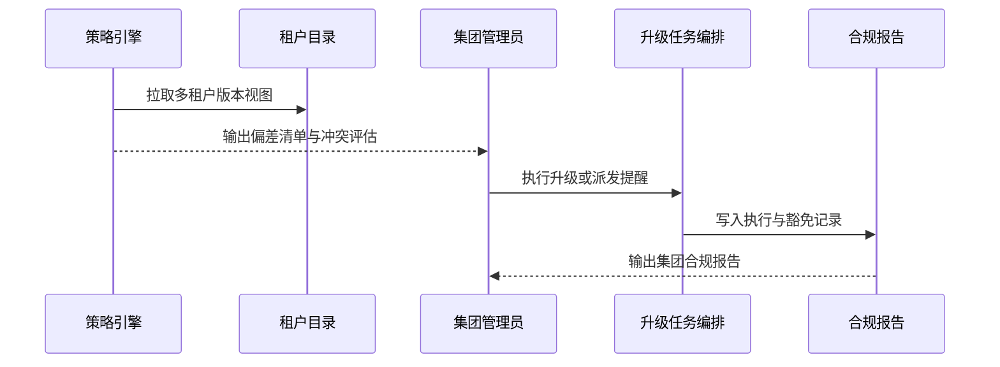

doc_id: UC-DEV-PLUGIN-VERSION-MULTI-TENANT-001
scn_id: SCN-DEV-PLUGIN-VERSION-COMPAT-001
title: 跨租户版本一致性治理（可选）
status: Draft
version: v0.1.0
repo_key: powerx
scope: powerx
layer: ops
domain: dev
scenario_title: "插件版本与兼容性管理主场景"
owners:
  - name: Matrix Ops
    role: Platform Ops Lead
    contact: ops@artisan-cloud.com
  - name: Erin Xu
    role: Enterprise Tenant Admin Lead
    contact: admin@artisan-cloud.com
contributors: []
linked_requirements:
  - SCN-DEV-PLUGIN-VERSION-MULTI-TENANT-001
code_refs:
  - repo: powerx
    path: internal/version/governance/snapshot_aggregator.go
    description: 聚合多租户插件版本视图、生成基线快照
  - repo: powerx
    path: internal/version/governance/policy_enforcer.go
    description: 策略评估、冲突检测、任务编排
  - repo: powerx
    path: internal/version/governance/tenant_task_runner.go
    description: 偏差租户升级任务、通知、SLA 跟踪
  - repo: powerx
    path: internal/audit/version/policy_reporter.go
    description: 集团合规报告导出、豁免记录、审计留痕
  - repo: powerx
    path: packages/cli/src/commands/version/policy.ts
    description: 集团策略 CLI 命令、模拟评估、执行监控
feature_flags:
  - plugin-multi-tenant-sync
  - plugin-version-governance
optional: true
last_reviewed_at: 2025-11-20

---

# Usecase Overview

- **业务目标**：帮助集团管理员在多租户环境下统筹插件版本，自动识别偏差租户、执行对齐任务或发出提醒，最终输出合规报告并可追溯执行轨迹。
- **成功度量**：偏差检测延迟 <10 分钟；策略执行成功率 ≥95%；冲突模拟准确率 ≥98%；合规报告生成 ≤10 分钟且覆盖全部租户。
- **场景关联**：支撑主场景 Stage 4，可与版本扫描和灰度升级协作，实现集团维度的版本治理闭环。

> 借助集中化的版本策略，集团可在保障租户隔离的前提下保持核心插件一致，减少协作阻碍与合规风险。

# Context & Assumptions

- **前置条件**
  - Feature Flag `plugin-multi-tenant-sync`、`plugin-version-governance` 已启用。
  - 集团级租户目录可提供租户清单、权限与策略基线。
  - 版本治理服务已持久化每个租户的插件 Manifest 与最近升级记录。
  - 通知与审计系统支持企业通讯录、IM 通道、报告归档。
- **输入/输出**
  - 输入：目标插件列表、策略定义（基线版本、豁免租户、冲突规则）、租户版本快照。
  - 输出：偏差清单、升级任务/提醒、策略冲突报告、集团合规报告、审计记录。
- **边界**
  - 不负责单租户灰度升级细节（由灰度用例涵盖）。
  - 不处理离线包分发或 Marketplace 审核。

# Solution Blueprint

## 体系分解

| 层 | 主要组件/模块 | 责任 | 代码入口 |
|----|---------------|------|---------|
| 数据聚合层 | `internal/version/governance/snapshot_aggregator.go` | 汇总租户插件版本、生成基线快照、检测漂移 | `services/version/governance` |
| 策略执行层 | `internal/version/governance/policy_enforcer.go` | 应用策略、冲突模拟、生成执行计划 | `services/version/governance` |
| 任务编排层 | `internal/version/governance/tenant_task_runner.go` | 针对偏差租户触发升级任务或提醒、跟踪进度 | `services/version/governance` |
| 报告与审计层 | `internal/audit/version/policy_reporter.go` | 输出集团合规报告、记录豁免与执行结果 | `services/audit/version` |
| 工具支撑层 | `packages/cli/src/commands/version/policy.ts` | CLI/控制台策略维护、模拟评估、执行监控 | `packages/cli` |

## 流程与时序

1. **Step 1 – 版本快照与偏差检测**：定时或人工触发，汇总集团租户插件版本，与策略基线对比并生成偏差列表。
2. **Step 2 – 策略评估与冲突模拟**：对偏差租户运行策略评估，检查是否与豁免或其他策略冲突，并输出建议动作。
3. **Step 3 – 执行与通知**：自动为可执行租户发起升级任务或发送提醒；无法自动执行的呈现给管理员处理。
4. **Step 4 – 报告与复盘**：生成集团合规报告，记录执行结果、未完成项与后续计划，并写入审计。

# Contracts & Interfaces

- **Inbound APIs / Events**
  - `POST /internal/version/governance/snapshot` — 生成集团版本快照。
  - `POST /internal/version/policy/enforce` — 执行策略并返回执行计划。
- **Outbound 调用**
  - `POST /internal/notify/version` — 通知偏差租户管理员与集团负责人。
  - `POST /internal/version/upgrade/plan` — 为偏差租户创建升级计划。
  - `POST /internal/audit/version` — 写入策略执行、豁免与冲突记录。
- **配置与脚本**
  - `config/version/multi_tenant_baselines.yaml` — 策略基线、豁免列表、SLA。
  - `config/version/policy_profiles.yaml` — 策略模板、权重、通知设置。
  - `scripts/workflows/version-policy-sync.mjs` — 多租户策略同步脚本。

# Implementation Checklist

| 项目 | 描述 | 完成状态 | 负责人 |
|------|------|----------|--------|
| 版本快照 | 构建多租户快照与差异检测、支持增量更新 | [ ] | Matrix Ops |
| 策略引擎 | 支持冲突模拟、豁免处理、优先级队列 | [ ] | Matrix Ops |
| 升级任务 | 对接升级编排器、跟踪状态、回写结果 | [ ] | Alex Wei |
| 通知与报告 | 集团通知模板、合规报告导出、豁免备案 | [ ] | Erin Xu |
| CLI/控制台 | 策略管理界面、模拟评估、执行监控 | [ ] | Michael Hu |

# Testing Strategy

- **单元**：快照生成、策略冲突模拟、任务编排状态机、报告生成。
- **集成**：运行 `scripts/workflows/version-policy-sync.mjs`，验证偏差检测、冲突处理、升级任务与通知链路。
- **端到端**：复现主场景用例 D-1/D-2，验证偏差修复、冲突报告、豁免处理。
- **非功能**：大规模租户数据处理性能、并发策略执行、通知风暴防护。

# Observability & Ops

- **指标**：`version.policy.drift_total`、`version.policy.enforced_total`、`version.policy.conflict_total`、`version.policy.compliance_rate`。
- **日志**：记录租户、策略、目标版本、执行决定、豁免原因，脱敏后存储 ≥365 天。
- **告警**：偏差未在 SLA 内关闭、策略执行失败、冲突率异常升高、报告生成失败。
- **Dashboards**：Group Version Compliance Dashboard、Policy Conflict Monitor、`workflow-metrics.mjs`。

# Rollback & Failure Handling

- **回滚步骤**：暂停策略执行、撤销待处理任务、恢复上一版本快照；通知集团管理员重新评估。
- **补救措施**：提供手动修复入口、重新生成偏差清单、支持人工确认冲突解决路径。
- **数据修复**：运行 `scripts/workflows/version-policy-reconcile.mjs` 对齐快照、策略执行与审计数据。

# Follow-ups & Risks

| 风险/事项 | 影响 | 缓解方案 | 负责人 | ETA |
|-----------|------|----------|--------|-----|
| 多策略冲突处理复杂 | 策略执行效率 | 提供冲突模拟与优先级调度工具 | Matrix Ops | 2025-12-22 |
| 集团通知链路多样 | 协作效率 | 对接企业通讯录与 IM 平台，支持批量提醒 | Erin Xu | 2025-12-18 |
| 租户隐私与隔离 | 合规风险 | 严控可见范围，采用掩码或聚合展示 | Grace Lin | 2025-12-15 |

# References & Links

- 场景文档：`docs/scenarios/plugin-lifecycle/SCN-DEV-PLUGIN-VERSION-MULTI-TENANT-001.md`
- 主场景：`docs/scenarios/plugin-lifecycle/SCN-DEV-PLUGIN-VERSION-COMPAT-001.md`
- 标准：`docs/standards/powerx-plugin/release/Group_Governance_Guide.md`
- 配置：`config/version/multi_tenant_baselines.yaml`、`config/version/policy_profiles.yaml`
