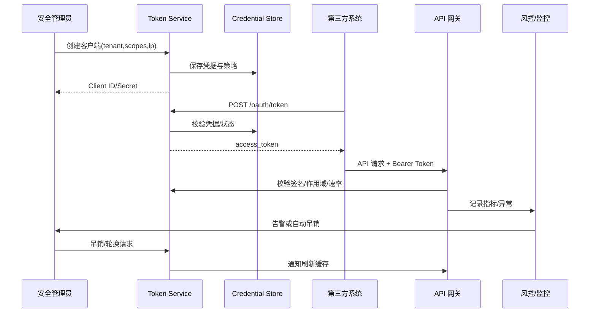

scn_id: SCN-IAM-LOGIN-API-TOKEN-001
title: 第三方系统 API Token 接入
status: Draft
version: v0.1.0
owners:
  - name: Li Wei
    role: IAM Product Lead
    contact: iam@artisan-cloud.com
  - name: Matrix Ops
    role: Platform Ops Lead
    contact: ops@artisan-cloud.com
domains: [iam]
layers: [service]
repos:
  - key: powerx
    scope: core-platform
    responsibility: 客户端凭据管理、Token 签发与吊销
  - key: powerx-gateway
    scope: edge
    responsibility: 网关认证、作用域校验、速率限制
  - key: powerx-risk
    scope: governance
    responsibility: 异常调用检测、告警联动
related_usecases: []
last_reviewed_at: 2025-10-30

---

# Executive Summary

该子场景定义第三方系统通过 Client Credentials/OAuth2 模式访问 PowerX API 的完整链路，覆盖凭据签发、Token 交换、网关校验与异常吊销。目标是在保证安全隔离的前提下，让受信任调用稳定返回 2xx，越权或异常请求在 1 分钟内阻断并记录审计/告警。

# Scope & Guardrails

- **In Scope**：客户端凭据生命周期管理、Token 交换、作用域与 IP 白名单校验、速率限制、异常吊销流程。
- **Out of Scope**：终端用户的会话管理、插件内部接口授权、异步回调签名。
- **Environment & Flags**：需启用 `iam-api-token`、`gateway-rate-limit`、`iam-token-auto-rotate` 与 `audit-streaming`；要求 API 网关具备 TLS 终端、风控引擎订阅异常事件。

# Participants & Responsibilities

| Scope | Repository | Layer | 责任与交付物 | Owners |
|-------|------------|-------|--------------|--------|
| core-platform | powerx | service | 客户端凭据 API、Token 签发/续签/吊销、审计记录 | Li Wei（IAM Product Lead / iam@artisan-cloud.com） |
| edge | powerx-gateway | service | Bearer Token 校验、作用域/速率/IP 控制、调用日志 | Matrix Ops（Platform Ops Lead / ops@artisan-cloud.com） |
| governance | powerx-risk | service | 异常调用检测、告警推送、自动吊销建议 | Matrix Ops（Platform Ops Lead / ops@artisan-cloud.com） |

# End-to-End Flow

1. **Step 1 – 客户端登记**：安全管理员在集成管理控制台创建客户端，配置租户、作用域、IP 白名单、有效期。
2. **Step 2 – Token 交换**：第三方服务通过 Client Credentials 获取 Access Token，系统对凭据、IP、租户状态进行校验。
3. **Step 3 – 网关授权**：业务调用携带 Bearer Token；网关校验签名、有效期、作用域、速率限制后转发。
4. **Step 4 – 审计与监控**：成功/失败调用写入审计与指标；越权、速率超限、黑名单命中生成异常事件。
5. **Step 5 – 吊销与轮换**：管理员或风控触发吊销，网关实时更新缓存；定时任务执行密钥轮换并通知集成方。

# Key Interactions & Contracts

- `POST /internal/auth/clients` — 创建客户端，必填字段：`name`, `tenant_uuid`, `scopes[]`, `ip_whitelist[]`, `expires_in_hours`。
- `POST /oauth/token` — Client Credentials 交换接口，返回 `access_token`, `token_type`, `expires_in`, `scope`。
- `DELETE /internal/auth/clients/{id}` — 吊销客户端；网关通过事件订阅刷新缓存。
- `POST /internal/auth/clients/{id}/rotate` — Secret 轮换，提供新旧并行窗口。
- `EVENT security.token.anomaly` — 越权、黑名单或速率异常事件，字段含 `client_id`, `tenant_uuid`, `error_code`, `count`。

# Usecase Links

- `SCN-IAM-LOGIN-AUTH-001` — 主场景 Stage 2，描述与 SSO/MFA 的交互依赖。
- QA 校验参见 `docs/meta/scenarios/powerx/core-platform/iam-rbac/login-and-auth/primary.md` 中 B 类用例。

# Acceptance Criteria

1. **用例 B-1（正向）**：配置合法作用域与 IP 后，`GET /api/contacts` 返回 200 并记录调用审计，令牌剩余有效期可在控制台查询。
2. **用例 B-2（逆向）**：使用作用域不足的 Token 调用写操作，返回 403 `insufficient_scope`，异常事件进入告警中心。
3. 每次 Secret 轮换须在 5 分钟内同步网关缓存，并通知所有集成联系人，避免旧 Secret 长期有效。

# Telemetry & Ops

- 指标：`auth.token.issued_total`、`auth.token.revoked_total`、`gateway.api.success_total`、`gateway.api.forbidden_total`、`gateway.api.rate_limit_reject_total`。
- 告警阈值：越权请求 ≥10 次/5 分钟触发 PagerDuty；Token 续签失败率 >5% 推送 Slack；速率限制命中率高于基线 2 倍时自动创建工单。
- 观测来源：Grafana `API Gateway / Auth`, Datadog `gateway.auth-*`, `reports/iam/auth-security-dashboard`。

# Open Issues & Follow-ups

| 风险/事项 | 影响范围 | 负责人 | ETA |
|-----------|----------|--------|-----|
| IP 白名单维护缺少自动化校验，易遗忘更新 | 访问控制准确性 | Li Wei | 2025-11-08 |
| 网关缓存刷新延迟导致吊销滞后 | 安全响应 | Matrix Ops | 2025-11-15 |

# Appendix

- 《PowerX API 集成指南》最新章节：客户端凭据策略。
- 运维脚本：`scripts/ops/token-rotation.sh`、`scripts/ops/revoke-token.sh`。
- 告警工作流模板：`ops/runbooks/api-token-incident.md`。
