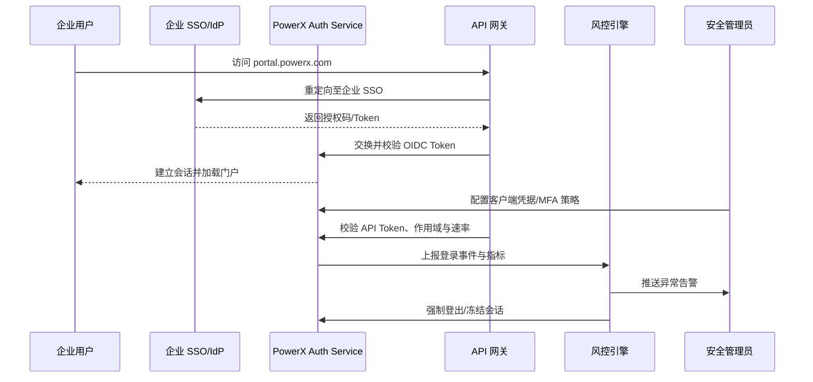

scn_id: SCN-IAM-LOGIN-AUTH-001
title: PowerX 登录与认证
status: Draft
version: v0.1.0
owners:
  - name: Li Wei
    role: IAM Product Lead
    contact: iam@artisan-cloud.com
  - name: Matrix Ops
    role: Platform Ops Lead
    contact: ops@artisan-cloud.com
domains: [iam]
layers: [service, security]
repos:
  - key: powerx
    scope: core-platform
    responsibility: 登录服务、OIDC/SAML 集成、会话管理、审计落库
  - key: powerx-gateway
    scope: edge
    responsibility: API 网关认证、Token 校验、速率限制与观测
  - key: powerx-risk
    scope: governance
    responsibility: 风险引擎、异常告警、会话强制下线
related_usecases:
  - doc_id: SCN-IAM-LOGIN-SSO-001
    layer: service
    domain: iam
  - doc_id: SCN-IAM-LOGIN-API-TOKEN-001
    layer: service
    domain: iam
  - doc_id: SCN-IAM-LOGIN-MFA-001
    layer: service
    domain: iam
  - doc_id: SCN-IAM-LOGIN-RISK-001
    layer: service
    domain: iam
last_reviewed_at: 2025-10-30

---

# Executive Summary

PowerX 核心平台需要提供统一、可信、可观察的登录与认证体验，既要满足企业终端用户的便捷访问，也要支撑第三方系统调用与安全管理员的风控治理需求。场景覆盖企业 SSO 单点登录、API Token 接入、多因子认证策略及异常登录自动响应，目标是在统一入口下实现身份可信、权限可控、异常可回滚，并把审计、监控、告警串联成闭环。

# Scope & Guardrails

- **In Scope**：
  - 企业 SSO/OIDC/SAML 登录流程、会话管理与门户加载；
  - 第三方系统的 API Token 生命周期管理、作用域与网关校验；
  - 敏感操作的 MFA 策略配置、绑定、验证与审计留痕；
  - 登录行为风险识别、告警推送、会话强制下线与策略回滚；
  - 登录链路的审计、指标、告警与运维 Runbook。
- **Out of Scope**：
  - 插件内部细粒度权限与授权模型（见《SCN-IAM-USER-ROLE-001》）；
  - 设备合规、MDM、零信任网络访问策略；
  - 计费或 License 校验逻辑。
- **Environment & Flags**：
  - `iam-login-sso-v2`（统一 SSO/OIDC 网关）、`iam-api-token`（客户端凭据管理）、`iam-mfa-policy`、`iam-risk-engine`；
  - 依赖企业 IdP、PowerX API 网关、审计事件总线、通知服务、风险策略平台与指标采集脚本。

# Participants & Responsibilities

| Scope | Repository | Layer | 责任与交付物 | Owners |
|-------|------------|-------|--------------|--------|
| core-platform | powerx | service | 登录/认证服务、IdP 集成、会话与审计接口 | Li Wei（IAM Product Lead / iam@artisan-cloud.com） |
| edge | powerx-gateway | infra | API 网关认证、Token 校验、速率限制、观测数据 | Matrix Ops（Platform Ops Lead / ops@artisan-cloud.com） |
| governance | powerx-risk | service | 风控策略配置、异常识别、告警与会话处置编排 | Matrix Ops（Platform Ops Lead / ops@artisan-cloud.com） |
| automation | powerx | ops | Token 生命周期自动化、告警工单与 Runbook | Matrix Ops（Platform Ops Lead / ops@artisan-cloud.com） |

# End-to-End Flow

1. **Stage 1 – 企业 SSO 登录门户**：终端用户访问 PowerX 门户，经由企业 SSO 完成授权码流程，平台验证 Token 并生成受控会话。
2. **Stage 2 – 第三方 API Token 接入**：安全管理员为合作系统签发客户端凭据，网关按租户、作用域与速率限制校验调用。
3. **Stage 3 – MFA 保护敏感插件**：管理员为高风险插件启用 MFA，用户绑定设备、验证通过后才能执行敏感操作。
4. **Stage 4 – 异常登录检测与响应**：风控引擎监控登录行为，命中规则即推送告警、强制登出并支持误报回滚。

# Key Interactions & Contracts

- `GET /auth/sso/redirect` / `GET /auth/sso/callback` — 统一入口，对接企业 SSO 授权码流程。
- `POST /auth/token` — Exchange 授权码为 Access/ID Token，校验租户、签名、Nonce。
- `POST /api/auth/client-credentials` — 签发客户端凭据，支持租户作用域与 IP 白名单。
- `POST /oauth/token`（Client Credentials）— 第三方系统换取访问 Token。
- `GET/POST /api/*` — 网关对业务 API 进行 Token 校验、作用域检查与速率限制。
- `POST /auth/mfa/enroll`、`POST /auth/mfa/verify` — MFA 绑定与验证接口，返回状态与审计 ID。
- `EVENT security.login.detected`、`EVENT security.login.blocked` — 风控事件流，包含风险评分、会话 ID、处置动作。
- `POST /internal/sessions/force-logout` — 强制终止会话、触发通知。

# Usecase Links

- `SCN-IAM-LOGIN-SSO-001` — Stage 1：企业 SSO 登录门户。
- `SCN-IAM-LOGIN-API-TOKEN-001` — Stage 2：第三方系统 API Token 接入。
- `SCN-IAM-LOGIN-MFA-001` — Stage 3：敏感插件多因子认证守护。
- `SCN-IAM-LOGIN-RISK-001` — Stage 4：异常登录检测与处置。

# Acceptance Criteria

1. SSO 登录成功率 ≥ 99%，平均认证耗时（端到端） ≤ 3 秒，失败原因记录覆盖率 100%。
2. API Token 调用受控：合法请求 2xx 占比 ≥ 98%，越权/速率异常事件在 1 分钟内告警并支持自动吊销。
3. MFA 与风险处置可追溯：敏感插件访问前置 MFA 校验成功率 ≥ 97%，高危登录在 60 秒内完成告警与会话处置，可在审计中完整检索。

# Telemetry & Ops

- 指标：`auth.sso.success_rate`、`auth.sso.latency_p95`、`auth.api_token.success_total`、`auth.mfa.verification_success`、`auth.risk.forced_logout_total`。
- 告警阈值：SSO 失败率 >3%/5 分钟、API Token 403 超过基线 2 倍、MFA 连续失败 3 次/用户、风险处置耗时 >60 秒。
- 观测来源：Grafana `IAM / Login Overview`、Datadog `auth-*` 指标、`reports/iam/auth-security-dashboard`、`node scripts/qa/workflow-metrics.mjs` 周期报告。

# Open Issues & Follow-ups

| 风险/事项 | 影响范围 | 负责人 | ETA |
|-----------|----------|--------|-----|
| 新增硬件 Key 支持的 MFA 流程尚未完成功能开关与演练 | MFA 绑定/验证 | Li Wei | 2025-11-10 |
| 风控引擎与外部 SIEM 的事件字段映射未统一，影响跨系统追溯 | 风险告警与审计 | Matrix Ops | 2025-11-18 |

# Appendix

- `docs/meta/scenarios/powerx/core-platform/iam-rbac/login-and-auth/primary.md` — 需求背景与子场景原始分析。
- 安全策略设计草案（Confluence：IAM-Login-Security-Blueprint）。
- Runbook：`ops/runbooks/auth-anomaly-response.md`（待更新硬件 Key 支持）。
