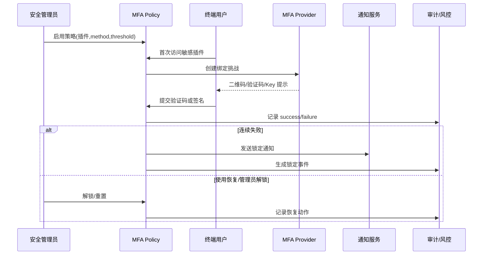

scn_id: SCN-IAM-LOGIN-MFA-001
title: 敏感插件多因子认证守护
status: Draft
version: v0.1.0
owners:
  - name: Li Wei
    role: IAM Product Lead
    contact: iam@artisan-cloud.com
  - name: Matrix Ops
    role: Platform Ops Lead
    contact: ops@artisan-cloud.com
domains: [iam]
layers: [service]
repos:
  - key: powerx
    scope: core-platform
    responsibility: MFA 策略配置、绑定流程、验证服务
  - key: powerx-risk
    scope: governance
    responsibility: 锁定策略、误报回滚、审计联动
  - key: powerx-notify
    scope: service
    responsibility: 验证码发送、锁定通知、审批提醒
related_usecases: []
last_reviewed_at: 2025-10-30

---

# Executive Summary

该子场景保障访问财务、安全等敏感插件时的多因子认证体验，涵盖策略启用、用户绑定、验证执行、锁定告警与恢复路径。目标是让敏感操作前置 MFA 校验成功率 ≥97%，同时确保锁定事件可审计、可快速解锁并具备备用验证方案。

# Scope & Guardrails

- **In Scope**：按租户/插件/操作粒度配置 MFA、绑定与验证流程、锁定与恢复策略、通知/审计闭环。
- **Out of Scope**：终端设备管理（如 MDM）、非敏感操作的提示性验证、硬件 Key 采购与发放流程。
- **Environment & Flags**：需启用 `iam-mfa-policy`、`iam-mfa-recovery`、`notify-transactional`、`audit-streaming`；要求通知渠道（短信/邮件/推送）与审计事件总线可用。

# Participants & Responsibilities

| Scope | Repository | Layer | 责任与交付物 | Owners |
|-------|------------|-------|--------------|--------|
| core-platform | powerx | service | MFA 策略 CRUD、绑定流程、验证 API、恢复码管理 | Li Wei（IAM Product Lead / iam@artisan-cloud.com） |
| governance | powerx-risk | service | 锁定阈值策略、误报回滚、风控审计 | Matrix Ops（Platform Ops Lead / ops@artisan-cloud.com） |
| notifications | powerx-notify | service | 验证码下发、锁定/解锁通知、审批提醒 | Matrix Ops（Platform Ops Lead / ops@artisan-cloud.com） |

# End-to-End Flow

1. **Step 1 – 策略启用**：安全管理员在控制台为敏感插件启用 MFA，配置验证方式、失败阈值、备用方案。
2. **Step 2 – 首次绑定**：用户首次访问敏感插件时进入绑定流程，生成 TOTP/短信验证码或注册硬件 Key，并保存恢复码。
3. **Step 3 – 二次验证**：后续访问敏感操作时触发验证，通过后才可继续；失败计数记录在租户维度。
4. **Step 4 – 锁定与告警**：连续失败达阈值触发锁定、通知用户与管理员，并在风控控制台创建事件。
5. **Step 5 – 恢复与审计**：管理员审批重置或用户使用恢复码解锁，审计事件记录起止时间与处理人。

# Key Interactions & Contracts

- `POST /internal/security/mfa/policies` — 配置策略，字段含 `plugin`, `operations[]`, `methods[]`, `fail_threshold`, `grace_period_minutes`。
- `POST /auth/mfa/enroll` — 生成绑定挑战，返回二维码、秘密种子或 WebAuthn Challenge。
- `POST /auth/mfa/verify` — 提交验证码/签名，校验通过后返回 `verification_id`。
- `POST /internal/security/mfa/lock` / `unlock` — 锁定或解锁用户对敏感插件的访问。
- `EVENT security.mfa.assigned/verified/locked/recovered` — 审计事件，落地到日志与风控平台。

# Usecase Links

- `SCN-IAM-LOGIN-AUTH-001` — 主场景 Stage 3 的安全控制补充。
- QA 覆盖用例：`docs/meta/scenarios/powerx/core-platform/iam-rbac/login-and-auth/primary.md` 中 C 类用例。

# Acceptance Criteria

1. **用例 C-1（正向）**：用户在首次访问财务插件时 1 分钟内完成 TOTP 绑定与验证，验证成功后允许继续操作并写入审计。
2. **用例 C-2（逆向）**：同一用户 5 分钟内连续失败 3 次被锁定 10 分钟，门户提示锁定信息并向用户与安全管理员发送通知。
3. 管理员重置或用户使用恢复码后，锁定状态立刻解除且审计记录包含操作人与时间戳。

# Telemetry & Ops

- 指标：`auth.mfa.enroll_success_total`、`auth.mfa.verify_success_total`、`auth.mfa.verify_fail_total`、`auth.mfa.locked_total`、`auth.mfa.reset_total`。
- 告警阈值：MFA 验证失败率 >5%/5 分钟触发 PagerDuty；锁定事件 >5 次/租户/10 分钟推送 Slack；绑定耗时 P95 > 60 秒生成运维工单。
- 观测来源：Grafana `IAM / MFA Overview`、Datadog `auth-mfa-*`、`reports/iam/auth-security-dashboard`、审计事件聚合。

# Open Issues & Follow-ups

| 风险/事项 | 影响范围 | 负责人 | ETA |
|-----------|----------|--------|-----|
| 海外短信通道延迟导致验证超时 | 验证成功率 | Matrix Ops | 2025-11-20 |
| 硬件 Key 支持尚未完成灰度，需补充测试矩阵 | 绑定覆盖率 | Li Wei | 2025-11-12 |

# Appendix

- 策略配置指南：`docs/standards/security/mfa-policy-guide.md`（需更新硬件 Key 章节）。
- 运维手册：`ops/runbooks/mfa-lock-reset.md`。
- 监控脚本：`scripts/qa/workflow-metrics.mjs --module mfa`。
