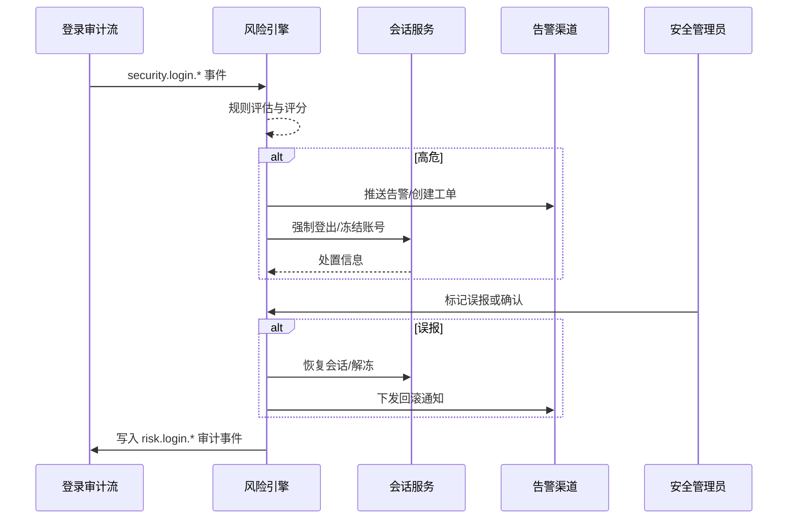

scn_id: SCN-IAM-LOGIN-RISK-001
title: 异常登录检测与处置
status: Draft
version: v0.1.0
owners:
  - name: Li Wei
    role: IAM Product Lead
    contact: iam@artisan-cloud.com
  - name: Matrix Ops
    role: Platform Ops Lead
    contact: ops@artisan-cloud.com
domains: [iam]
layers: [service]
repos:
  - key: powerx
    scope: core-platform
    responsibility: 审计事件输出、会话管理、冻结接口
  - key: powerx-risk
    scope: governance
    responsibility: 风险规则、告警编排、回滚策略
  - key: powerx-notify
    scope: service
    responsibility: 告警通知、工单集成、用户告知
related_usecases: []
last_reviewed_at: 2025-10-30

---

# Executive Summary

该子场景覆盖登录行为的风险识别、告警推送、会话强制登出与误报回滚。通过实时分析登录审计事件、设备指纹与地理位置，风险引擎在 60 秒内完成处置动作，同时保留审计链路和策略调整能力，确保平台在面对暴力破解、异地秒登等威胁时仍可快速恢复。

# Scope & Guardrails

- **In Scope**：风险规则配置、事件评分、告警与工单生成、会话强制登出/冻结、误报回滚、策略调优。
- **Out of Scope**：根因调查、第三方情报同步策略、账户生命周期管理（交由 IAM 用户管理场景）。
- **Environment & Flags**：需启用 `iam-risk-engine`、`auth-session-hardening`、`notify-transactional`、`audit-streaming`；要求风险引擎可访问登录审计事件流与黑名单库。

# Participants & Responsibilities

| Scope | Repository | Layer | 责任与交付物 | Owners |
|-------|------------|-------|--------------|--------|
| core-platform | powerx | service | 登录审计事件、会话强制登出/冻结接口、回滚 API | Li Wei（IAM Product Lead / iam@artisan-cloud.com） |
| governance | powerx-risk | service | 风险规则执行、告警编排、回滚策略、指标出具 | Matrix Ops（Platform Ops Lead / ops@artisan-cloud.com） |
| notifications | powerx-notify | service | 告警通知、PagerDuty/Slack 集成、工单自动化 | Matrix Ops（Platform Ops Lead / ops@artisan-cloud.com） |

# End-to-End Flow

1. **Step 1 – 数据接入**：风险引擎消费 `security.login.*` 审计事件，构建地理、设备、失败次数等上下文。
2. **Step 2 – 风险评估**：执行异地秒登、暴力破解、黑名单 IP、异常速率等规则，给出风险评分与处置建议。
3. **Step 3 – 告警与处置**：高危事件触发 PagerDuty/Slack 告警，同时调用会话服务强制登出或冻结账号。
4. **Step 4 – 复盘与回滚**：安全管理员在告警中心确认是否误报；误报触发自动回滚并调整阈值。
5. **Step 5 – 报告与指标**：生成事件报告、更新风险指标，供合规与运维复盘。

# Key Interactions & Contracts

- `EVENT security.login.detected` — 风险评估输入，字段含 `tenant_id`, `user_id`, `session_id`, `ip`, `geo`, `device`, `result`, `latency_ms`。
- `POST /internal/risk/login/incidents` — 手动创建或重放风险事件，便于调试。
- `POST /internal/risk/login/incidents/{id}/ack` — 管理员确认高危事件（`status=confirmed|false_positive`）。
- `POST /internal/risk/login/incidents/{id}/rollback` — 触发会话恢复、账号解冻、阈值调优。
- `POST /internal/sessions/force-logout`、`POST /internal/users/{id}/freeze` — 处置动作接口。
- `EVENT security.login.blocked` / `security.login.rollback` — 输出到审计与 SIEM，包含处置动作与耗时。

# Usecase Links

- `SCN-IAM-LOGIN-AUTH-001` — 主场景 Stage 4，依赖 SSO/MFA 输送的审计与会话信息。
- QA 覆盖用例：`docs/meta/scenarios/powerx/core-platform/iam-rbac/login-and-auth/primary.md` 中 D 类用例。

# Acceptance Criteria

1. **用例 D-1（正向）**：同一账号在 5 分钟内出现异地登录，风险引擎 60 秒内生成高危告警，强制登出相关会话并冻结账号 30 分钟。
2. **用例 D-2（逆向/误报）**：管理员标记误报后，账号立即恢复、历史会话不再强制下线，策略进入观察模式并记录回滚审计。
3. 风险事件处理链路需保留完整 TraceID，可在 SIEM 中关联到具体租户与操作人。

# Telemetry & Ops

- 指标：`risk.login.high_risk_total`、`risk.login.false_positive_total`、`risk.login.response_latency_p95`、`risk.login.forced_logout_total`、`risk.login.rollback_total`。
- 告警阈值：风险事件积压 >100 条或处理耗时 >60 秒触发 PagerDuty；误报率 >5% 触发安全评审；冻结失败率 >1% 推送 Slack。
- 观测来源：Grafana `IAM / Risk Login`、Datadog `risk-login-*`, `reports/iam/auth-security-dashboard`、SIEM 风控面板。

# Open Issues & Follow-ups

| 风险/事项 | 影响范围 | 负责人 | ETA |
|-----------|----------|--------|-----|
| 外部 SIEM 字段映射未统一，导致跨系统追踪困难 | 合规审计 | Matrix Ops | 2025-11-18 |
| 风险规则缺少灰度发布与自动调优能力 | 运营效率 | Li Wei | 2025-11-25 |

# Appendix

- 风控策略配置文档：`docs/standards/security/login-risk-rules.md`。
- 回滚操作指南：`ops/runbooks/login-risk-rollback.md`。
- 指标采集脚本：`scripts/qa/workflow-metrics.mjs --module risk`.
