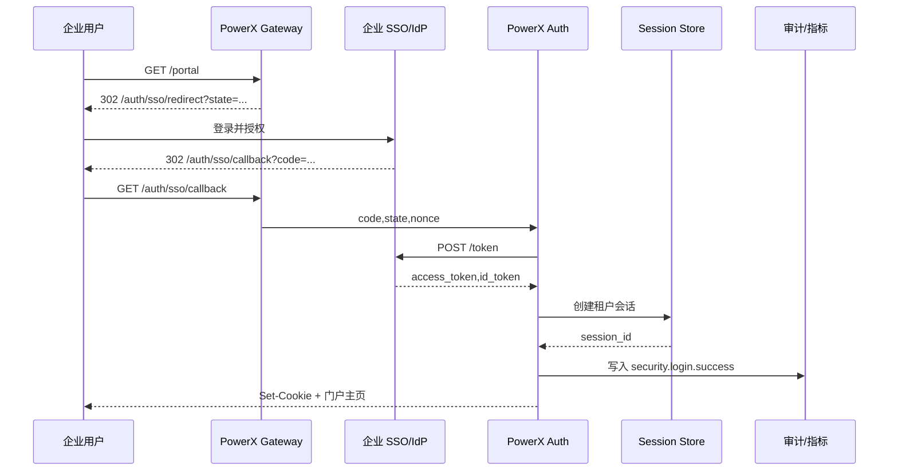

scn_id: SCN-IAM-LOGIN-SSO-001
title: 企业 SSO 登录统一门户
status: Draft
version: v0.1.0
owners:
  - name: Li Wei
    role: IAM Product Lead
    contact: iam@artisan-cloud.com
  - name: Matrix Ops
    role: Platform Ops Lead
    contact: ops@artisan-cloud.com
domains: [iam]
layers: [service]
repos:
  - key: powerx
    scope: core-platform
    responsibility: Auth 服务、会话管理、审计落库
  - key: powerx-gateway
    scope: edge
    responsibility: 门户重定向、OIDC 回调、速率保护
related_usecases: []
last_reviewed_at: 2025-10-30

---

# Executive Summary

该子场景聚焦企业终端用户通过公司 SSO/OIDC 登录 PowerX 统一门户的全链路体验，涵盖 Redirect、授权码交换、会话生成与审计回写。目标是在不牺牲安全性的前提下，将端到端登录耗时控制在 3 秒以内，并完整记录租户、设备、地理信息，以便后续风控与运维使用。

# Scope & Guardrails

- **In Scope**：门户入口跳转、授权码/断言校验、会话生成、租户隔离、审计与监控、失败兜底页。
- **Out of Scope**：本地账号登录、自助注册流程、插件级权限加载、异常登录处置（由风控子场景承担）。
- **Environment & Flags**：需启用 `iam-login-sso-v2`、`auth-session-hardening`、`audit-streaming`；要求企业 IdP 已配置回调域名与证书，Redis/SessionStore 具备高可用。

# Participants & Responsibilities

| Scope | Repository | Layer | 责任与交付物 | Owners |
|-------|------------|-------|--------------|--------|
| core-platform | powerx | service | OIDC/SAML 处理、Token 验签、会话与审计事件 | Li Wei（IAM Product Lead / iam@artisan-cloud.com） |
| edge | powerx-gateway | service | 门户路由、Redirect/Callback 管理、速率限制 | Matrix Ops（Platform Ops Lead / ops@artisan-cloud.com） |
| integrations | powerx | service | IdP 客户端配置、证书轮换、租户信任管理 | Li Wei（IAM Product Lead / iam@artisan-cloud.com） |

# End-to-End Flow

1. **Step 1 – 门户访问**：用户访问 `https://portal.powerx.com`，网关根据租户判定重定向目标并生成 `state`、`nonce`。
2. **Step 2 – IdP 授权**：用户在企业 SSO 页面完成凭据输入或无感登录，IdP 返回授权码或 SAML 断言。
3. **Step 3 – Token 交换与校验**：PowerX Auth 服务调用 IdP Token 端点，校验签名、租户绑定、过期时间与 `nonce`。
4. **Step 4 – 会话建立与首屏加载**：会话服务写入 Session Store，返回门户配置、插件列表，并记录审计与指标。
5. **Step 5 – 失败兜底与告警**：遇到租户冻结、用户禁用或 Token 校验失败，跳转提示页并触发告警。

# Key Interactions & Contracts

- `GET /auth/sso/redirect` — 生成 `state`、`nonce` 并缓存到 Redis，返回 IdP 授权地址。
- `GET /auth/sso/callback` — 校验 `state`、`nonce`，处理错误码 `access_denied`、`interaction_required` 等。
- `POST /idp/token` — 授权码交换为 Access/ID Token，超时 3 秒，失败重试 1 次。
- `POST /internal/sessions` — 写入 Session Store，绑定 `tenant_id`、设备指纹、IP。
- `EVENT security.login.success/failure` — 审计事件，包含租户、用户、来源 IP、UA、耗时。

# Usecase Links

- `SCN-IAM-LOGIN-AUTH-001` — 主场景「登录与认证」Stage 1 的 SSO 流程基线。
- 测试用例参考：`docs/meta/scenarios/powerx/core-platform/iam-rbac/login-and-auth/primary.md` 中的 A 类用例。

# Acceptance Criteria

1. **用例 A-1（正向）**：IdP 信任关系有效时，端到端耗时 P95 ≤ 3 秒，门户成功加载并记录完整审计日志。
2. **用例 A-2（逆向）**：租户被冻结时，回调流程在 1 秒内返回冻结提示，不生成有效会话且发送告警。
3. 失败原因必须分类为 Token 校验、租户状态、用户状态、系统错误四类，便于审计与运维排查。

# Telemetry & Ops

- 指标：`auth.sso.success_rate`、`auth.sso.latency_p95`、`auth.sso.failure_total`（分原因）、`auth.session.creation_success_total`。
- 告警阈值：连续 5 次/租户登录失败或 5 分钟内成功率 <97% 触发 PagerDuty；授权码交换超时率 >3% 推送 Slack `#iam-alerts`。
- 观测来源：Grafana `IAM / Login Overview`、Splunk 登录失败面板、`reports/iam/auth-security-dashboard` 周报、`node scripts/qa/workflow-metrics.mjs`。

# Open Issues & Follow-ups

| 风险/事项 | 影响范围 | 负责人 | ETA |
|-----------|----------|--------|-----|
| 企业证书轮换节奏不一致，易导致登录中断 | IdP 集成稳定性 | Li Wei | 2025-11-05 |
| Portal 地域路由未对接最新 CDN，导致跨区域延迟 | 登录耗时 | Matrix Ops | 2025-11-12 |

# Appendix

- 企业 SSO 集成手册《IAM-Login-SSO-Blueprint》。
- 运维手册：`ops/runbooks/auth-sso-troubleshoot.md`。
- 指标采集脚本：`scripts/qa/workflow-metrics.mjs` SSO 模块。
