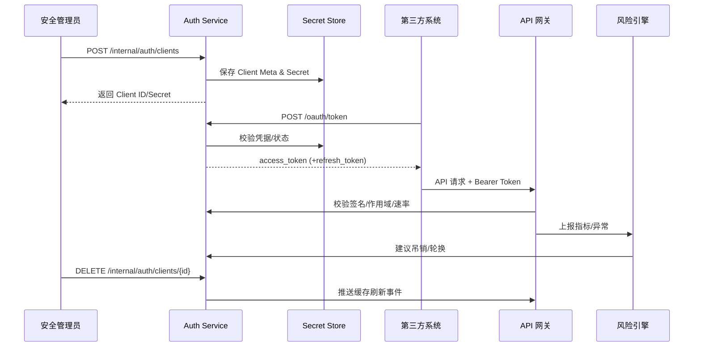

doc_id: UC-IAM-LOGIN-API-TOKEN-001
scn_id: SCN-IAM-LOGIN-AUTH-001
title: 第三方 API Token 管理与网关校验
status: Draft
version: v0.1.0
repo_key: powerx
scope: powerx
layer: service
domain: iam
scenario_title: "PowerX 登录与认证"
owners:
  - name: Li Wei
    role: IAM Product Lead
    contact: iam@artisan-cloud.com
  - name: Matrix Ops
    role: Platform Ops Lead
    contact: ops@artisan-cloud.com
contributors: []
linked_requirements:
  - SCN-IAM-LOGIN-API-TOKEN-001
code_refs:
  - repo: powerx
    path: internal/service/auth/client_credentials_service.go
    description: 客户端凭据签发、续签与吊销编排
  - repo: powerx
    path: internal/service/auth/token_exchange_handler.go
    description: OAuth2 Token 交换入口与响应封装
  - repo: powerx
    path: pkg/gateway/middleware/authz.go
    description: 网关 Token 校验、作用域验证与速率控制
  - repo: powerx
    path: pkg/core/security/token_signer.go
    description: 密钥签名、轮换与加密存储
  - repo: powerx
    path: pkg/audit/api_token_logger.go
    description: Token 审计事件、异常告警与指标采集
feature_flags:
  - iam-api-token
  - gateway-rate-limit
  - iam-token-auto-rotate
  - audit-streaming
last_reviewed_at: 2025-10-31

---

# Usecase Overview

- **业务目标**：为第三方与集团内自动化系统提供安全、可控的 API 访问通道，实现凭据签发、Token 交换、授权校验与异常吊销闭环，保障租户隔离与最小权限原则。
- **成功度量**：Token 签发成功率 ≥ 99%；合法调用 2xx 占比 ≥ 98%；越权或速率异常响应时间 ≤ 60 秒；Secret 轮换同步延迟 < 5 分钟。
- **场景关联**：支撑主场景 `SCN-IAM-LOGIN-AUTH-001` Stage 2，并与 SSO、MFA、风险处置共享登录上下文、审计链路与告警通道。

> 摘要：实现 “客户端凭据 → Token 交换 → 网关校验 → 风控/审计” 的端到端能力，确保第三方调用既高可用又可追溯。

# Context & Assumptions

- **前置条件**
  - Feature Flag：`iam-api-token`, `gateway-rate-limit`, `iam-token-auto-rotate`, `audit-streaming` 已在目标租户启用。
  - PowerX 网关启用 TLS/mTLS，并配置作用域、IP 白名单、速率限制策略中心。
  - 风险引擎订阅 `security.token.*` 事件并具备告警渠道；审计事件总线保持健康。
  - 租户管理员具备 `api_token.manage` 权限，网关缓存与密钥存储（KMS/Secrets Manager）可用。
- **输入/输出**
  - 输入：管理员创建客户端请求、第三方 `POST /oauth/token` 请求、API 调用中的 Bearer Token、风险告警反馈。
  - 输出：Access/Refresh Token、凭据元数据、审计与指标记录、异常告警（PagerDuty/Slack）、吊销或轮换任务。
- **边界**
  - 不覆盖终端用户会话与插件内部授权；不处理第三方回调签名。
  - 密钥托管、凭据分发渠道由安全团队维护，本文仅消费其接口。

# Solution Blueprint

## 体系分解

| 层 | 主要组件/模块 | 责任 | 代码入口 |
|----|---------------|------|---------|
| 控制面 | `internal/service/auth/client_credentials_service.go` | 客户端创建、作用域/IP 校验、Secret 生命周期管理 | `services/auth` |
| 交换层 | `internal/service/auth/token_exchange_handler.go` | 处理 `POST /oauth/token` 请求、验证凭据状态、生成 Token | `services/auth` |
| 网关层 | `pkg/gateway/middleware/authz.go` | 校验 Token 签名、有效期、作用域、速率；注入审计上下文 | `pkg/gateway/middleware` |
| 安全层 | `pkg/core/security/token_signer.go` | 管理密钥、执行签名与加解密、配合自动轮换任务 | `pkg/core/security` |
| 审计与风控 | `pkg/audit/api_token_logger.go`, `pkg/risk/analyzers/token_anomaly.go` | 记录成功/失败事件、识别越权、触发告警与吊销建议 | `pkg/audit`, `pkg/risk/analyzers` |

## 流程与时序

1. **Step 1 – 客户端登记**：管理员通过控制台/API 创建客户端，校验租户状态、作用域、IP 白名单；生成 Client ID/Secret 并加密落库。
2. **Step 2 – Token 交换**：第三方调用 `POST /oauth/token`；系统验证凭据、IP、租户状态，签发短期 Access Token（可选 Refresh Token），写入审计。
3. **Step 3 – 网关授权**：业务请求携带 Bearer Token；网关校验签名、有效期、作用域、速率；记录调用指标。
4. **Step 4 – 风控联动**：越权/黑名单/速率异常触发 `security.token.anomaly`，风险引擎建议吊销或冻结。
5. **Step 5 – 吊销与轮换**：管理员或自动任务调用吊销/轮换接口，刷新缓存并通知集成方；审计记录生效时间。

# Contracts & Interfaces

- **Inbound API / Event**
  - `POST /internal/auth/clients` — 创建客户端，校验 `tenant_id`、作用域、IP 白名单、有效期，失败返回 `INVALID_SCOPE`、`DUPLICATE_NAME`、`TENANT_FROZEN` 等错误码。
  - `POST /oauth/token` — Client Credentials 交换接口，支持 HTTP Basic 或 body 凭据，默认 TTL 60 分钟，可选 Refresh Token；超时 3 秒，失败重试 1 次。
  - `DELETE /internal/auth/clients/{id}` — 吊销客户端，写入审计并广播缓存失效事件。
  - `POST /internal/auth/clients/{id}/rotate` — Secret 轮换，返回新旧 Secret，旧 Secret 在 `grace_period` 内有效。
- **Outbound 调用**
  - `Gateway.CacheInvalidate`（事件）— 通知网关刷新认证缓存。
  - `Risk.RecordAnomaly` — 上报越权/黑名单/速率异常，触发告警与自动吊销建议。
- **配置与脚本**
  - `config/auth/client_credentials.yaml` — 默认作用域、TTL、白名单策略、轮换宽限。
  - `scripts/ops/token-rotation.sh`、`scripts/ops/revoke-token.sh` — 批量轮换与吊销任务。
  - Feature Flag：`iam-api-token`, `gateway-rate-limit`, `iam-token-auto-rotate`, `audit-streaming` 控制功能启用。

# Implementation Checklist

| 项目 | 描述 | 完成状态 | 负责人 |
|------|------|----------|--------|
| 数据模型 | 设计 `auth_client`/`auth_client_secret` 表结构，新增索引与加密字段 | [ ] | Li Wei |
| 业务逻辑 | 实现客户端创建、Secret 存储、Token 交换、吊销/轮换流程 | [ ] | Li Wei |
| 缓存与网关 | 与网关协同完善缓存刷新、速率限制、热更新机制 | [ ] | Matrix Ops |
| 风控联动 | 接入 `security.token.anomaly` 告警、自动吊销工作流 | [ ] | Matrix Ops |
| 配置发布 | 发布默认作用域、IP 模板及轮换任务 Cron，更新运维 Runbook | [ ] | Matrix Ops |
| 文档同步 | 更新 `docs/standards/security/api-token-governance.md`、站点指南 | [ ] | Li Wei |

# Testing Strategy

- **单元测试**：覆盖客户端创建/更新、Secret 加密解密、Token 交换正反向、速率限制策略。
- **集成测试**：使用沙箱网关验证 `POST /oauth/token`、合法/越权调用、IP 白名单校验，确保审计、告警写入正确。
- **端到端验证**：执行场景用例 B-1/B-2，验证正向调用、作用域不足、Token 吊销后立即失效，并检查仪表板指标。
- **非功能测试**：压测 Token 交换（≥ 2k RPS）、网关校验延迟（P95 < 30 ms），Chaos 注入缓存延迟或密钥轮换失败，确认降级与恢复策略。

# Observability & Ops

- **指标**：`auth.token.issued_total`, `auth.token.revoked_total`, `gateway.api.success_total`, `gateway.api.forbidden_total`, `gateway.api.rate_limit_reject_total`, `security.token.anomaly_total`。
- **日志**：记录 `client_id`, `tenant_id`, `scope`, `ip`, `user_agent`, `error_code`, `trace_id`；敏感字段脱敏或加密；分类写入业务日志与审计流。
- **告警**：越权请求 ≥10 次/5 分钟触发 PagerDuty；轮换任务失败或缓存刷新超时触发 Slack `#iam-alerts`；Token 续签失败率 >5% 创建工单。
- **仪表板**：Grafana `API Gateway / Auth`、Datadog `gateway.auth*`、`reports/iam/auth-security-dashboard`。

# Rollback & Failure Handling

- **回滚步骤**：回滚 Auth Service/网关部署，关闭 `iam-api-token` 功能开关，恢复旧版密钥配置，删除异常 Token/Secret。
- **补救措施**：运行 `scripts/ops/revoke-token.sh --client <id>` 吊销可疑 Token；`token-rotation.sh --force` 重新生成 Secret；必要时将租户置为只读模式。
- **数据修复**：利用 `scripts/audit/replay-token-events.mjs` 重放缺失审计；`scripts/gateway/reset-auth-cache.sh` 批量刷新缓存；修正 IP 白名单配置。

# Follow-ups & Risks

| 风险/事项 | 影响 | 缓解方案 | 负责人 | ETA |
|-----------|------|----------|--------|-----|
| IP 白名单维护缺少自动化校验，可能遗漏更新 | 访问控制准确性 | 接入自动化校验脚本并在控制台增加提醒提示 | Li Wei | 2025-11-08 |
| 网关缓存刷新延迟导致吊销滞后 | 安全响应 | 缩短缓存 TTL，引入推送通道与健康探针监控 | Matrix Ops | 2025-11-15 |

# References & Links

- 场景文档：`docs/scenarios/iam/SCN-IAM-LOGIN-API-TOKEN-001.md`
- 主场景：`docs/scenarios/iam/SCN-IAM-LOGIN-AUTH-001.md`
- 运维脚本：`scripts/ops/token-rotation.sh`、`scripts/ops/revoke-token.sh`
- 标准参考：`docs/standards/security/api-token-governance.md`

> 完成 Seed 后，请运行 `npm run publish:usecases -- --scn-id SCN-IAM-LOGIN-AUTH-001 --validate-only` 校验结构，再按流程分发到下游仓库。
