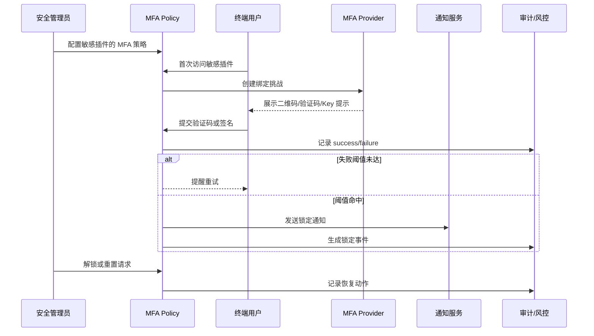

doc_id: UC-IAM-LOGIN-MFA-001
scn_id: SCN-IAM-LOGIN-AUTH-001
title: 敏感插件多因子认证守护
status: Draft
version: v0.1.0
repo_key: powerx
scope: powerx
layer: service
domain: iam
scenario_title: "PowerX 登录与认证"
owners:
  - name: Li Wei
    role: IAM Product Lead
    contact: iam@artisan-cloud.com
  - name: Matrix Ops
    role: Platform Ops Lead
    contact: ops@artisan-cloud.com
contributors: []
linked_requirements:
  - SCN-IAM-LOGIN-MFA-001
code_refs:
  - repo: powerx
    path: internal/service/auth/mfa_policy_service.go
    description: MFA 策略启用、租户/插件粒度配置与评估
  - repo: powerx
    path: internal/service/auth/mfa_enrollment_service.go
    description: 设备绑定、恢复码生成、验证上下文
  - repo: powerx
    path: pkg/mfa/providers/totp.go
    description: TOTP 生成与校验、容差策略
  - repo: powerx
    path: pkg/mfa/providers/webauthn.go
    description: WebAuthn 挑战、签名验证与设备管理
  - repo: powerx
    path: pkg/audit/mfa_logger.go
    description: MFA 审计事件、锁定记录与告警采集
feature_flags:
  - iam-mfa-policy
  - iam-mfa-recovery
  - notify-transactional
  - audit-streaming
last_reviewed_at: 2025-10-31

---

# Usecase Overview

- **业务目标**：在高风险插件或操作前引入多因子认证，确保只有通过绑定验证的用户才能执行敏感动作，同时提供锁定、恢复与审计闭环。
- **成功度量**：MFA 绑定成功率 ≥ 95%；验证成功率 ≥ 97%；锁定误报率 ≤ 0.5%；恢复处理 SLA ≤ 15 分钟。
- **场景关联**：支撑主场景 `SCN-IAM-LOGIN-AUTH-001` Stage 3，与 SSO、API Token、风险处置共享登录上下文、告警通道与审计链路。

> 摘要：构建多因子策略、绑定、验证、锁定与恢复的一体化能力，确保敏感操作“安全可控、体验可接受、审计可追溯”。

# Context & Assumptions

- **前置条件**
  - Feature Flag：`iam-mfa-policy`, `iam-mfa-recovery`, `notify-transactional`, `audit-streaming` 已启用并配置默认值。
  - 通知服务支持短信、邮件、站内信等通知通道；硬件 Key 需通过 WebAuthn 接口接入。
  - 安全管理员具备策略配置权限，用户具备访问敏感插件的授权。
  - 风险引擎订阅 `security.mfa.*` 事件，用于监控锁定统计与误报分析。
- **输入/输出**
  - 输入：策略配置（插件、操作、验证方式、失败阈值）、用户绑定请求、验证码/签名、恢复码、管理员重置指令。
  - 输出：MFA 绑定状态、验证票据、锁定/恢复事件、通知消息、审计与告警记录。
- **边界**
  - 不处理终端设备管理（MDM）与硬件 Key 采购；不涵盖非敏感操作的提示性验证。
  - 账号生命周期、角色授权由其他子用例负责，本用例只关注敏感操作的额外校验。

# Solution Blueprint

## 体系分解

| 层 | 主要组件/模块 | 责任 | 代码入口 |
|----|---------------|------|---------|
| 策略层 | `internal/service/auth/mfa_policy_service.go` | 策略 CRUD、租户/插件/操作粒度评估、阈值计算 | `services/auth` |
| 绑定层 | `internal/service/auth/mfa_enrollment_service.go` | 首次绑定流程、恢复码生成、绑定信息存储 | `services/auth` |
| 验证层 | `pkg/mfa/providers/{totp,webauthn,sms}.go` | 提供各类验证器实现、容差与失败计数 | `pkg/mfa/providers` |
| 通知层 | `pkg/notify/dispatchers/mfa.js` | 锁定通知、恢复提醒、管理员审批工作流 | `pkg/notify` |
| 审计与风控 | `pkg/audit/mfa_logger.go`, `pkg/risk/analyzers/mfa_anomaly.go` | 审计事件写入、锁定监控、误报回滚记录 | `pkg/audit`, `pkg/risk/analyzers` |

## 流程与时序

1. **Step 1 – 策略启用**：安全管理员配置敏感插件的验证方式、失败阈值、备用方案。
2. **Step 2 – 首次绑定**：用户首次访问敏感插件时完成设备绑定（TOTP/短信/WebAuthn），生成恢复码。
3. **Step 3 – 验证执行**：后续每次访问敏感操作触发二次验证，通过后才继续；失败计数累加。
4. **Step 4 – 锁定与告警**：达到失败阈值时锁定访问、发送通知并记录审计事件。
5. **Step 5 – 恢复与回滚**：用户使用恢复码或管理员审批解锁，审计记录恢复动作并同步风险分析。

# Contracts & Interfaces

- **Inbound API**
  - `POST /internal/security/mfa/policies` — 配置策略，字段包括 `plugin`, `operations[]`, `methods[]`, `fail_threshold`, `grace_period_minutes`, `backup_methods[]`。
  - `POST /auth/mfa/enroll` — 生成绑定挑战，返回二维码、秘密种子、WebAuthn Challenge、恢复码。
  - `POST /auth/mfa/verify` — 提交验证码/签名，返回 `verification_id` 与状态；失败时返回 `LOCKED`, `INVALID_CODE`, `EXPIRED` 等错误码。
  - `POST /internal/security/mfa/lock` / `unlock` — 锁定或解锁用户，供管理员或风控调用。
- **Events**
  - `security.mfa.assigned`、`security.mfa.verified`、`security.mfa.locked`、`security.mfa.recovered` — 审计事件，包含 `tenant_id`, `user_id`, `method`, `plugin`, `status`, `trace_id`。
- **配置与脚本**
  - `config/mfa/policies.yaml` — 默认策略、阈值、失败宽限。
  - `config/mfa/providers.yaml` — 各验证器的容差、重试及依赖配置。
  - `scripts/mfa/generate-recovery-codes.sh`、`scripts/mfa/unlock-users.sh` — 批量恢复/解锁工具。

# Implementation Checklist

| 项目 | 描述 | 完成状态 | 负责人 |
|------|------|----------|--------|
| 策略模型 | 设计策略表结构、租户隔离字段、索引 | [ ] | Li Wei |
| 绑定流程 | 实现绑定向导、恢复码生成、重复绑定检测 | [ ] | Li Wei |
| 通知与告警 | 配置锁定通知、审批提醒、告警阈值 | [ ] | Matrix Ops |
| 审计联动 | 接入审计事件、风险误报回滚机制 | [ ] | Matrix Ops |
| 文档与 Runbook | 更新 `docs/standards/security/mfa-policy-guide.md`、运维手册 | [ ] | Li Wei |

# Testing Strategy

- **单元测试**：覆盖策略评估、失败计数、锁定逻辑、恢复码验证、WebAuthn 安全检查。
- **集成测试**：模拟 TOTP/SMS/WebAuthn 绑定与验证；触发锁定/解锁流程，检查审计与通知。
- **端到端验证**：执行场景用例 C-1/C-2，验证正向验证、失败锁定、管理员解锁、备用验证流程。
- **非功能测试**：验证高并发下的验证延迟、通知延迟；Chaos 注入短信通道/验证服务故障，确认降级策略。

# Observability & Ops

- **指标**：`auth.mfa.enroll_success_total`, `auth.mfa.verify_success_total`, `auth.mfa.verify_fail_total`, `auth.mfa.locked_total`, `auth.mfa.reset_total`。
- **日志**：记录 `tenant_id`, `user_id`, `plugin`, `method`, `status`, `error_code`, `trace_id`（敏感信息脱敏）。
- **告警**：验证失败率 >5%/5 分钟触发 PagerDuty；锁定事件 >5 次/租户/10 分钟推送 Slack；恢复失败触发工单。
- **仪表板**：Grafana `IAM / MFA Overview`、Datadog `auth-mfa-*`、`reports/iam/auth-security-dashboard`。

# Rollback & Failure Handling

- **回滚步骤**：回滚最新部署；关闭 `iam-mfa-policy` 功能开关；撤销策略变更。
- **补救措施**：使用 `scripts/mfa/unlock-users.sh --tenant <id>` 批量解锁；`scripts/mfa/generate-recovery-codes.sh` 补发恢复码；通知管理员手动审批。
- **数据修复**：通过审计事件回放修复锁定状态；手动清理异常绑定记录；同步更新通知与风险系统。

# Follow-ups & Risks

| 风险/事项 | 影响 | 缓解方案 | 负责人 | ETA |
|-----------|------|----------|--------|-----|
| 海外短信通道延迟导致验证超时 | 验证成功率 | 增加备用渠道/就近节点，加速短信发送 | Matrix Ops | 2025-11-20 |
| 硬件 Key 灰度尚未完成 | 绑定覆盖率 | 扩充测试矩阵，与采购协同部署 | Li Wei | 2025-11-12 |

# References & Links

- 场景文档：`docs/scenarios/iam/SCN-IAM-LOGIN-MFA-001.md`
- 主场景：`docs/scenarios/iam/SCN-IAM-LOGIN-AUTH-001.md`
- 运行手册：`ops/runbooks/mfa-lock-reset.md`
- 指标脚本：`scripts/qa/workflow-metrics.mjs --module mfa`

> 完成 Seed 后，请运行 `npm run publish:usecases -- --scn-id SCN-IAM-LOGIN-AUTH-001 --validate-only` 校验结构，再按流程分发到下游仓库。
