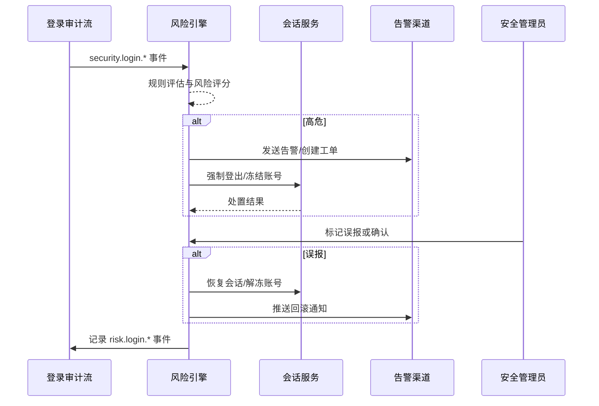

doc_id: UC-IAM-LOGIN-RISK-001
scn_id: SCN-IAM-LOGIN-AUTH-001
title: 异常登录检测与响应
status: Draft
version: v0.1.0
repo_key: powerx
scope: powerx
layer: service
domain: iam
scenario_title: "PowerX 登录与认证"
owners:
  - name: Li Wei
    role: IAM Product Lead
    contact: iam@artisan-cloud.com
  - name: Matrix Ops
    role: Platform Ops Lead
    contact: ops@artisan-cloud.com
contributors: []
linked_requirements:
  - SCN-IAM-LOGIN-RISK-001
code_refs:
  - repo: powerx
    path: internal/service/risk/login_risk_service.go
    description: 风险规则执行、评分与处置编排
  - repo: powerx
    path: pkg/risk/rules/geo_velocity.go
    description: 异地登录、暴力破解、黑名单规则实现
  - repo: powerx
    path: internal/service/session/session_service.go
    description: 会话强制登出、账号冻结与回滚接口
  - repo: powerx
    path: pkg/audit/risk_logger.go
    description: 风险事件审计、误报回滚记录、指标采集
  - repo: powerx
    path: pkg/notify/incident_notifier.go
    description: 告警通知、工单创建与渠道编排
feature_flags:
  - iam-risk-engine
  - auth-session-hardening
  - notify-transactional
  - audit-streaming
last_reviewed_at: 2025-10-31

---

# Usecase Overview

- **业务目标**：实时识别并处置高风险登录行为，在 60 秒内完成告警、会话终止与误报回滚，降低暴力破解、异地秒登等攻击面。
- **成功度量**：高危登录检测准确率 ≥ 95%；误报率 ≤ 2%；处置耗时 ≤ 60 秒；回滚响应 ≤ 5 分钟；告警触达率 100%。
- **场景关联**：支撑主场景 `SCN-IAM-LOGIN-AUTH-001` Stage 4，与 SSO、API Token、MFA 子场景共享审计数据、会话接口与告警链路。

> 摘要：构建登录风险识别、告警处置与误报回滚闭环，确保安全事件“快检测、快响应、可追溯、可恢复”。

# Context & Assumptions

- **前置条件**
  - Feature Flag：`iam-risk-engine`, `auth-session-hardening`, `notify-transactional`, `audit-streaming` 已启用。
  - 登录审计事件 `security.login.*` 包含租户、用户、设备、IP、地理位置等字段；风险引擎可消费事件流。
  - 会话服务支持强制登出、冻结/解冻接口；通知服务具备告警渠道（PagerDuty/Slack/Email）。
  - 黑名单库、地理信息库与外部情报源定期同步更新。
- **输入/输出**
  - 输入：登录审计事件、风险规则配置、黑名单列表、管理员反馈（确认/误报）、回滚指令。
  - 输出：风险评分、告警通知、强制登出与冻结任务、回滚记录、风险指标与报告。
- **边界**
  - 不负责根因调查或外部情报平台同步；账号生命周期、角色管理由其它子场景覆盖。
  - 不直接处理用户密码重置或信任设备配置。

# Solution Blueprint

## 体系分解

| 层 | 主要组件/模块 | 责任 | 代码入口 |
|----|---------------|------|---------|
| 数据接入层 | `internal/service/risk/login_ingestor.go` | 消费登录审计事件、构建风险上下文、送入规则引擎 | `services/risk` |
| 规则引擎层 | `pkg/risk/rules/*` | 异地、暴力破解、黑名单、速率等规则执行 | `pkg/risk/rules` |
| 处置编排层 | `internal/service/risk/login_risk_service.go` | 风险评分、告警/工单、会话强制登出/冻结、回滚 | `services/risk` |
| 会话与账号层 | `internal/service/session/session_service.go` | 强制登出、会话冻结、账号解封接口 | `services/session` |
| 审计与指标层 | `pkg/audit/risk_logger.go`, `pkg/metrics/risk_login_metrics.go` | 记录 `security.login.*`、`risk.login.*` 事件与指标 | `pkg/audit`, `pkg/metrics` |
| 通知协作层 | `pkg/notify/incident_notifier.go` | PagerDuty/Slack/邮件告警、工单自动化 | `pkg/notify` |

## 流程与时序

1. **Step 1 – 数据接入**：风险引擎持续消费 `security.login.*` 事件，聚合会话、设备、IP、地理信息。
2. **Step 2 – 风险评估**：执行异地秒登、失败次数、黑名单、速率等规则，计算风险分并生成处置建议。
3. **Step 3 – 告警与处置**：高危事件触发告警/工单，同时调用会话服务强制登出、冻结账号，记录处置结果。
4. **Step 4 – 复盘与回滚**：安全管理员确认告警（真阳性/误报）；误报触发回滚并调整阈值或进入观察。
5. **Step 5 – 报告与指标**：输出风险报告、更新指标，供安全运营复盘与策略迭代。

# Contracts & Interfaces

- **Inbound Events / APIs**
  - `EVENT security.login.detected` / `security.login.success` / `security.login.failure` — 风险评估输入。
  - `POST /internal/risk/login/incidents` — 手动触发或重放风险事件，用于调试或演练。
  - `POST /internal/risk/login/incidents/{id}/ack` — 管理员确认风险事件（`confirmed`/`false_positive`）。
  - `POST /internal/risk/login/incidents/{id}/rollback` — 执行会话恢复、账号解冻或阈值调整。
  - `POST /internal/sessions/force-logout`，`POST /internal/users/{id}/freeze` / `unfreeze` — 会话与账号处置接口。
- **Events 输出**
  - `security.login.blocked`、`security.login.rollback`、`risk.login.incident` — 包含 `incident_id`, `tenant_uuid`, `user_id`, `rule_id`, `action`, `trace_id`, `latency_ms`。
- **配置与脚本**
  - `config/risk/login_rules.yaml` — 风险规则、阈值、权重。
  - `config/risk/blacklist.yaml` — 黑名单/地理风险源。
  - `scripts/risk/requeue-events.sh` — 重放事件；`scripts/sessions/force-logout-by-tenant.sh` — 应急强制登出。

# Implementation Checklist

| 项目 | 描述 | 完成状态 | 负责人 |
|------|------|----------|--------|
| 规则配置 | 实现异地、速率、黑名单、设备指纹等规则与测试 | [ ] | Li Wei |
| 告警编排 | 接入 PagerDuty/Slack/工单系统、配置通知模板 | [ ] | Matrix Ops |
| 处置流程 | 打通强制登出、冻结/解冻、回滚 API | [ ] | Li Wei |
| 审计与报表 | 输出风险事件审计、统计指标、月度报告模版 | [ ] | Matrix Ops |
| Runbook | 更新异常登录处置、误报回滚、风控参数调优指南 | [ ] | Matrix Ops |

# Testing Strategy

- **单元测试**：覆盖各类风险规则、阈值判断、批量去重、误报回滚逻辑。
- **集成测试**：重放登录审计事件，验证告警触发、会话处置、缓存刷新、SIEM 同步。
- **端到端验证**：执行场景用例 D-1/D-2，模拟异地秒登、暴力破解、误报回滚，验证告警链路与恢复时间。
- **非功能测试**：压力测试（每分钟 ≥ 50k 事件）、延迟测试（处置耗时）、Chaos 模拟通知或队列故障，确认降级方案。

# Observability & Ops

- **指标**：`risk.login.high_risk_total`, `risk.login.false_positive_total`, `risk.login.response_latency_p95`, `risk.login.forced_logout_total`, `risk.login.rollback_total`。
- **日志**：记录 `incident_id`, `tenant_uuid`, `user_id`, `rule_id`, `score`, `action`, `trace_id`，敏感字段脱敏。
- **告警**：风险事件积压 >100 或处置耗时 >60 秒触发 PagerDuty；误报率 >5% 触发安全评审；冻结失败率 >1% 推送 Slack。
- **仪表板**：Grafana `IAM / Risk Login`、Datadog `risk-login-*`、`reports/iam/auth-security-dashboard`。

# Rollback & Failure Handling

- **回滚步骤**：关闭 `iam-risk-engine`，回退至人工审批模式；卸载最新规则配置；恢复会话状态。
- **补救措施**：`scripts/risk/requeue-events.sh` 重放丢失事件；`scripts/sessions/force-logout-by-tenant.sh` 批量处置；`scripts/risk/fix-incident-state.sh` 修复状态机。
- **数据修复**：`scripts/audit/replay-risk-events.mjs` 补写审计；手动同步 SIEM 字段；校准黑名单或规则配置。

# Follow-ups & Risks

| 风险/事项 | 影响 | 缓解方案 | 负责人 | ETA |
|-----------|------|----------|--------|-----|
| 外部 SIEM 字段映射未统一，跨系统追溯困难 | 合规审计 | 制定字段映射、同步文档、更新解析器 | Matrix Ops | 2025-11-18 |
| 风险规则缺乏灰度与自动调优能力，易产生噪音 | 运营效率 | 引入灰度发布、历史数据回放、自适应阈值 | Li Wei | 2025-11-25 |

# References & Links

- 场景文档：`docs/scenarios/iam/SCN-IAM-LOGIN-RISK-001.md`
- 主场景：`docs/scenarios/iam/SCN-IAM-LOGIN-AUTH-001.md`
- 风险策略：`docs/standards/security/login-risk-rules.md`
- Runbook：`ops/runbooks/login-risk-rollback.md`
- 指标脚本：`scripts/qa/workflow-metrics.mjs --module risk`

> 完成 Seed 后，请运行 `npm run publish: "usecases -- --scn-id SCN-IAM-LOGIN-AUTH-001 --validate-only` 校验结构，再按流程分发到下游仓库。"
