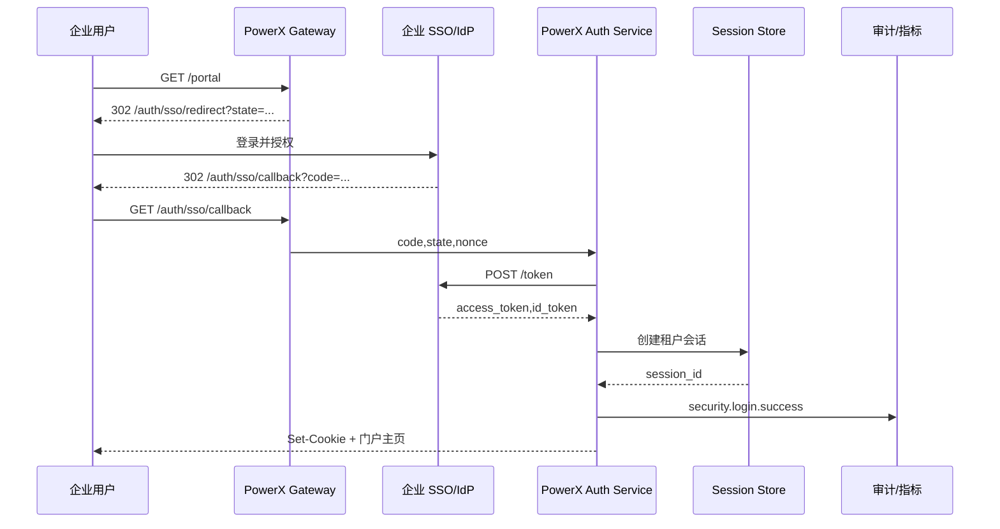

doc_id: UC-IAM-LOGIN-SSO-001
scn_id: SCN-IAM-LOGIN-AUTH-001
title: 企业 SSO 登录门户
status: Draft
version: v0.1.0
repo_key: powerx
scope: powerx
layer: service
domain: iam
scenario_title: "PowerX 登录与认证"
owners:
  - name: Li Wei
    role: IAM Product Lead
    contact: iam@artisan-cloud.com
  - name: Matrix Ops
    role: Platform Ops Lead
    contact: ops@artisan-cloud.com
contributors: []
linked_requirements:
  - SCN-IAM-LOGIN-SSO-001
code_refs:
  - repo: powerx
    path: internal/transport/http/auth/sso_handler.go
    description: Redirect/Callback 处理、state/nonce 校验、错误兜底
  - repo: powerx
    path: pkg/auth/idp/client.go
    description: OIDC/SAML 客户端、JWKS 缓存、Token 验签
  - repo: powerx
    path: internal/service/session/session_service.go
    description: 会话生成、租户隔离、设备指纹记录
  - repo: powerx
    path: pkg/audit/login_logger.go
    description: 登录审计事件、指标采集、失败分类
  - repo: powerx
    path: pkg/notify/templates/auth_sso_error.html
    description: 登录失败通知模版与渠道配置
feature_flags:
  - iam-login-sso-v2
  - auth-session-hardening
  - audit-streaming
last_reviewed_at: 2025-10-31

---

# Usecase Overview

- **业务目标**：整合企业 SSO/OIDC 登录流程，在 3 秒内完成授权跳转、Token 验证与门户加载，并确保租户隔离、审计追踪与失败兜底体验。
- **成功度量**：SSO 登录成功率 ≥ 99%；端到端耗时 P95 ≤ 3 秒；失败原因分类准确率 100%；审计落库覆盖率 100%。
- **场景关联**：支撑主场景 `SCN-IAM-LOGIN-AUTH-001` Stage 1，并为后续 API Token、MFA、风险处置提供登录上下文与审计链路。

> 摘要：实现企业 SSO/OIDC 授权码流程的一站式入口，覆盖 Redirect、Token 交换、会话生成、失败告警与审计。

# Context & Assumptions

- **前置条件**
  - Feature Flag：`iam-login-sso-v2`, `auth-session-hardening`, `audit-streaming` 已在目标环境启用。
  - 企业 IdP 配置正确的 Redirect URI、证书与客户端凭据；请求域名加入白名单。
  - Session Store（Redis/DB）高可用；审计事件总线、指标采集脚本可用。
  - 租户状态、用户状态与访问控制在 IdP 与 PowerX 中保持同步。
- **输入/输出**
  - 输入：用户访问门户请求、授权码/断言、IdP Token 响应、租户与用户上下文。
  - 输出：PowerX 会话、门户配置、审计日志、失败告警、指标数据。
- **边界**
  - 不处理本地账号登录、自助注册；不覆盖插件级授权或异常登录处置。
  - 租户冻结、用户禁用的后续处置由风险子场景承担。

# Solution Blueprint

## 体系分解

| 层 | 主要组件/模块 | 责任 | 代码入口 |
|----|---------------|------|---------|
| 网关层 | `internal/transport/http/auth/sso_handler.go` | 处理 Redirect/Callback、state/nonce 校验、错误兜底与重定向 | `services/auth` |
| 集成层 | `pkg/auth/idp/client.go` | OIDC/SAML 客户端、JWKS 缓存、Token 验签、租户绑定检查 | `pkg/auth/idp` |
| 会话层 | `internal/service/session/session_service.go` | 会话生成、租户隔离、设备指纹记录、刷新策略 | `services/session` |
| 审计层 | `pkg/audit/login_logger.go`, `pkg/metrics/auth_login_metrics.go` | 登录审计事件、指标统计、失败分类、告警触发 | `pkg/audit`, `pkg/metrics` |
| 通知层 | `pkg/notify/templates/auth_sso_error.html` | 登录失败/租户冻结通知模版与渠道配置 | `pkg/notify/templates` |

## 流程与时序

1. **Step 1 – 门户访问**：用户访问 `portal.powerx.com`，网关识别租户，生成 `state`、`nonce`，重定向到企业 SSO。
2. **Step 2 – IdP 授权**：用户在 IdP 完成登录，重定向回 `auth/sso/callback` 携带授权码或断言。
3. **Step 3 – Token 交换与校验**：Auth 服务调用 IdP Token 端点，校验签名、租户绑定、过期时间、`nonce`。
4. **Step 4 – 会话生成**：Session 服务写入会话、绑定租户与设备信息，生成门户配置。
5. **Step 5 – 告警与回退**：失败场景触发告警、展示兜底页面，并记录审计事件与指标。

# Contracts & Interfaces

- **Inbound APIs**
  - `GET /auth/sso/redirect` — 接收 `tenant_id`, `return_to`，生成 `state`/`nonce` 并缓存。
  - `GET /auth/sso/callback` — 校验 `state`/`nonce`，处理 IdP 错误码 `access_denied`, `interaction_required` 等。
  - `POST /internal/sessions` — 创建会话，参数包含 `tenant_id`, `user_id`, `device`, `ip`。
- **Outbound 调用**
  - `POST /idp/token` — 交换授权码为 Access/ID Token，超时 3 秒，失败重试 1 次。
- **事件与通知**
  - `EVENT security.login.success/failure` — 审计事件，记录成功/失败原因、耗时、设备信息。
  - 登录失败或租户冻结时触发通知（Slack/PagerDuty/邮件）。
- **配置**
  - `config/auth/sso.yaml` — IdP 客户端配置、证书、回调 URI。
  - `config/auth/session.yaml` — 会话 TTL、刷新策略。

# Implementation Checklist

| 项目 | 描述 | 完成状态 | 负责人 |
|------|------|----------|--------|
| IdP 集成 | 配置 Redirect URI、证书轮换、客户端 ID/Secret | [ ] | Li Wei |
| 会话安全 | state/nonce 防重放、SameSite Cookie、租户隔离策略 | [ ] | Li Wei |
| 失败兜底 | 设计冻结提示页、用户禁用提示、告警通道 | [ ] | Matrix Ops |
| 审计与指标 | 落地 `security.login.*`、`auth.sso.*` 指标与告警阈值 | [ ] | Matrix Ops |
| 文档同步 | 更新集成指南、故障排查 Runbook | [ ] | Li Wei |

# Testing Strategy

- **单元测试**：覆盖 state/nonce 校验、Token 验签、失败分类、租户隔离逻辑。
- **集成测试**：使用沙箱 IdP 验证授权码流程、Token 交换、Session 创建与审计记录。
- **端到端验证**：执行场景用例 A-1/A-2，验证正向登录、租户冻结、用户禁用、IdP 超时等场景。
- **非功能测试**：压测回调处理延迟（P95 < 100 ms）、授权码交换成功率，Chaos 模拟 IdP 或 Redis 故障确保兜底流程。

# Observability & Ops

- **指标**：`auth.sso.success_rate`, `auth.sso.latency_p95`, `auth.sso.failure_total`（分类）、`auth.session.creation_success_total`。
- **日志**：记录 `tenant_id`, `user_id`, `state`, `nonce`, `ip`, `ua`, `error_code`, `trace_id`。
- **告警**：连续 5 次登录失败或成功率 <97% 触发 PagerDuty；授权码交换超时率 >3% 推送 Slack。
- **仪表板**：Grafana `IAM / Login Overview`、Splunk 登录失败面板、`reports/iam/auth-security-dashboard`。

# Rollback & Failure Handling

- **回滚步骤**：回滚 Auth/网关部署；关闭 `iam-login-sso-v2`；恢复旧版证书；清理异常会话。
- **补救措施**：通知运维检查 IdP 状态；使用 `scripts/auth/reset-sso-state.sh` 清理缓存；人工生成临时登录链接（如适用）。
- **数据修复**：重放审计事件、矫正登录统计；手动解除错误锁定、更新租户状态。

# Follow-ups & Risks

| 风险/事项 | 影响 | 缓解方案 | 负责人 | ETA |
|-----------|------|----------|--------|-----|
| 企业证书轮换节奏不一致导致登录中断 | IdP 集成稳定性 | 建立证书轮换提醒与自动化检查 | Li Wei | 2025-11-05 |
| Portal 地域路由未接入最新 CDN，跨区域延迟 | 登录耗时 | 完成 CDN 配置与路由调整 | Matrix Ops | 2025-11-12 |

# References & Links

- 场景文档：`docs/scenarios/iam/SCN-IAM-LOGIN-SSO-001.md`
- 主场景：`docs/scenarios/iam/SCN-IAM-LOGIN-AUTH-001.md`
- 集成指南：`docs/standards/security/iam-login-sso-blueprint.md`
- 运维手册：`ops/runbooks/auth-sso-troubleshoot.md`

> 完成后请运行 `npm run publish: "usecases -- --scn-id SCN-IAM-LOGIN-AUTH-001 --validate-only` 校验结构，再按流程分发到下游仓库。"
