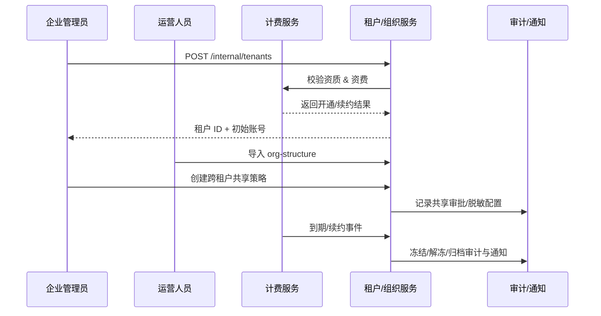

# Positioning & Goals

PowerX 需要在集团级场景下提供“多租户 + 组织管理”的一体化体验：从租户开通、组织建模到跨租户共享与生命周期治理，要求流程在线、审计可追溯，并且与计费/权限/通知深度联动。目标是让企业管理员可在 8 分钟内完成租户开通，在一个控制台里维护组织与共享策略，同时确保续约、冻结、归档都具备标准化的回滚与告警。

# Scope & Guardrails

- **In Scope**：租户开通与初始化模板、组织结构建模与同步、跨租户共享策略审批、计费驱动的续约提醒与冻结、归档与数据保留、相关审计与通知。
- **Out of Scope**：插件级细粒度权限（见《SCN-IAM-USER-ROLE-001》）、License 定价模型、个人账号生命周期（见《SCN-IAM-LOGIN-AUTH-001》）、租户内业务数据的实际迁移。
- **Environment & Flags**：`tenant-v2`（新控制台）、`tenant-cross-share`（跨租户策略）、`tenant-billing-sync`（计费同步）、`tenant-freeze-automation`（生命周期自动化）。依赖计费服务、通知中心（邮件/站内信/Webhook）、审计事件总线、对象存储备份与租户元数据仓库。

# Core Capabilities

1. **Tenant Lifecycle Orchestrator**：统一的开通/冻结/归档流水线，与计费、通知、审计联动。
2. **Org Modeling & Sync**：标准化组织树/权限模板导入，可视化编辑，并实时同步至 IAM 与插件权限目录。
3. **Cross-Tenant Collaboration Guardrails**：审批驱动的共享策略、脱敏配置、有效期与审计存证，确保集团协作安全合规。

# Participants & Responsibilities

| Scope | Repository | Layer | 责任与交付物 | Owners |
|-------|------------|-------|--------------|--------|
| core-platform | powerx | service | 多租户控制台、租户生命周期 API、组织建模服务 | Michael Hu（Product Manager / matrix-x@artisan-cloud.com） |
| billing | powerx-billing | ops | 资质校验、续约与冻结策略、账单与提醒 | Matrix Ops（Platform Ops Lead / ops@artisan-cloud.com） |
| governance | powerx-audit | security | 跨租户共享审批、审计留痕、合规报告输出 | Matrix Ops（Platform Ops Lead / ops@artisan-cloud.com） |
| operations | powerx-notify | service | 通知模板、邮件/站内信/Webhook 发送与回执 | Matrix Ops（Platform Ops Lead / ops@artisan-cloud.com） |

# Validation Workflow

1. **Stage 1 – 租户开通**：管理员提交租户信息，系统校验资质与计费状态并创建租户空间、初始管理员及访问入口。
2. **Stage 2 – 组织建模**：运营人员导入或编辑组织树与权限模板，系统同步至 IAM/插件目录并生成差异报告。
3. **Stage 3 – 跨租户共享**：集团管理员配置共享策略，审批通过后写入共享网关、触发通知，并在审计库中留存。
4. **Stage 4 – 生命周期治理**：计费任务触发续约提醒，未续约则自动冻结并限制访问，恢复或归档均写入审计与备份。

# Architecture Diagram

# Key Interactions & Contracts

- **APIs / Events**：
  - `POST /internal/tenants` — 租户创建，携带计费策略、模板、初始管理员。
  - `PUT /internal/tenants/{id}/org-structure` — 导入组织树、角色模板。
  - `POST /internal/tenant-sharing` — 跨租户共享策略（资源、期限、脱敏、审批人）。
  - `POST /internal/billing/tenants/{id}/renewal` — 续约/到期事件回调。
  - `EVENT tenant.lifecycle.updated` — frozen/archived 状态广播，供插件或第三方监听。
- **Configs / Schemas**：
  - `docs/standards/iam/tenant/org-structure-schema.md` — 组织树字段及约束。
  - `config/tenant/cross_share_policies.yaml` — 共享策略、审批路由、脱敏模板。
- **Security / Compliance**：
  - 跨租户共享必须经过脱敏校验 + 审批，并将审批结论写入审计。
  - 冻结后自动阻断写操作，仅允许管理员发起有限读取并记录审计。
  - 归档/删除遵循 `docs/standards/iam/tenant/deletion_retention.md`（≥365 天保留）。

# Related Links

- `UC-IAM-MULTI-TENANT-ONBOARD-001` — 租户开通流程。
- `UC-IAM-MULTI-TENANT-ORG-MODELING-001` — 组织建模与同步。
- `UC-IAM-MULTI-TENANT-CROSS-SHARE-001` — 跨租户共享策略。
- `UC-IAM-MULTI-TENANT-RENEWAL-FREEZE-001` — 续约与冻结治理。
- 设计稿：`docs/meta/scenarios/powerx/core-platform/iam-rbac/multi-tenant/primary.md`
- Runbook：`ops/runbooks/tenant-lifecycle.md`
- 指标面板：`reports/iam/tenant-ops-dashboard`

# Acceptance Criteria

1. 租户创建成功率 ≥ 99%，端到端耗时 ≤ 8 分钟，所有操作写入审计。
2. 组织结构同步成功率 ≥ 98%，冲突自动回滚并在 5 分钟内通知管理员。
3. 共享策略审批 SLA ≤ 4 小时、冲突率 ≤ 2%，所有策略具备可追溯签名。
4. 续约提醒成功率 ≥ 99%，冻结/解冻执行 ≤ 5 分钟，归档可在 30 分钟内完成并可回滚。

# Telemetry & Ops

- 指标：`tenant.onboard.duration_ms`、`tenant.org.sync_success_rate`、`tenant.cross_share.active_total`、`tenant.lifecycle.freeze_duration_ms`。
- 告警阈值：开通失败率 >3%/小时、组织同步失败 3 次连续、共享审批超 SLA、冻结执行 >15 分钟。
- 观测来源：`reports/iam/tenant-ops-dashboard`、计费/通知日志、`scripts/qa/workflow-metrics.mjs` 周报。

# Open Issues & Follow-ups

| 风险/事项 | 影响范围 | 负责人 | ETA |
|-----------|----------|--------|-----|
| 计费服务延迟可能导致冻结卡住，需要增加重试与人工兜底 | 租户冻结/恢复 | Matrix Ops | 2025-11-15 |
| 跨租户共享审批缺少二次身份验证，需引入 MFA 步骤 | 跨租户访问 | Michael Hu | 2025-11-30 |

# Appendix

- `projects/iam/tenant-lifecycle/product-spec.md` — 需求 & backlog。
- `ops/migrations/tenant-v1-to-v2.md` — 迁移计划。
- `docs/standards/iam/tenant/deletion_retention.md` — 数据保留策略。
