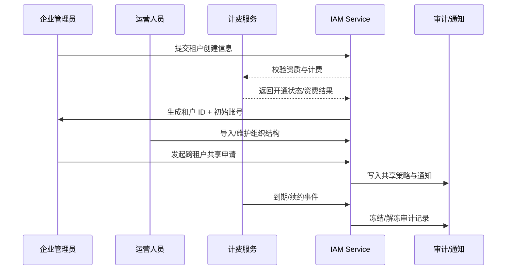

scn_id: SCN-IAM-MULTI-TENANT-001
title: PowerX 多租户与组织管理
status: Draft
version: v0.1.0
owners:
  - name: Michael Hu
    role: Product Manager
    contact: matrix-x@artisan-cloud.com
  - name: Matrix Ops
    role: Platform Ops Lead
    contact: ops@artisan-cloud.com
domains: [iam]
layers: [business]
repos:
  - key: powerx
    scope: core-platform
    responsibility: 多租户控制台、租户生命周期与组织建模服务
  - key: powerx-billing
    scope: billing
    responsibility: 计费、续约与冻结策略集成
  - key: powerx-audit
    scope: governance
    responsibility: 审计日志、共享策略留存
related_usecases:
  - doc_id: UC-IAM-MULTI-TENANT-ONBOARD-001
    layer: service
    domain: iam
  - doc_id: UC-IAM-MULTI-TENANT-ORG-MODELING-001
    layer: service
    domain: iam
  - doc_id: UC-IAM-MULTI-TENANT-CROSS-SHARE-001
    layer: service
    domain: iam
  - doc_id: UC-IAM-MULTI-TENANT-RENEWAL-FREEZE-001
    layer: service
    domain: iam
last_reviewed_at: 2025-10-29

---

# Executive Summary

PowerX 核心平台需要在集团级场景下提供“多租户 + 组织管理”能力，支撑业务单元快速开通、灵活建模与跨租户的协作共享。本场景涵盖：

- 企业管理员在统一控制台中创建与配置新租户；
- 运营人员在租户内部构建、维护组织树及权限边界；
- 集团管理员按需进行跨租户数据共享与协作；
- 计费系统触发的续约提醒、冻结与归档等生命周期治理。

成功判定标准包括：租户生命周期管理受控、组织结构同步准确、共享策略具备可审计性，以及到期冻结/续约可回溯。缺失的实施细节在后续 Clarify 中确认。

# Scope & Guardrails

- **In Scope**：
  - 新租户开通、初始化组织模板与默认权限策略；
  - 租户内部门/团队建模、跨部门协作组配置；
  - 跨租户数据共享策略、访问审批与审计留存；
  - 租户即将到期、冻结、归档与续约流程；
  - 计费、通知、审计等支撑服务的对接。
- **Out of Scope**：
  - 插件级权限粒度（另见“插件权限与访问控制”主用例）；
  - 具体计费策略定价模型，仅消费计费系统出具的状态；
  - 员工账号生命周期管理（链接至“用户与角色管理”主用例）。
- **Environment & Flags**：
  - TODO_ENV_列出需启用的 Feature Flag（如 tenant-v2, cross-tenant-sharing）。
  - TODO_ENV_标注依赖的计费、通知、审计环境或外部接口。

# Participants & Responsibilities

| Scope | Repository | Layer | 责任与交付物 | Owners |
|-------|------------|-------|--------------|--------|
| core-platform | powerx | service | 租户控制台、租户服务 API、组织结构与权限同步 | Michael Hu |
| billing | powerx-billing | service | 续约提醒、冻结执行、费用校验 | Matrix Ops（Platform Ops Lead / ops@artisan-cloud.com） |
| governance | powerx-audit | infra | 审计日志、共享策略留存、告警联动 | Matrix Ops（Platform Ops Lead / ops@artisan-cloud.com） |
| operations | powerx-notify | service | 邮件/站内信/Webhook 通知渠道 | Matrix Ops（Platform Ops Lead / ops@artisan-cloud.com） |

# End-to-End Flow

1. **Stage 1 – 租户开通**：企业管理员提交租户基本信息，系统校验资质与计费状态，生成租户空间、初始管理员与访问入口。
2. **Stage 2 – 组织建模**：运营人员导入或配置组织树，设置负责人与权限包，系统同步至权限目录与员工目录。
3. **Stage 3 – 跨租户共享**：集团管理员选择源/目标租户、资源与授权用户，校验合规策略后生成共享策略并通知相关人员。
4. **Stage 4 – 生命周期治理**：计费任务检测到期，发送续约提醒；未续约时冻结租户，续约完成后恢复；超过宽限期则执行归档与备份。

# Key Interactions & Contracts

- **APIs / Events**：
  - `POST /internal/tenants` — 创建租户（计费校验、模板选择参数）。
  - `PUT /internal/tenants/{tenantId}/org-structure` — 导入组织树、权限包。
  - `POST /internal/tenant-sharing` — 创建跨租户共享策略（含脱敏配置、期限）。
  - `POST /internal/billing/tenants/{tenantId}/renewal` — 续约结果回调。
  - `EVENT tenant.lifecycle.updated` — Frozen / Archived 状态广播。
- **Configs / Schemas**：
  - TODO_CONFIG_组织结构 schema 链接（YAML / JSON 模板）。
  - TODO_CONFIG_共享策略配置项与审批工作流。
- **Security / Compliance**：
  - 所有跨租户共享需通过合规策略与数据脱敏校验；
  - 冻结后强制阻断写操作，访问敏感数据必须经审计；
  - TODO_SEC_补充租户删除/归档的保留政策。

# Usecase Links

- `UC-IAM-MULTI-TENANT-ONBOARD-001` — 租户开通流程（service 层）。
- `UC-IAM-MULTI-TENANT-ORG-MODELING-001` — 组织结构维护（service 层）。
- `UC-IAM-MULTI-TENANT-CROSS-SHARE-001` — 跨租户数据共享（service 层）。
- `UC-IAM-MULTI-TENANT-RENEWAL-FREEZE-001` — 租户续约与冻结治理（service 层）。

# Acceptance Criteria

1. 租户创建成功率 ≥ TODO_METRIC_CREATION_SUCCESS_RATE，平均耗时 ≤ TODO_METRIC_CREATION_TIME。
2. 跨租户共享审批全量留痕，权限冲突触发率 ≤ TODO_METRIC_CONFLICT_RATE。
3. 冻结到恢复的响应时间 ≤ TODO_METRIC_LIFECYCLE_SLA，续约提醒发送成功率 ≥ TODO_METRIC_NOTIFICATION_RATE。

# Telemetry & Ops

- 指标：租户开通耗时、组织同步成功率、共享策略命中率、冻结/解冻事件数。
- 告警阈值：TODO_ALERT_定义超时、失败率阈值及通知渠道（Ops Chat、邮件）。
- 观测来源：`reports/iam/tenant-ops-dashboard`、`scripts/qa/workflow-metrics.mjs` 出具的 Telemetry。

# Open Issues & Follow-ups

| 风险/事项 | 影响范围 | 负责人 | ETA |
|-----------|----------|--------|-----|
| TODO_RISK_计费系统返回场景的回退策略需确认 | 租户冻结/恢复 | TODO_OWNER | 2025-11-15 |
| TODO_RISK_跨租户共享审批链路需要补充安全认证 | 跨租户访问 | TODO_OWNER | 2025-11-30 |

# Appendix

- TODO_LINK_设计稿或白板地址。
- TODO_LINK_PRD 与工作项追踪链接。
- TODO_NOTE_历史版本或迁移计划。
