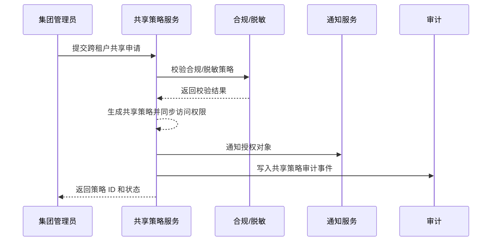

scn_id: SCN-IAM-MULTI-TENANT-CROSS-SHARE-001
title: 跨租户数据共享策略与协作
status: Draft
version: v0.1.0
owners:
  - name: Michael Hu
    role: Product Manager
    contact: matrix-x@artisan-cloud.com
  - name: Matrix Ops
    role: Platform Ops Lead
    contact: ops@artisan-cloud.com
domains: [iam]
layers: [service]
repos:
  - key: powerx
    scope: core-platform
    responsibility: 跨租户共享策略管理、审批流程、通知触发
  - key: powerx-audit
    scope: governance
    responsibility: 审计留痕、策略历史与违规告警
  - key: powerx-directory
    scope: identity
    responsibility: 用户组/权限校验、脱敏策略对接
related_usecases:
  - doc_id: UC-IAM-MULTI-TENANT-CROSS-SHARE-001
    layer: service
    domain: iam
last_reviewed_at: 2025-10-29

---

# Executive Summary

该子场景聚焦集团管理员在多个租户之间按需共享数据资源的流程，涵盖授权申请、合规校验、策略生效与自动撤销。目标是在确保合规与审计的前提下，实现租户间的安全协作。

# Scope & Guardrails

- **In Scope**：跨租户共享申请、资源与用户组选择、合规/脱敏校验、策略生效与通知、授权到期自动撤销。
- **Out of Scope**：租户内部组织权限分配（子场景 B）、计费或插件级访问控制、外部第三方共享。
- **Environment & Flags**：需开启 `cross-tenant-sharing`、`iam-compliance-check` Feature Flag；依赖审计、通知、目录与脱敏配置服务。

# Participants & Responsibilities

| Scope | Repository | Layer | 责任与交付物 | Owners |
|-------|------------|-------|--------------|--------|
| core-platform | powerx | service | 共享策略 API、审批流、到期撤销 | Michael Hu |
| identity | powerx-directory | service | 用户组验证、权限校验、脱敏策略 | Matrix Ops（Platform Ops Lead / ops@artisan-cloud.com） |
| governance | powerx-audit | infra | 审计日志、违规告警、策略历史 | Matrix Ops（Platform Ops Lead / ops@artisan-cloud.com） |
| notifications | powerx-notify | service | 授权成功/失败通知、到期提醒 | Matrix Ops（Platform Ops Lead / ops@artisan-cloud.com） |

# End-to-End Flow

1. **Stage 1 – 授权申请**：集团管理员选择源/目标租户、资源组合与授权对象。
2. **Stage 2 – 合规校验**：系统检查脱敏策略、用户安全认证、合规规则。
3. **Stage 3 – 策略生效**：共享策略落库、同步至访问控制服务、通知相关人员。
4. **Stage 4 – 生命周期管理**：到期自动撤销、违规阻断、审计留痕与告警。

# Key Interactions & Contracts

- `POST /internal/cross-tenant/sharing` — 创建共享策略，包含源/目标租户、资源清单、授权对象、期限与权限级别。
- `POST /internal/compliance/check` — 合规/脱敏校验接口。
- `POST /internal/sharing/{id}/revoke` — 手动撤销共享策略。
- `EVENT cross-tenant.share.updated` — 策略生效或撤销事件，用于审计与通知。

# Usecase Links

- `UC-IAM-MULTI-TENANT-CROSS-SHARE-001` — 跨租户共享场景及测试映射。

# Acceptance Criteria

1. **测试用例 C-1（正向）**：授权成功后 5 分钟内目标用户可以访问共享数据，通知与审计记录完整。
2. **测试用例 C-2（逆向）**：当目标用户未满足安全认证或合规要求时，系统拒绝共享并返回明确错误，审计记录违规详情。
3. 共享到期后自动撤销策略，并触发通知/审计事件；手动撤销时无需人工清理权限。

# Telemetry & Ops

- 指标：跨租户共享成功率、合规阻断率、撤销响应时间。
- 告警阈值：合规阻断率 >10% 或撤销延迟 >5 分钟。
- 观测来源：`cross-tenant.share.updated` 事件监控、审计日志、通知发送统计。

# Open Issues & Follow-ups

| 风险/事项 | 影响范围 | 负责人 | ETA |
|-----------|----------|--------|-----|
| TODO_RISK_脱敏策略覆盖面需确认 | 合规校验 | TODO_OWNER | 2025-11-25 |
| TODO_RISK_审批链与第三方认证联动 | 授权流程 | TODO_OWNER | 2025-12-05 |

# Appendix

- TODO_LINK_合规策略指南与脱敏配置。
- TODO_LINK_共享审批流程设计稿。
- TODO_NOTE_历史共享案例与审计分析。
