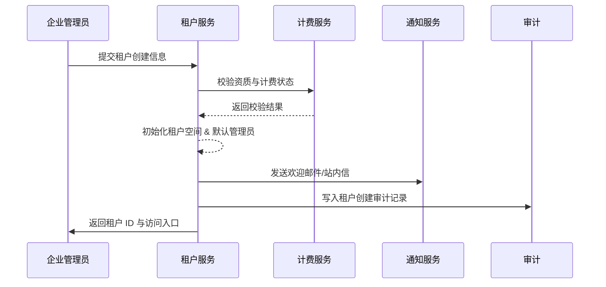

scn_id: SCN-IAM-MULTI-TENANT-ONBOARD-001
title: 企业管理员创建与开通新租户
status: Draft
version: v0.1.0
owners:
  - name: Michael Hu
    role: Product Manager
    contact: matrix-x@artisan-cloud.com
  - name: Matrix Ops
    role: Platform Ops Lead
    contact: ops@artisan-cloud.com
domains: [iam]
layers: [service]
repos:
  - key: powerx
    scope: core-platform
    responsibility: 租户管理控制台、租户服务 API、初始管理员配置
  - key: powerx-billing
    scope: billing
    responsibility: 资质校验、计费方案验证、续约接口
related_usecases:
  - doc_id: UC-IAM-MULTI-TENANT-ONBOARD-001
    layer: service
    domain: iam
last_reviewed_at: 2025-10-29

---

# Executive Summary

该子场景覆盖企业管理员在 PowerX 控制台中创建新租户的流程，从提交业务信息、资质校验到租户成功激活及通知下发。目标是确保集团内新增业务单元可以在 5 分钟内完成租户开通，并具备审批、审计与计费联动能力。

# Scope & Guardrails

- **In Scope**：租户创建向导、资质与计费校验、租户空间初始化、初始管理员账号与欢迎通知。
- **Out of Scope**：组织结构导入（见子场景 B）、插件级权限、计费定价策略本身。
- **Environment & Flags**：需开启 `tenant-v2-wizard`、`billing-integration` Feature Flag；依赖计费、通知、审计沙箱环境。

# Participants & Responsibilities

| Scope | Repository | Layer | 责任与交付物 | Owners |
|-------|------------|-------|--------------|--------|
| core-platform | powerx | service | 租户创建向导、租户表、欢迎通知触发 | Michael Hu |
| billing | powerx-billing | service | 企业资质校验、计费方案确认、续约信息 | Matrix Ops（Platform Ops Lead / ops@artisan-cloud.com） |
| governance | powerx-audit | infra | 租户创建事件审计、审批留痕 | Matrix Ops（Platform Ops Lead / ops@artisan-cloud.com） |
| notifications | powerx-notify | service | 发送欢迎邮件/站内信 | Matrix Ops（Platform Ops Lead / ops@artisan-cloud.com） |

# End-to-End Flow

1. **Stage 1 – 信息收集**：企业管理员在向导中填写租户基础信息与计费方案。
2. **Stage 2 – 审批校验**：系统对接计费/合规服务进行资质与支付状态校验。
3. **Stage 3 – 租户初始化**：创建租户空间、生成租户 ID、初始化默认管理员和访问入口。
4. **Stage 4 – 通知与审计**：通知服务发送欢迎邮件，审计服务记录创建日志及审批结果。

# Key Interactions & Contracts

- `POST /internal/tenants` — 创建租户，包含名称、业务域、数据区域、计费方案与资质材料。
- `POST /internal/billing/tenants/verify` — 资质及计费校验接口。
- `POST /internal/notifications/send` — 欢迎通知与审批结果通知。
- `EVENT tenant.lifecycle.created` — 租户创建成功事件，落入审计。

# Usecase Links

- `UC-IAM-MULTI-TENANT-ONBOARD-001` — 租户开通过程的详细实现与测试用例映射。

# Acceptance Criteria

1. **测试用例 A-1（正向）**：在组织模板有效、计费已支付的前提下，租户状态 5 分钟内变为 Active，欢迎通知与审计日志完整。
2. **测试用例 A-2（逆向）**：若资质校验失败，流程阻断在 Pending-Review，生成待审核工单且无访问入口。
3. 计费或通知故障时能够重试或生成告警，避免 silent failure。

# Telemetry & Ops

- 指标：租户创建平均耗时、审批通过率、资质校验失败率。
- 告警阈值：资质校验连续失败 >=3 次/小时；欢迎邮件发送失败率 >5%。
- 观测来源：`reports/iam/tenant-onboarding-dashboard`、审计事件聚合、通知服务告警面板。

# Open Issues & Follow-ups

| 风险/事项 | 影响范围 | 负责人 | ETA |
|-----------|----------|--------|-----|
| TODO_RISK_审批工单 SLA 待确认 | 合规审批 | TODO_OWNER | 2025-11-15 |
| TODO_RISK_欢迎邮件模板多语言需求 | 通知 | TODO_OWNER | 2025-11-30 |

# Appendix

- TODO_LINK_租户向导 PRD 与设计稿。
- TODO_LINK_审批工作流配置文档。
- TODO_NOTE_历史版本或迁移计划。
