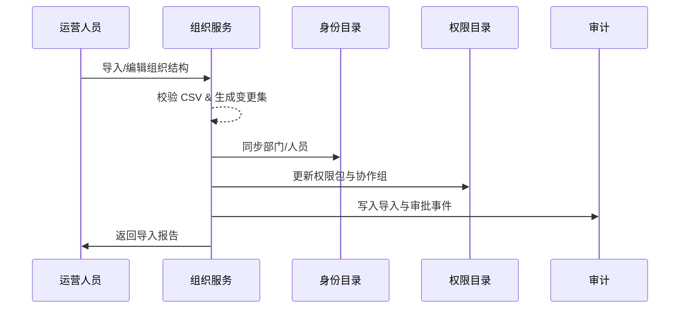

scn_id: SCN-IAM-MULTI-TENANT-ORG-MODELING-001
title: 租户内组织层级建模与协作配置
status: Draft
version: v0.1.0
owners:
  - name: Michael Hu
    role: Product Manager
    contact: matrix-x@artisan-cloud.com
  - name: Matrix Ops
    role: Platform Ops Lead
    contact: ops@artisan-cloud.com
domains: [iam]
layers: [service]
repos:
  - key: powerx
    scope: core-platform
    responsibility: 组织结构管理、协作组与权限包配置
  - key: powerx-directory
    scope: identity
    responsibility: 身份目录同步、部门负责人权限映射
related_usecases:
  - doc_id: UC-IAM-MULTI-TENANT-ORG-MODELING-001
    layer: service
    domain: iam
last_reviewed_at: 2025-10-29

---

# Executive Summary

该子场景描述租户开通后，运营人员如何在控制台导入或维护组织结构，配置部门负责人与跨部门协作组，并确保权限目录与员工目录实时同步。目标是在确保数据准确、权限合规的前提下，支撑复杂组织的灵活建模。

# Scope & Guardrails

- **In Scope**：组织结构导入/编辑、权限包绑定、协作组与数据边界配置、与身份目录/权限目录的同步。
- **Out of Scope**：租户创建（子场景 A）、跨租户协作（子场景 C）、员工账号生命周期管理（另见 IAM 用户场景）。
- **Environment & Flags**：需要启用 `org-structure-v2`、`iam-directory-sync` Feature Flag；依赖身份目录、权限目录、通知服务。

# Participants & Responsibilities

| Scope | Repository | Layer | 责任与交付物 | Owners |
|-------|------------|-------|--------------|--------|
| core-platform | powerx | service | 组织结构 UI/API、协作组配置、导入校验 | Michael Hu |
| identity | powerx-directory | service | 部门/成员同步、权限映射、冲突检测 | Matrix Ops（Platform Ops Lead / ops@artisan-cloud.com） |
| governance | powerx-audit | infra | 导入日志、冲突审批留痕 | Matrix Ops（Platform Ops Lead / ops@artisan-cloud.com） |
| notifications | powerx-notify | service | 冲突与审批通知 | Matrix Ops（Platform Ops Lead / ops@artisan-cloud.com） |

# End-to-End Flow

1. **Stage 1 – 组织导入/编辑**：运营人员导入 CSV 或逐级编辑组织树。
2. **Stage 2 – 权限与负责人配置**：为部门设置负责人、默认权限包与业务域。
3. **Stage 3 – 协作组与边界管理**：创建跨部门协作组，设定数据访问边界及审批策略。
4. **Stage 4 – 同步与审计**：同步至身份目录/权限目录，记录导入结果与审批事件。

# Key Interactions & Contracts

- `POST /internal/tenants/{tenantId}/org/import` — 导入组织结构，支持 CSV 模板。
- `PUT /internal/tenants/{tenantId}/org/{nodeId}` — 编辑部门节点与负责人。
- `POST /internal/tenants/{tenantId}/collaboration-groups` — 创建跨部门协作组。
- `EVENT tenant.org.sync.completed` — 组织同步结果事件。

# Usecase Links

- `UC-IAM-MULTI-TENANT-ORG-MODELING-001` — 组织结构维护及测试用例映射。

# Acceptance Criteria

1. **测试用例 B-1（正向）**：支持模板化导入，导入后部门负责人与权限包在身份/权限目录中可见，导入报告准确。
2. **测试用例 B-2（风控）**：当跨部门权限冲突时触发审批，未审批前协作组保持 Pending 状态且权限未生效。
3. 导入失败需给出具体字段/行的错误详情，并记录在审计与导入报告中。

# Telemetry & Ops

- 指标：组织导入成功率、同步延迟、权限冲突率。
- 告警阈值：同步失败率 >3% 或冲突审批积压 >5 单。
- 观测来源：组织导入报表、`tenant.org.sync.completed` 事件监控面板。

# Open Issues & Follow-ups

| 风险/事项 | 影响范围 | 负责人 | ETA |
|-----------|----------|--------|-----|
| TODO_RISK_协作组审批流程需确认审批人列表 | 协作组生效 | TODO_OWNER | 2025-11-20 |
| TODO_RISK_CSV 模板字段待定 | 导入体验 | TODO_OWNER | 2025-11-10 |

# Appendix

- TODO_LINK_组织结构模板与校验规则。
- TODO_LINK_协作组审批配置文档。
- TODO_NOTE_历史导入案例及回滚策略。
