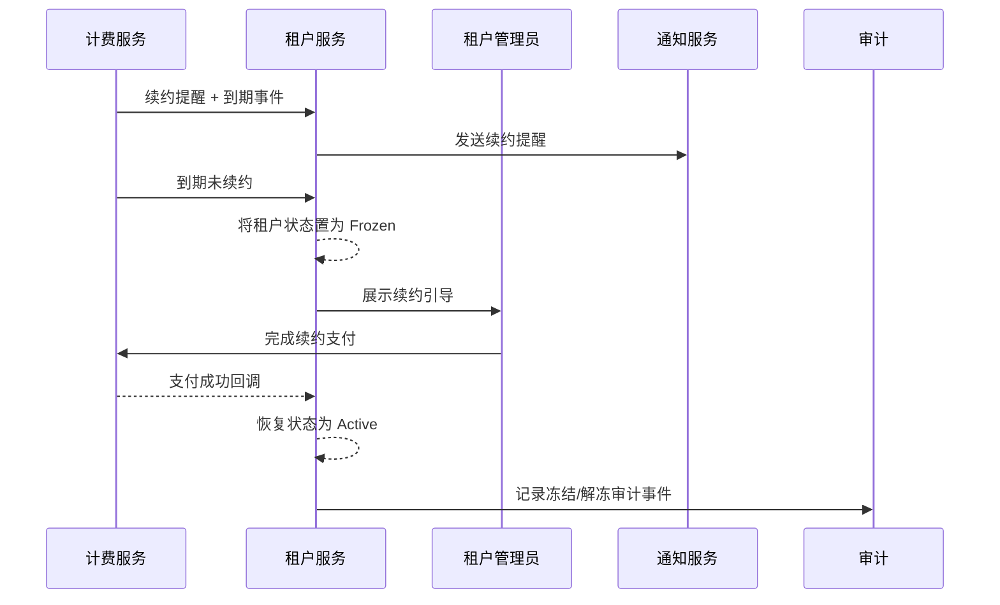

scn_id: SCN-IAM-MULTI-TENANT-RENEWAL-FREEZE-001
title: 租户到期冻结与续约恢复
status: Draft
version: v0.1.0
owners:
  - name: Michael Hu
    role: Product Manager
    contact: matrix-x@artisan-cloud.com
  - name: Matrix Ops
    role: Platform Ops Lead
    contact: ops@artisan-cloud.com
domains: [iam]
layers: [service]
repos:
  - key: powerx
    scope: core-platform
    responsibility: 租户状态机、冻结/恢复逻辑、续约引导
  - key: powerx-billing
    scope: billing
    responsibility: 到期检测、续约支付、宽限策略
  - key: powerx-notify
    scope: operations
    responsibility: 续约提醒、冻结通知、多渠道告警
  - key: powerx-audit
    scope: governance
    responsibility: 状态变更审计、宽限期监控
related_usecases:
  - doc_id: UC-IAM-MULTI-TENANT-RENEWAL-FREEZE-001
    layer: service
    domain: iam
last_reviewed_at: 2025-10-29

---

# Executive Summary

该子场景描述租户生命周期后段的续约提醒、到期冻结、宽限期管理以及续约恢复流程，涵盖计费、通知与审计联动，确保到期租户访问可控、续约体验可追踪。

# Scope & Guardrails

- **In Scope**：续约提醒、到期检测、冻结执行、续约恢复、宽限期归档策略。
- **Out of Scope**：租户创建（子场景 A）、组织权限（子场景 B）、跨租户共享（子场景 C）。
- **Environment & Flags**：需开启 `tenant-renewal-automation`、`billing-webhook` Feature Flag；依赖计费、通知、审计服务与备份脚本。

# Participants & Responsibilities

| Scope | Repository | Layer | 责任与交付物 | Owners |
|-------|------------|-------|--------------|--------|
| core-platform | powerx | service | 租户状态机、冻结/解冻 API、续约引导 UI | Michael Hu |
| billing | powerx-billing | service | 到期检测、支付结果回调、宽限期策略 | Matrix Ops（Platform Ops Lead / ops@artisan-cloud.com） |
| notifications | powerx-notify | service | 续约提醒邮件/站内信/Webhook | Matrix Ops（Platform Ops Lead / ops@artisan-cloud.com） |
| governance | powerx-audit | infra | 冻结/解冻审计、宽限期告警 | Matrix Ops（Platform Ops Lead / ops@artisan-cloud.com） |
| backup | powerx-backup | infra | 归档与数据备份策略 | Matrix Ops（Platform Ops Lead / ops@artisan-cloud.com） |

# End-to-End Flow

1. **Stage 1 – 续约提醒**：计费系统在到期前 N 天发送续约提醒至管理员与财务联系人。
2. **Stage 2 – 到期冻结**：到期仍未续约时，状态置为 Frozen，限制写操作并展示续约引导。
3. **Stage 3 – 宽限期管理**：在宽限期内支持快速续约或申请延长；超过宽限期进入 Archived 并触发备份。
4. **Stage 4 – 恢复与审计**：续约支付成功后恢复 Active，记录审计日志与通知。

# Key Interactions & Contracts

- `EVENT billing.tenant.renewal.reminder` — 到期前提醒事件。
- `EVENT billing.tenant.expired` — 到期未续约事件。
- `POST /internal/tenants/{tenantId}/freeze` — 冻结租户 API。
- `POST /internal/tenants/{tenantId}/resume` — 恢复租户 API。
- `EVENT tenant.lifecycle.updated` — 状态变更广播（Frozen、Archived、Active）。

# Usecase Links

- `UC-IAM-MULTI-TENANT-RENEWAL-FREEZE-001` — 租户生命周期治理用例与测试映射。

# Acceptance Criteria

1. **测试用例 D-1（正向）**：到期未续约时自动冻结，管理员登录仅见续约提示，通知与审计记录完整，写操作阻断。
2. **测试用例 D-2（正向）**：续约支付成功后 2 分钟内恢复 Active，访问权限重启且审计记录支付流水号与恢复时间。
3. 冻结期间所有敏感操作需触发告警；宽限期结束后自动归档并执行备份策略。

# Telemetry & Ops

- 指标：续约提醒触达率、冻结响应时间、宽限期内恢复率。
- 告警阈值：冻结后仍有写操作尝试 >3 次/小时；支付回调失败率 >2%。
- 观测来源：续约任务仪表板、`tenant.lifecycle.updated` 事件流、通知发送报表。

# Open Issues & Follow-ups

| 风险/事项 | 影响范围 | 负责人 | ETA |
|-----------|----------|--------|-----|
| TODO_RISK_宽限期规则需与法务确认 | 生命周期策略 | TODO_OWNER | 2025-11-18 |
| TODO_RISK_归档存储成本评估 | 归档/备份 | TODO_OWNER | 2025-12-10 |

# Appendix

- TODO_LINK_续约引导设计稿。
- TODO_LINK_计费回调契约与时序。
- TODO_NOTE_历史冻/解冻事件统计。
