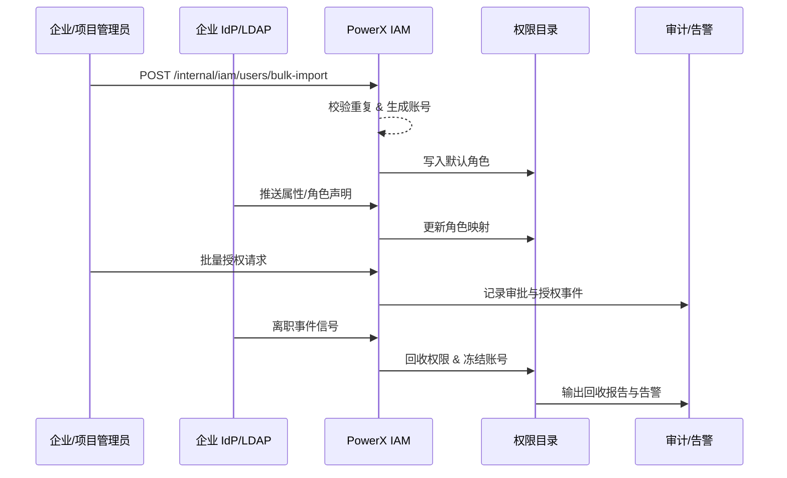

# Positioning & Goals

PowerX 需要覆盖员工从入职、目录同步、授权到离职回收的全栈身份治理。该主场景协同企业管理员、项目管理员、企业 IdP 与审计系统，要求批量导入、高频同步、批量授权与离职回收都在 5 分钟内完成，并维持 ≥99% 的同步成功率以及全程可追溯的审计。

# Scope & Guardrails

- **In Scope**：员工建档/导入、企业目录同步（OIDC/LDAP）、批量授权与审批、离职回收及自动化通知/审计。
- **Out of Scope**：登录体验（见《SCN-IAM-LOGIN-AUTH-001》）、插件内部细粒度权限（见对应业务场景）、跨租户共享策略（见《SCN-IAM-MULTI-TENANT-001》）。
- **Environment & Flags**：`iam-directory-v2`（目录服务）、`sso-oidc-sync`（IdP 同步）、`iam-bulk-assign`（批量授权）、`iam-auto-revoke`（自动回收）。依赖企业 IdP、通知中心、审计事件总线、批处理计算队列。

# Core Capabilities

1. **Identity Onboarding Engine**：批量导入、字段校验与默认角色赋予，确保入职即上手。
2. **Directory Sync & Mapping**：OIDC/LDAP 属性同步、字段映射与冲突回滚，维持组织/角色一致性。
3. **Authorization Automation**：批量授权审批、最小权限校验、离职触发回收与审计报告自动生成。

# Participants & Responsibilities

| Scope | Repository | Layer | 责任与交付物 | Owners |
|-------|------------|-------|--------------|--------|
| core-platform | powerx | service | 用户目录、角色策略引擎、导入/授权 API | Li Wei（IAM Product Lead / iam@artisan-cloud.com） |
| automation | powerx | ops | 定时同步任务、离职回收工作流、批处理器 | Matrix Ops（Platform Ops Lead / ops@artisan-cloud.com） |
| governance | powerx | security | 审计日志、回收报告、告警配置 | Matrix Ops（Platform Ops Lead / ops@artisan-cloud.com） |
| integrations | powerx | ui | IdP/OIDC/LDAP 连接器、管理员门户、通知/邮件集成 | Li Wei（IAM Product Lead / iam@artisan-cloud.com） |

# Validation Workflow

1. **Stage 1 – 身份建档与导入**：管理员导入入职清单，目录服务校验并创建账号、分配默认角色。
2. **Stage 2 – 目录同步与映射**：调度任务或 OIDC 回调同步组织/角色声明，执行映射与冲突处理。
3. **Stage 3 – 授权审批与生效**：项目管理员发起批量授权，系统自动审批、记录最小权限校验并写入权限目录。
4. **Stage 4 – 离职回收与审计**：离职事件触发账号冻结、权限回收、数据归档，并生成审计报告/告警。

# Architecture Diagram

# Key Interactions & Contracts

- `POST /internal/iam/users/bulk-import` — 批量导入员工，包含字段校验/重复检测/默认角色赋予。
- `POST /internal/iam/sync/oidc`、`/cron/iam/sync-directory` — 同步 IdP/LDAP 属性与组织映射。
- `POST /internal/iam/roles/batch-assign` — 批量授权接口，内置审批、最小权限校验与告警。
- `EVENT iam.user.offboarded` — 离职事件，驱动会话终止、权限回收、审计归档。
- `EVENT iam.permission.anomaly` — 授权冲突或回收失败时触发的高优先级告警。

# Related Links

- `UC-IAM-USER-ROLE-IMPORT-001` — 批量导入员工建号。
- `UC-IAM-USER-ROLE-DIRECTORY-SYNC-001` — 目录同步与映射流程。
- `UC-IAM-USER-ROLE-BULK-AUTH-001` — 项目批量授权与审批。
- `UC-IAM-USER-ROLE-OFFBOARD-001` — 离职自动回收与告警。
- 设计稿：Confluence「IAM-RBAC-Design」。
- 导入模板：`docs/standards/iam/user/bulk-import-spec.md`
- 离职回收 BPMN：`ops/runbooks/iam-offboard.md`

# Acceptance Criteria

1. 批量导入 500 名员工成功率 ≥ 98%，平均耗时 ≤ 10 分钟，所有错误可追溯。
2. 目录同步成功率 ≥ 99%，字段映射冲突自动回滚并在 5 分钟内通知管理员。
3. 离职事件触发后 ≤ 2 分钟冻结账号并回收全部角色，审计日志 100% 可检索。

# Telemetry & Ops

- 指标：`iam.bulk_import.success_rate`、`iam.directory_sync.duration_ms`、`iam.batch_assign.latency_ms`、`iam.offboard.revoke_latency_ms`。
- 告警阈值：导入失败率 >5%/小时、同步耗时 >10 分钟、授权延迟 >5 分钟、回收延迟 >3 分钟。
- 观测来源：`reports/iam/user-lifecycle-dashboard`、工作流指标采集脚本、审计事件聚合面板。

# Open Issues & Follow-ups

| 风险/事项 | 影响范围 | 负责人 | ETA |
|-----------|----------|--------|-----|
| 高峰期目录同步易堵塞，需按租户分片 + 并发限流策略 | Directory Sync | Matrix Ops | 2025-11-15 |
| 离职回收失败的人工兜底流程未固化，需要 SOP 与自动化校验 | Offboarding | Li Wei | 2025-11-22 |

# Appendix

- `docs/meta/scenarios/powerx/core-platform/iam-rbac/user-role/primary.md`
- `docs/standards/iam/user/bulk-import-spec.md`
- `ops/runbooks/iam-offboard.md`
