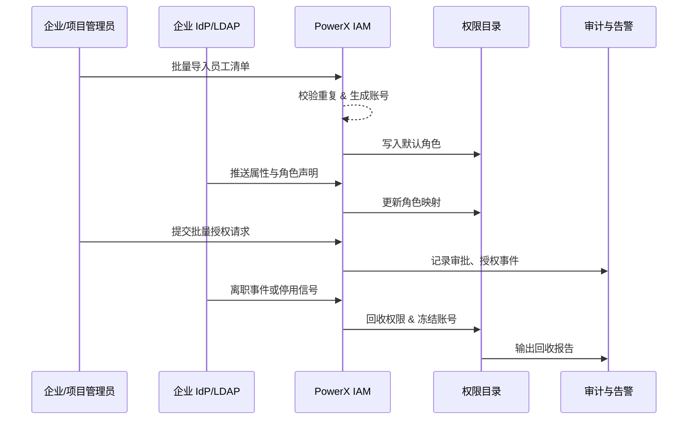

scn_id: SCN-IAM-USER-ROLE-001
title: PowerX 用户与角色管理
status: Draft
version: v0.1.0
owners:
  - name: Li Wei
    role: IAM Product Lead
    contact: iam@artisan-cloud.com
  - name: Matrix Ops
    role: Platform Ops Lead
    contact: ops@artisan-cloud.com
domains: [iam]
layers: [service, ui]
repos:
  - key: powerx
    scope: core-platform
    responsibility: 用户目录、角色策略引擎、审批集成、审计事件
related_usecases:
  - doc_id: UC-IAM-USER-ROLE-IMPORT-001
    layer: service
    domain: iam
  - doc_id: UC-IAM-USER-ROLE-DIRECTORY-SYNC-001
    layer: service
    domain: iam
  - doc_id: UC-IAM-USER-ROLE-BULK-AUTH-001
    layer: service
    domain: iam
  - doc_id: UC-IAM-USER-ROLE-OFFBOARD-001
    layer: service
    domain: iam
last_reviewed_at: 2025-10-30

---

# Executive Summary

PowerX 需要提供从员工入职到离职的全栈身份治理能力，覆盖批量建号、企业目录同步、项目级授权与回收。该主场景协调企业管理员、项目管理员、企业 IdP、风控审计等角色，确保角色策略配置准确、授权与回收可自动化执行、关键操作全程可追溯。四个核心子场景分别处理批量导入建号、OIDC/LDAP 目录同步、批量授权审批以及离职自动回收，目标是在 5 分钟内完成授权或回收动作并维持 ≥99% 的同步成功率。

# Scope & Guardrails

- **In Scope**：员工账号建档、外部目录同步、批量授权、离职回收以及相关审批、通知、审计流程。
- **Out of Scope**：用户登录体验（见《SCN-IAM-LOGIN-001》）、插件内部细粒度权限、跨租户数据共享策略。
- **Environment & Flags**：`iam-directory-v2`、`sso-oidc-sync`、`iam-bulk-assign`、`iam-auto-revoke` Feature Flag；依赖企业 IdP、邮件/通知服务、审计事件总线与批处理任务队列。

# Participants & Responsibilities

| Scope | Repository | Layer | 责任与交付物 | Owners |
|-------|------------|-------|--------------|--------|
| core-platform | powerx | service | 用户目录、角色策略引擎、导入与授权 API | Li Wei（IAM Product Lead / iam@artisan-cloud.com） |
| automation | powerx | service | 定时同步任务、离职回收工作流、批处理器 | Matrix Ops（Platform Ops Lead / ops@artisan-cloud.com） |
| governance | powerx | infra | 审计日志、回收报告、异常告警配置 | Matrix Ops（Platform Ops Lead / ops@artisan-cloud.com） |
| integrations | powerx | service | IdP/OIDC/LDAP 连接器、通知/邮件集成 | Li Wei（IAM Product Lead / iam@artisan-cloud.com） |

# End-to-End Flow

1. **Stage 1 – 身份建档与导入**：企业管理员导入入职清单，目录服务校验数据并创建账号、分配默认角色。
2. **Stage 2 – 目录同步与映射**：调度任务或 OIDC 回调同步组织与角色声明，执行字段映射和冲突处理。
3. **Stage 3 – 授权审批与生效**：项目管理员发起批量授权，系统执行审批、最小权限校验并写入权限目录。
4. **Stage 4 – 离职回收与审计**：离职事件触发账号冻结、权限回收、数据归档，并生成审计报告与告警。

# Key Interactions & Contracts

- `POST /internal/iam/users/bulk-import` — 批量导入员工，支持字段校验、重复检测与默认角色分配。
- `POST /internal/iam/sync/oidc`、`/cron/iam/sync-directory` — 从 IdP 拉取组织/角色并执行映射。
- `POST /internal/iam/roles/batch-assign` — 批量授权接口，内置审批路由与最小权限校验。
- `EVENT iam.user.offboarded` — 离职事件，驱动会话终止、权限回收、审计报告生成。
- `EVENT iam.permission.anomaly` — 授权冲突或回收失败时触发高优先级告警。

# Usecase Links

- `UC-IAM-USER-ROLE-IMPORT-001` — 批量导入员工建号（service 层，PowerX 仓）。
- `UC-IAM-USER-ROLE-DIRECTORY-SYNC-001` — IdP 目录同步映射流程（service 层，PowerX 仓）。
- `UC-IAM-USER-ROLE-BULK-AUTH-001` — 项目批量授权与审批（service 层，PowerX 仓）。
- `UC-IAM-USER-ROLE-OFFBOARD-001` — 离职自动回收与告警（service 层，PowerX 仓）。

# Acceptance Criteria

1. 批量导入 500 名员工的成功率 ≥ 98%，平均耗时 ≤ 10 分钟。
2. 目录同步成功率 ≥ 99%，字段映射冲突自动回滚并在 5 分钟内通知管理员。
3. 离职事件触发后 2 分钟内冻结账号并回收全部角色，审计日志完整可追溯。

# Telemetry & Ops

- 指标：`iam.bulk_import.success_rate`、`iam.directory_sync.duration`、`iam.batch_assign.latency`、`iam.offboard.revoke_latency`。
- 告警阈值：导入失败率 >5%/小时、同步耗时 >10 分钟、授权延迟 >5 分钟、回收延迟 >3 分钟。
- 观测来源：`reports/iam/user-lifecycle-dashboard`、工作流指标采集脚本、审计事件聚合面板。

# Open Issues & Follow-ups

| 风险/事项 | 影响范围 | 负责人 | ETA |
|-----------|----------|--------|-----|
| 高峰期目录同步易阻塞，需要评估按租户分片策略 | automation | Matrix Ops | 2025-11-15 |
| 离职回收失败的人工兜底路径未固化，需要补充 SOP | governance | Li Wei | 2025-11-22 |

# Appendix

- PowerX IAM 角色模型设计稿（Confluence: IAM-RBAC-Design）。
- 批量导入模板与字段校验规则说明（Notion: IAM Bulk Import Spec）。
- 离职回收工作流 BPMN 配置（Ops Runbook #IAM-OFFBOARD）。
