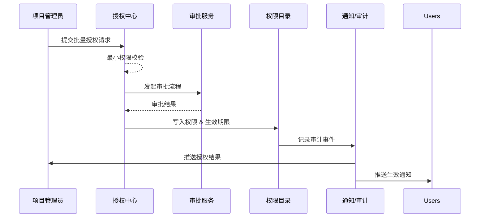

scn_id: SCN-IAM-USER-ROLE-BULK-AUTH-001
title: 项目管理员批量分配角色与权限策略
status: Draft
version: v0.1.0
owners:
  - name: Li Wei
    role: IAM Product Lead
    contact: iam@artisan-cloud.com
  - name: Matrix Ops
    role: Platform Ops Lead
    contact: ops@artisan-cloud.com
domains: [iam]
layers: [service, ui]
repos:
  - key: powerx
    scope: core-platform
    responsibility: 授权中心、审批工作流、最小权限校验与通知集成
related_usecases: []
last_reviewed_at: 2025-10-30

---

# Executive Summary

该子场景描述项目管理员在授权中心为项目成员批量分配角色或权限包的流程，涵盖成员选择、审批策略、最小权限校验、权限生效与通知。目标是在受控的审批链路下，将授权响应时间控制在 5 分钟以内，并保留完整的审计与回溯信息。

# Scope & Guardrails

- **In Scope**：成员选择、权限包与生效期限配置、审批与最小权限校验、授权写入、通知与审计。
- **Out of Scope**：单人自助申请、离职回收（独立场景）、跨租户共享策略。
- **Environment & Flags**：`iam-bulk-assign`、`minimal-privilege-check` Feature Flag；依赖审批中心、通知服务、审计日志。

# Participants & Responsibilities

| Scope | Repository | Layer | 责任与交付物 | Owners |
|-------|------------|-------|--------------|--------|
| core-platform | powerx | service | 授权中心 API、权限包管理、最小权限校验器 | Li Wei（IAM Product Lead / iam@artisan-cloud.com） |
| governance | powerx | infra | 审批策略配置、审计日志、异常预警 | Matrix Ops（Platform Ops Lead / ops@artisan-cloud.com） |
| automation | powerx | service | Approval workflow 路由、通知投递、失效处理 | Matrix Ops（Platform Ops Lead / ops@artisan-cloud.com） |

# End-to-End Flow

1. **Stage 1 – 授权配置**：项目管理员选择项目/资源域、成员列表、权限包及生效期限。
2. **Stage 2 – 审批与校验**：系统执行最小权限校验，触发审批流程（项目主管/安全团队）。
3. **Stage 3 – 权限写入**：审批通过后，写入权限目录并记录授权来源、期限、审批结果。
4. **Stage 4 – 通知与监控**：向成员与项目管理员推送授权结果；高危或失败场景触发告警，过期前自动提醒回收。

# Key Interactions & Contracts

- `POST /internal/iam/roles/batch-assign` — 创建批量授权任务，包含成员、权限包、期限、审批策略。
- `POST /internal/iam/roles/batch-assign/validate` — 最小权限校验接口，输出风险与建议。
- `POST /internal/approvals/start` — 启动审批流程，支持动态审批人和 SLA。
- `EVENT iam.permission.granted` — 授权成功事件；`EVENT iam.permission.pending_approval` — 待审批事件。
- `EVENT iam.permission.expiring` — 授权到期前提醒回收。

# Usecase Links

- 暂无（待 Usecase Seed 补全后更新）。

# Acceptance Criteria

1. 批量授权 100 名成员的平均完成时间 ≤ 5 分钟，成功率 ≥ 99%。
2. 高危权限包需触发安全审批并保留理由，审批通过前权限不得生效。
3. 重复授权自动合并，审计日志展示授权来源、审批链路与生效/失效时间。

# Telemetry & Ops

- 指标：`iam.batch_assign.queue_latency`、`iam.batch_assign.approval_duration`、`iam.batch_assign.failure_ratio`。
- 告警阈值：审批等待超过 30 分钟触发提醒；授权失败率 >2%/小时触发告警；`iam.permission.expiring` 未处理数量 >10 触发提示。
- 观测来源：授权中心仪表板、审批服务队列监控、审计事件流。

# Open Issues & Follow-ups

| 风险/事项 | 影响范围 | 负责人 | ETA |
|-----------|----------|--------|-----|
| 权限包粒度需与插件团队对齐，避免大量自定义策略 | core-platform | Li Wei | 2025-11-10 |
| 审批超时的自动升级策略需在 Ops Runbook 中补充 | governance | Matrix Ops | 2025-11-18 |

# Appendix

- 权限包定义规范（Docs: iam/permission-packages.md）。
- 审批流程配置示例（Notion: IAM Bulk Assignment Approval）。
- 授权事件字段说明（Docs: iam/events/permission-granted.yaml）。
