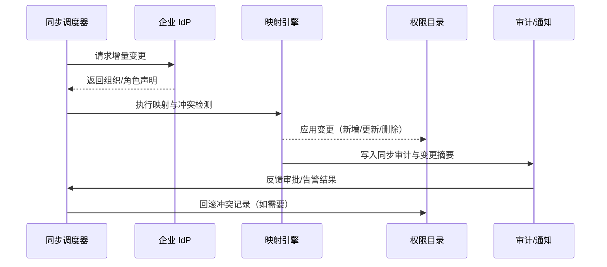

scn_id: SCN-IAM-USER-ROLE-DIRECTORY-SYNC-001
title: OIDC/LDAP 目录同步组织与角色
status: Draft
version: v0.1.0
owners:
  - name: Li Wei
    role: IAM Product Lead
    contact: iam@artisan-cloud.com
  - name: Matrix Ops
    role: Platform Ops Lead
    contact: ops@artisan-cloud.com
domains: [iam]
layers: [service]
repos:
  - key: powerx
    scope: core-platform
    responsibility: IdP 连接器、目录映射规则引擎、同步任务调度
related_usecases: []
last_reviewed_at: 2025-10-30

---

# Executive Summary

该子场景阐述 PowerX 与企业 IdP（OIDC/LDAP）之间的目录同步流程，包括组织结构、岗位属性与角色声明的增量更新。目标是在保持 5 分钟内同步 SLA 的同时，确保冲突回滚、审计留痕与管理员可见的变更摘要。

# Scope & Guardrails

- **In Scope**：IdP 连接、属性映射规则、增量/全量同步、冲突处理、审批触发、审计通知。
- **Out of Scope**：账号初次建号（见批量导入场景）、项目级授权、离职回收。
- **Environment & Flags**：`sso-oidc-sync`、`ldap-hub` Feature Flag；依赖 IdP 访问凭证、安全代理、审计日志、审批服务。

# Participants & Responsibilities

| Scope | Repository | Layer | 责任与交付物 | Owners |
|-------|------------|-------|--------------|--------|
| core-platform | powerx | service | IdP 连接器、同步任务编排、映射配置管理 | Li Wei（IAM Product Lead / iam@artisan-cloud.com） |
| automation | powerx | service | 同步调度、回滚与重试、异常监控 | Matrix Ops（Platform Ops Lead / ops@artisan-cloud.com） |
| governance | powerx | infra | 同步审计、审批记录、异常告警转发 | Matrix Ops（Platform Ops Lead / ops@artisan-cloud.com） |

# End-to-End Flow

1. **Stage 1 – 同步触发**：定时任务或 IdP 回调触发同步，根据租户配置选择增量或全量模式。
2. **Stage 2 – 属性映射**：拉取组织/岗位/角色声明，执行映射规则与冲突检测，生成变更集。
3. **Stage 3 – 变更应用**：对新增/更新/删除记录执行写入，冲突或高危角色变更进入审批。
4. **Stage 4 – 审计与通知**：记录审计事件，生成变更摘要推送管理员，异常时触发告警与回滚。

# Key Interactions & Contracts

- `GET /idp/oidc/users?since=<ts>`、`GET /idp/ldap/delta` — 从 IdP 拉取增量数据的接口标准。
- `POST /internal/iam/directory/apply` — 应用映射后的组织/角色变更集，支持幂等、回滚令牌。
- `POST /internal/iam/directory/conflict` — 将冲突记录提交审批或人工处置。
- `EVENT iam.directory.sync_completed` — 同步完成事件，包含统计、耗时、冲突数量。
- `EVENT iam.directory.sync_failed` — 同步失败事件，用于高优先级告警。

# Usecase Links

- 暂无（待 Usecase Seed 补全后更新）。

# Acceptance Criteria

1. 增量同步平均耗时 ≤ 5 分钟，成功率 ≥ 99%。
2. 高危角色变更需进入审批，审批通过前不生效且有留痕。
3. 同步冲突需自动回滚，并在 3 分钟内向管理员发送处理通知。

# Telemetry & Ops

- 指标：`iam.directory_sync.duration`、`iam.directory_sync.delta_size`、`iam.directory_sync.conflict_ratio`。
- 告警阈值：连续失败 ≥2 次触发 P1 告警；冲突率 >10% 触发 P2 告警；审批积压超过 30 分钟触发提示。
- 观测来源：目录同步仪表板、审计事件流、审批队列监控。

# Open Issues & Follow-ups

| 风险/事项 | 影响范围 | 负责人 | ETA |
|-----------|----------|--------|-----|
| 多 IdP 并存时的映射策略需标准化，避免规则冲突 | core-platform | Li Wei | 2025-11-12 |
| 同步失败的重试窗口需与 IdP 速率限制协调 | automation | Matrix Ops | 2025-11-20 |

# Appendix

- IdP 映射规则配置指南（Docs: iam/directory-mapping.md）。
- 同步任务调度架构设计（Confluence: IAM Directory Sync）。
- 审批流程配置示例（Notion: IAM Role Change Approval）。
