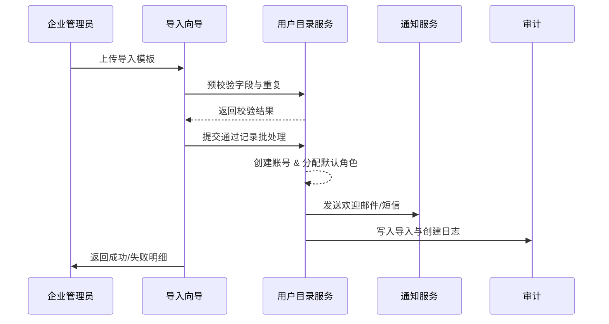

scn_id: SCN-IAM-USER-ROLE-IMPORT-001
title: 管理员批量导入员工并自动建号
status: Draft
version: v0.1.0
owners:
  - name: Li Wei
    role: IAM Product Lead
    contact: iam@artisan-cloud.com
  - name: Matrix Ops
    role: Platform Ops Lead
    contact: ops@artisan-cloud.com
domains: [iam]
layers: [service, ui]
repos:
  - key: powerx
    scope: core-platform
    responsibility: 用户目录、批量导入校验引擎、账号生命周期 API
related_usecases: []
last_reviewed_at: 2025-10-30

---

# Executive Summary

该子场景描述企业管理员在 PowerX 控制台通过模板批量导入入职员工，系统自动创建账号、分配默认角色并发送激活通知。目标是在少人工干预的前提下，实现高准确率建号、清晰的错误反馈以及可追溯的导入日志。

# Scope & Guardrails

- **In Scope**：导入模板校验、重复检测、账号创建、默认角色分配、欢迎通知与导入日志。
- **Out of Scope**：目录同步（由《SCN-IAM-USER-ROLE-DIRECTORY-SYNC-001》覆盖）、插件级权限配置、离职回收流程。
- **Environment & Flags**：`iam-directory-v2`、`user-bulk-import` Feature Flag；依赖对象存储（模板上传）、通知服务、审计事件总线。

# Participants & Responsibilities

| Scope | Repository | Layer | 责任与交付物 | Owners |
|-------|------------|-------|--------------|--------|
| core-platform | powerx | service | 导入校验器、账号创建、默认角色映射 | Li Wei（IAM Product Lead / iam@artisan-cloud.com） |
| automation | powerx | service | 导入批处理调度、错误报告生成、任务幂等控制 | Matrix Ops（Platform Ops Lead / ops@artisan-cloud.com） |
| governance | powerx | infra | 导入审计事件、错误追踪、告警配置 | Matrix Ops（Platform Ops Lead / ops@artisan-cloud.com） |

# End-to-End Flow

1. **Stage 1 – 模板准备**：管理员下载模板、填写员工基础信息与岗位/组织字段，上传至导入向导。
2. **Stage 2 – 数据校验**：导入校验器执行字段完整性、格式、重复检测，并生成预检查报告。
3. **Stage 3 – 账号创建**：通过批处理任务创建账号、分配默认角色、触发初始密码或 SSO 绑定。
4. **Stage 4 – 通知与审计**：向员工发送欢迎邮件/短信，导入日志写入审计系统并反馈错误明细。

# Key Interactions & Contracts

- `POST /internal/iam/users/bulk-import/validation` — 上传模板后执行字段、重复、策略校验。
- `POST /internal/iam/users/bulk-import/commit` — 对校验通过的记录执行建号及角色分配。
- `POST /internal/notifications/send` — 发送欢迎邮件或短信，支持个性化变量。
- `EVENT iam.user.bulk_imported` — 导入完成事件，包含成功/失败统计与错误清单引用。

# Usecase Links

- 暂无（待 Usecase Seed 补全后更新）。

# Acceptance Criteria

1. 500 条记录以内的导入需在 10 分钟内完成，成功率 ≥ 98%。
2. 重复账号、缺失必填字段需阻断创建，错误报告提供行号与原因。
3. 导入失败的记录支持重新上传，无需手动清理已成功的账号。

# Telemetry & Ops

- 指标：`iam.bulk_import.batch_size`、`iam.bulk_import.success_rate`、`iam.bulk_import.error_ratio`、`iam.bulk_import.duration`.
- 告警阈值：连续 3 批导入失败率 >5% 触发 P1 告警；导入耗时 >15 分钟触发 P2 告警。
- 观测来源：导入任务仪表板、对象存储上传日志、审计事件流。

# Open Issues & Follow-ups

| 风险/事项 | 影响范围 | 负责人 | ETA |
|-----------|----------|--------|-----|
| 模板字段扩展需与 HR 系统对齐，避免版本不一致 | core-platform | Li Wei | 2025-11-08 |
| 海量导入时队列拥塞，需要压测批处理并调优并发度 | automation | Matrix Ops | 2025-11-18 |

# Appendix

- 导入模板示例与字段说明（Notion: IAM Bulk Import Template）。
- 批处理作业架构设计（Confluence: IAM Bulk Job Design）。
- 审计事件字段定义（Docs: iam/events/bulk-import.yaml）。
