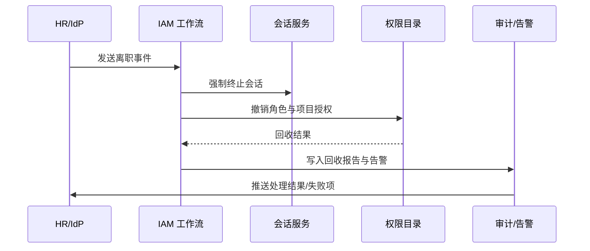

scn_id: SCN-IAM-USER-ROLE-OFFBOARD-001
title: 员工离职自动撤销权限
status: Draft
version: v0.1.0
owners:
  - name: Li Wei
    role: IAM Product Lead
    contact: iam@artisan-cloud.com
  - name: Matrix Ops
    role: Platform Ops Lead
    contact: ops@artisan-cloud.com
domains: [iam]
layers: [service]
repos:
  - key: powerx
    scope: core-platform
    responsibility: 离职事件监听、权限回收工作流、审计与告警
related_usecases: []
last_reviewed_at: 2025-10-30

---

# Executive Summary

该子场景覆盖员工离职或账号停用后，PowerX 自动冻结账号、终止会话、撤销角色与项目授权、完成数据归档并生成审计报告的流程。目标是确保离职事件触发后 2 分钟内完成权限回收，减少人工介入并满足合规要求。

# Scope & Guardrails

- **In Scope**：离职事件接入、账号冻结、会话终止、权限回收、数据移交、审计与告警。
- **Out of Scope**：离职审批流程（由 HR 系统负责）、插件或外部系统的数据擦除策略。
- **Environment & Flags**：`iam-auto-revoke`、`session-force-logout` Feature Flag；依赖 HR/IdP Webhook、会话管理服务、通知与审计系统。

# Participants & Responsibilities

| Scope | Repository | Layer | 责任与交付物 | Owners |
|-------|------------|-------|--------------|--------|
| core-platform | powerx | service | 离职事件监听、回收工作流编排、资产移交 | Li Wei（IAM Product Lead / iam@artisan-cloud.com） |
| automation | powerx | service | 重试与补偿、数据归档、报告生成 | Matrix Ops（Platform Ops Lead / ops@artisan-cloud.com） |
| governance | powerx | infra | 审计日志、告警推送、风险处置协同 | Matrix Ops（Platform Ops Lead / ops@artisan-cloud.com） |

# End-to-End Flow

1. **Stage 1 – 事件触发**：HR 系统或 IdP Webhook 发出离职事件，包含员工标识、离职时间与交接人。
2. **Stage 2 – 冻结与终止**：IAM 服务立即冻结账号、终止活跃会话、阻断登录。
3. **Stage 3 – 权限回收**：回收关联角色、项目授权与敏感数据访问权，执行通知与资产移交。
4. **Stage 4 – 审计与告警**：生成离职处理报告，记录成功与失败项；若回收失败，触发告警并安排重试。

# Key Interactions & Contracts

- `POST /webhook/hr/offboard` — 离职事件入口，验证签名并写入事件队列。
- `POST /internal/iam/users/{userId}/freeze` — 冻结账号并标记不可登录。
- `POST /internal/sessions/revoke` — 批量终止会话与访问令牌。
- `POST /internal/iam/permissions/revoke` — 回收角色与项目授权，支持幂等与重试。
- `EVENT iam.offboard.completed`、`EVENT iam.offboard.failed` — 回收完成或失败的审计事件。

# Usecase Links

- 暂无（待 Usecase Seed 补全后更新）。

# Acceptance Criteria

1. 离职事件触发后 2 分钟内完成账号冻结与权限回收，成功率 ≥ 99%。
2. 回收失败需自动重试 3 次并触发 P1 告警，告警中包含未回收的授权列表。
3. 生成的离职报告需包含回收清单、会话终止记录、资产移交情况，并保留至少 1 年。

# Telemetry & Ops

- 指标：`iam.offboard.trigger_count`、`iam.offboard.revoke_latency`、`iam.offboard.retry_count`、`iam.offboard.failure_ratio`。
- 告警阈值：回收延迟 >3 分钟触发 P1 告警；失败率 >1%/天触发 P0 升级；重试次数 >3 次触发 Ops 值班通知。
- 观测来源：离职处理仪表板、审计日志聚合、告警平台（Ops Chat）。

# Open Issues & Follow-ups

| 风险/事项 | 影响范围 | 负责人 | ETA |
|-----------|----------|--------|-----|
| 外部 SaaS 连接器的权限回收需统一纳入工作流 | automation | Matrix Ops | 2025-11-25 |
| 离职报告需要支持多语言模板以满足跨区域合规 | governance | Li Wei | 2025-11-30 |

# Appendix

- 离职事件字段规范（Docs: iam/events/offboard.yaml）。
- 工作流 BPMN 模型（Ops Runbook #IAM-OFFBOARD）。
- 告警与通知策略（Confluence: IAM Offboarding Alerts）。
