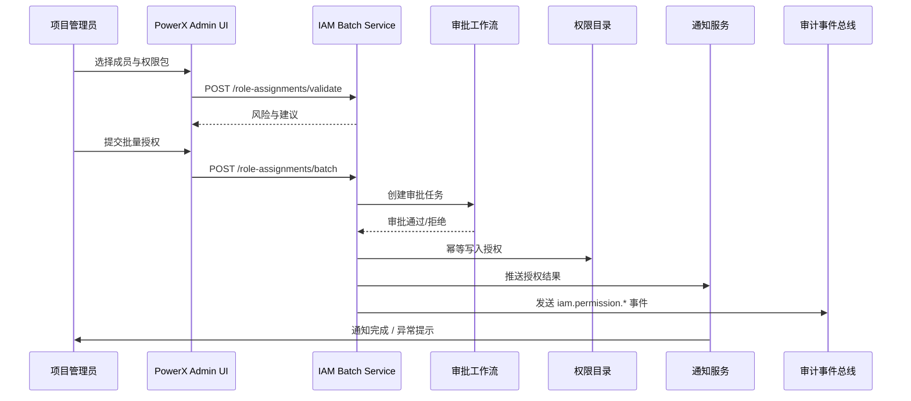

doc_id: UC-IAM-USER-ROLE-BULK-AUTH-001
scn_id: SCN-IAM-USER-ROLE-001
title: 项目批量授权与审批
status: Draft
version: v0.1.0
repo_key: powerx
scope: powerx
layer: service
domain: iam
scenario_title: "PowerX 用户与角色管理"
owners:
  - name: Michael Hu
    role: Tech Steward
    contact: tech@artisan-cloud.com
  - name: Matrix-X
    role: Docs Coordinator
    contact: dev@artisan-cloud.com
contributors: []
linked_requirements:
  - SCN-IAM-USER-ROLE-BULK-AUTH-001
code_refs:
  - repo: powerx
    path: internal/transport/http/admin/iam/rbac_handler.go
    description: Admin API endpoints for 批量授权校验与提交流程
  - repo: powerx
    path: internal/service/iam/rbac_service.go
    description: 批量授权编排、最小权限校验、审批集成
  - repo: powerx
    path: pkg/corex/db/persistence/repository/iam/member_assignment_repo.go
    description: 角色-成员绑定的持久化与去重
  - repo: powerx
    path: pkg/corex/flow
    description: 审批与通知工作流执行器
  - repo: powerx
    path: pkg/corex/audit
    description: 权限事件与审计日志管道
feature_flags:
  - iam-bulk-assign
  - minimal-privilege-check
  - audit-streaming
last_reviewed_at: 2025-10-30

---

# Usecase Overview

- **业务目标**：为项目管理员提供一次性为多名成员授予角色或权限包的能力，通过审批与最小权限校验确保合规，同时把授权操作纳入审计轨迹。
- **触发角色**：项目管理员（发起批量授权）、安全审计或项目负责人（审批节点）、平台审计服务（落库事件）。
- **成功度量**：100 名成员批量授权端到端完成时间 ≤ 5 分钟，成功率 ≥ 99%；高危权限包审批 SLA ≤ 15 分钟；重复授权合并率 ≥ 90%。
- **场景关联**：主场景 `SCN-IAM-USER-ROLE-001` 的 Stage 3；依赖导入建号（`UC-IAM-USER-ROLE-IMPORT-001`）与目录同步（`UC-IAM-USER-ROLE-DIRECTORY-SYNC-001`）提供成员基线。
- **关键依赖**：Feature Flag `iam-bulk-assign`、`minimal-privilege-check`、审批工作流（基于 `pkg/corex/flow`）、通知服务与审计事件总线。

> 摘要：实现批量角色授权的端到端链路，从 UI 选择成员与权限包，到审批、风控校验、幂等写入、通知与审计闭环，让授权流程既高效又可追溯。

# Context & Assumptions

- **前置条件**：
  - `iam-bulk-assign`、`minimal-privilege-check`、`audit-streaming` Feature Flag 已开启并配置默认值。
  - `docs/_data/docmap.yaml` 中 `UC-IAM-USER-ROLE-BULK-AUTH-001` 对应的 `scope/layer/domain/repo` 字段与本 Seed 一致。
  - PowerX Admin 前端已接入批量授权表单组件，并具备成员查询与权限包检索接口。
  - 审批流与通知渠道（邮件/Slack/站内信）在沙箱与生产环境均可用。
- **输入/输出**：
  - 输入：项目/资源域、目标成员列表（支持 CSV/目录选择）、权限包或角色 ID、授权有效期、审批策略、备注。
  - 输出：批量授权任务 ID、审批结果、写入成功的角色绑定记录、`iam.permission.*` 事件、通知消息、失败成员列表。
- **边界**：
  - 不覆盖离职回收（由 `UC-IAM-USER-ROLE-OFFBOARD-001` 负责）。
  - 不处理跨租户或跨环境授权请求，限定在单租户内执行。
  - 权限包定义与最小权限策略由标准文档管理，本用例仅消费策略结果。

# Solution Blueprint

## 体系分解

| 层 | 主要组件/模块 | 责任 | 代码入口 |
|----|---------------|------|---------|
| 接入层 | `internal/transport/http/admin/iam/rbac_handler.go` | 暴露批量校验/授权 API、参数校验、鉴权与审计注入 | `repos/powerx/internal/transport/http/admin/iam/` |
| 应用服务层 | `internal/service/iam/rbac_service.go`（新增 `BatchAssignmentService`） | 编排最小权限校验、审批触发、批量写入与回滚 | `repos/powerx/internal/service/iam/` |
| 仓储层 | `pkg/corex/db/persistence/repository/iam/member_assignment_repo.go` | 幂等写入成员-角色绑定、冲突去重、维度索引 | `repos/powerx/pkg/corex/db/persistence/repository/iam/` |
| 工作流层 | `pkg/corex/flow` + `internal/service/iam/batch_assignment_workflow.go` | 调度审批节点、处理超时/升级、写入工作流日志 | `repos/powerx/pkg/corex/flow/` |
| 通知与审计 | `pkg/corex/audit`, `pkg/event_bus`, `pkg/notify` | 生成 `iam.permission.*` 事件、推送授权结果、异常告警 | `repos/powerx/pkg/corex/audit/`, `repos/powerx/pkg/event_bus/` |

## 流程与时序

1. **Step 1 – 请求草稿**：项目管理员在 Admin UI 选择成员与权限包，调用 `POST /api/v1/admin/iam/role-assignments/validate`；后台执行最小权限校验与冲突检索，返回风险报告与建议拆分。
2. **Step 2 – 提交流程**：管理员确认后调用 `POST /api/v1/admin/iam/role-assignments/batch` 创建任务；服务写入任务表、记录待审批状态，并向审批流推送待办。
3. **Step 3 – 审批与降级**：审批人通过工作流节点审核；若超时根据策略自动升级到安全团队或拒绝任务。
4. **Step 4 – 权限写入**：审批通过后，服务批量写入 `iam_member_assignment`，幂等处理重复绑定，生成权限快照。
5. **Step 5 – 通知与审计**：触发通知服务向成员/管理员发送授权结果；`iam.permission.granted`、`iam.permission.pending_approval` 等事件进入审计总线。
6. **Step 6 – 失败回滚**：任一子批次写入失败时，撤销已成功的绑定、记录 `iam.permission.anomaly` 告警，并在任务详情中列出失败成员供重试。

# Contracts & Interfaces

- **Inbound APIs / Events**
  - `POST /api/v1/admin/iam/role-assignments/validate` — Request 包含成员 ID 列表、权限包 ID、有效期、审批策略；仅项目管理员/安全管理员可调用。
  - `POST /api/v1/admin/iam/role-assignments/batch` — 创建批量任务，返回 `task_id`、初始状态；需要 `iam.permission.batch_assign` 权限。
  - `GET /api/v1/admin/iam/role-assignments/:task_id` — 查询任务详情、审批进度、失败批次。
- **Outbound 调用**
  - `workflow.approval.start`（基于 `pkg/corex/flow`）— 触发审批链路；设置 SLA、超时升级策略。
  - `notify.SendBulk` — 发送成员通知与管理员回执，失败进入重试队列。
  - `event_bus.Publish("iam.permission.*")` — 推送授权生效、待审批、异常事件到审计/告警系统。
- **配置与脚本**
  - `config/iam.yaml` — 配置批量上限、单次写入批大小、审批 SLA。
  - `pkg/corex/flow/schemas` — 定义审批节点模板（项目负责人 → 安全团队 → 审计兜底）。
  - `scripts/qa/workflow-metrics.mjs` — 发布前校验工作流指标。

# Implementation Checklist

| 项目 | 描述 | 完成状态 | 负责人 |
|------|------|----------|--------|
| 数据模型 | `iam_batch_assignment_task`、`iam_batch_assignment_item` 表与索引，补充任务状态/审计字段 | [ ] | |
| 业务逻辑 | `BatchAssignmentService` 校验、审批、幂等写入与失败回滚实现 | [ ] | |
| 权限治理 | 新增 `iam.permission.batch_assign`、`iam.permission.batch_assign.approve` 权限；更新角色映射 | [ ] | |
| 配置发布 | 默认批量大小/审批 SLA 配置，Feature Flag 灰度策略 | [ ] | |
| 文档同步 | 更新 `docs/standards/powerx/backend/iam/use_case.md`、Admin UI 指南与 Runbook | [ ] | |

# Testing Strategy

- **单元测试**：`go test ./internal/service/iam -run TestBatchAssignment` 覆盖最小权限校验、审批失败、幂等绑定。
- **集成测试**：`go test ./tests/integration/iam -run BatchAssignment` 模拟审批通过/拒绝、部分失败重试、通知异常。
- **端到端验证**：QA 在沙箱执行 `tests/manual/iam/batch-assign.md` 脚本，准备 100 名成员与 3 个权限包，确认 5 分钟内完成授权并收到通知。
- **非功能测试**：压测 `POST /role-assignments/batch`（RPS 20、成员 200），观察 P95 延迟与数据库压力；Chaos 测试审批服务超时确保降级策略生效。
- **自动化回归**：将批量授权用例加入 `npm run test:workflows` 统计，确保指标报表同步。

# Observability & Ops

- **指标**：`iam_batch_assign_latency_seconds`（P95 ≤ 300s）、`iam_batch_assign_success_total`、`iam_batch_assign_failure_total`、`iam_batch_assign_pending_gauge`。
- **日志**：INFO 级别记录 `tenant_id`、`task_id`、成员数量、权限包；ERROR 级附 `error_code`、审批节点、失败成员快照；审计以结构化 JSON 推送。
- **告警**：
  - `iam_batch_assign_failure_total` 每小时 >2% → PagerDuty `IAM Oncall`。
  - 审批等待 > SLA（15 分钟） → Slack `#iam-alerts`，触发升级。
  - `iam.permission.anomaly` 事件连续出现 3 次 → 创建设备告警。
- **Dashboards**：Grafana `IAM / Batch Authorization Overview` 面板、`reports/iam/user-role-bulk-auth.csv`、Datadog `iam.permission` 命名空间。

# Rollback & Failure Handling

- **回滚步骤**：
  - 使用 Argo Rollouts 回滚至上一版本服务镜像。
  - 在 Feature Flag 控制台关闭 `iam-bulk-assign`，退回单人授权通路。
  - 执行 `scripts/migrations/iam_batch_assignment.down.sql`（如需撤销任务表）。
- **补救措施**：
  - 审批服务不可用：运行 `scripts/ops/batch-assign/force-approve.sh --task <ID>` 由安全团队手动决策，并记录审计。
  - 部分成员授权失败：使用 `POST /role-assignments/:task_id/retry` 仅重试失败项。
  - 通知失败：调用通知服务重发接口或导出失败列表补发邮件。
- **数据修复**：
  - 使用 `scripts/db/iam/backfill_assignment_snapshot.go` 重建授权快照。
  - 需要 DBA（Matrix Ops）执行 SQL 校正 `iam_member_assignment` 与任务表不一致记录。

# Follow-ups & Risks

| 风险/事项 | 影响 | 缓解方案 | 负责人 | ETA |
|-----------|------|----------|--------|-----|
| 权限包粒度与插件团队未对齐 | 高危权限可能绕开审批 | 制定共享权限包清单、上线前评审 | Li Wei | 2025-11-10 |
| 审批超时未自动升级 | 导致授权等待超 SLA | 在工作流中启用 2 次提醒 + 自动升级至安全团队 | Matrix Ops | 2025-11-12 |
| 最小权限策略数据滞后 | 误判风险或放行 | 每小时刷新策略缓存；失败降级为人工审查 | Michael Hu | 2025-11-08 |
| 通知模板缺少多语言 | 国际租户体验差 | 与本地化团队补齐多语言模板 | Matrix Ops | 2025-11-18 |

# References & Links

- 场景文档：`docs/scenarios/iam/SCN-IAM-USER-ROLE-BULK-AUTH-001.md`
- 主场景：`docs/scenarios/iam/SCN-IAM-USER-ROLE-001.md`
- Docmap 配置：`docs/_data/docmap.yaml`
- IAM 标准：`docs/standards/powerx/backend/iam/use_case.md`
- 前端守卫规范：`docs/standards/powerx/web-admin/auth-and-iam/Permission_Guards_and_RBAC.md`
- 工作流指标脚本：`scripts/qa/workflow-metrics.mjs`
