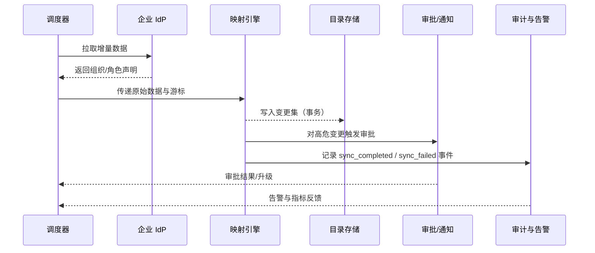

doc_id: UC-IAM-USER-ROLE-DIRECTORY-SYNC-001
scn_id: SCN-IAM-USER-ROLE-001
title: OIDC/LDAP 目录同步与角色映射
status: Draft
version: v0.1.0
repo_key: powerx
scope: powerx
layer: service
domain: iam
scenario_title: "PowerX 用户与角色管理"
owners:
  - name: Michael Hu
    role: Tech Steward
    contact: tech@artisan-cloud.com
  - name: Matrix-X
    role: Docs Coordinator
    contact: dev@artisan-cloud.com
contributors: []
linked_requirements:
  - SCN-IAM-USER-ROLE-DIRECTORY-SYNC-001
code_refs:
  - repo: powerx
    path: internal/service/iam/directory_sync_service.go
    description: 同步编排服务，负责调度 IdP 拉取、映射与冲突处理
  - repo: powerx
    path: internal/service/iam/directory_mapper.go
    description: 属性映射规则引擎与冲突检测逻辑
  - repo: powerx
    path: pkg/corex/db/persistence/repository/iam/member_repo.go
    description: 成员目录写入、去重与版本控制
  - repo: powerx
    path: pkg/corex/flow
    description: 审批与降级工作流执行引擎
  - repo: powerx
    path: pkg/corex/audit
    description: 同步审计事件、指标与告警接入
feature_flags:
  - iam-directory-v2
  - sso-oidc-sync
  - ldap-hub
  - audit-streaming
last_reviewed_at: 2025-10-30

---

# Usecase Overview

- **业务目标**：把企业 IdP（OIDC/LDAP）中的组织、岗位、角色声明持续同步到 PowerX，保障成员属性与授权基线一致、冲突可回滚、变更可审计。
- **触发角色**：Matrix Ops（运维调度）、企业管理员（配置映射与手动同步）、安全团队（审批高危角色变更）、审计与风控。
- **成功度量**：增量同步平均耗时 ≤ 5 分钟、成功率 ≥ 99%；冲突回滚时间 ≤ 2 分钟；管理员对账报告 SLA ≤ 10 分钟。
- **场景关联**：支撑主场景 `SCN-IAM-USER-ROLE-001` Stage 2，与批量导入（`UC-IAM-USER-ROLE-IMPORT-001`）共享成员基线，对批量授权（`UC-IAM-USER-ROLE-BULK-AUTH-001`）提供角色声明。
- **关键依赖**：Feature Flag `iam-directory-v2`、`sso-oidc-sync`、`ldap-hub`、`audit-streaming`；依赖审批工作流、通知服务、审计事件总线。

> 摘要：构建统一的目录同步流水线，按租户定时拉取 IdP 增量，执行映射、审批与幂等写入，并将结果投递到审计与告警，以保障角色策略始终与企业目录保持一致。

# Context & Assumptions

- **前置条件**：
  - `docs/_data/docmap.yaml` 中 `UC-IAM-USER-ROLE-DIRECTORY-SYNC-001` 的 `scope/layer/domain/repo` 与本 Seed 对齐。
  - `iam-directory-v2`、`sso-oidc-sync`、`ldap-hub`、`audit-streaming` 已在目标环境开启并配置默认值。
  - 每个租户在 Admin 控制台录入有效的 OIDC/LDAP 凭证与同步计划（频率、增量标记、审批策略）。
  - 审批服务与通知渠道可用，审计事件总线具备 7 日留存能力。
  - IdP 速率限制、分页策略已在集成规范中明确。
- **输入/输出**：
  - 输入：租户同步计划（cron / webhook）、IdP access token 或 LDAP bind 信息、组织/岗位/角色原始数据、上次同步游标。
  - 输出：目录变更集（新增/更新/删除）、审批待办、冲突回滚记录、`iam.directory.*` 审计事件、管理员通知摘要、指标采集。
- **边界**：
  - 不覆盖初次建号（由 Import Seed 负责），仅处理已存在成员的属性/角色变更。
  - 不支持跨租户目录共享；多 IdP 聚合需在未来扩展。
  - 不负责应用级权限细项同步，仅同步角色/组织维度。

# Solution Blueprint

## 体系分解

| 层 | 主要组件/模块 | 责任 | 代码入口 |
|----|---------------|------|---------|
| 接入层 | `internal/transport/http/admin/iam/directory_handler.go` | 管理员手动触发同步、查看状态、更新映射配置 | `repos/powerx/internal/transport/http/admin/iam/` |
| 调度层 | `internal/service/iam/directory_sync_service.go` | 统一调度 cron、webhook、手动触发；维护游标与租户计划 | `repos/powerx/internal/service/iam/` |
| 映射引擎 | `internal/service/iam/directory_mapper.go` | 执行属性/角色映射、冲突检测、审批分流 | `repos/powerx/internal/service/iam/` |
| 持久化层 | `pkg/corex/db/persistence/repository/iam/*` | 幂等写入成员、组织、角色、绑定记录；维护版本号 | `repos/powerx/pkg/corex/db/persistence/repository/iam/` |
| 审批与观测 | `pkg/corex/flow`, `pkg/corex/audit`, `pkg/event_bus` | 启动审批、发送通知、写入审计与指标、推送告警 | `repos/powerx/pkg/corex/` |

## 流程与时序

1. **Step 1 – 调度触发**：定时任务或 IdP webhook 触发 `directory_sync_service`，按租户读取计划与上次游标。
2. **Step 2 – 拉取增量**：调用 IdP OIDC/LDAP 接口分页拉取组织、岗位、角色声明，记录采集窗口。
3. **Step 3 – 映射与校验**：映射引擎应用字段规则、执行冲突检测（重复邮箱/角色撤销），标记高危变更并生成审批任务。
4. **Step 4 – 幂等写入**：对通过校验的变更集执行批量写入（成员、组织、角色绑定），使用事务与版本号保障幂等。
5. **Step 5 – 回滚与补偿**：对冲突或写入失败的记录生成回滚令牌，必要时还原旧数据并记录 `iam.directory.sync_failed`。
6. **Step 6 – 审计与通知**：同步完成后写入审计事件、指标，向管理员发送变更摘要，并在需要时触发审批或告警。

# Contracts & Interfaces

- **Inbound APIs / Events**
  - `cron.iam.directory-sync` — 调度事件，携带租户 ID、计划 ID、上次游标；失败需重试 3 次并指数回退。
  - `POST /api/v1/admin/iam/directory-sync/run` — 管理员手动触发同步；支持 `dry_run` 参数，仅输出变更差异。
  - `EVENT iam.directory.sync_request` — IdP webhook 转换的消息，触发即时同步。
- **Outbound 调用**
  - `GET /idp/oidc/users?since=<cursor>` / `LDAP.Search` — 拉取增量成员、组织、角色；超时 10s，失败重试 3 次。
  - `workflow.approval.start` — 构建审批实例，附带高危角色变更详情与 SLA。
  - `event_bus.Publish("iam.directory.*")` — 推送同步完成/失败、冲突信息，供审计与告警消费。
- **配置与脚本**
  - `config/iam-directory.yaml` — 定义租户默认同步频率、批大小、冲突阈值。
  - `scripts/qa/directory-sync.mjs` — QA 校验脚本，模拟 IdP 响应与冲突场景。
  - `docs/standards/powerx/backend/iam/use_case.md` — 映射字段与审批策略标准。

# Implementation Checklist

| 项目 | 描述 | 完成状态 | 负责人 |
|------|------|----------|--------|
| 数据模型 | 设计 `iam_directory_sync_task`、`iam_directory_change_log` 表结构、索引与回滚令牌 | [ ] | |
| IdP 接入 | 实现 OIDC/LDAP 连接器、分页/速率控制、凭证加密存储 | [ ] | |
| 映射与冲突处理 | 落地映射规则引擎、冲突分类、审批分流逻辑 | [ ] | |
| 幂等写入 | 扩展成员/组织/角色仓储接口，支持版本控制与批量回滚 | [ ] | |
| 审批与通知 | 配置审批模板、告警策略、管理员变更摘要通知 | [ ] | |
| 指标与审计 | 埋点 `iam.directory_sync.*` 指标、审计事件、Grafana 面板 | [ ] | |
| 文档同步 | 更新标准文档、Admin 指南、Runbook；同步 docmap 与站点链接 | [ ] | |

# Testing Strategy

- **单元测试**：`go test ./internal/service/iam -run TestDirectorySync` 覆盖游标计算、映射规则、冲突分类与回滚。
- **集成测试**：`go test ./internal/tests/integration -run DirectorySync` mock OIDC/LDAP、审批、通知，验证正向同步、冲突审批、失败重试。
- **端到端验证**：QA 在沙箱使用 `tests/manual/iam/directory-sync.md` 手册，配置真实 IdP 沙箱、运行 `scripts/qa/directory-sync.mjs` 验证指标与审计。
- **非功能测试**：压测 10k 成员增量同步 ≤ 5 分钟；Chaos 注入 IdP 超时、审批服务不可用，验证降级策略；运行 `npm run test:workflows -- --suite directory-sync` 统计工作流 SLA。
- **回归**：将目录同步关键路径纳入 `npm run lint`（配置校验）与 `npm run docs:build`（文档链接）检查。

# Observability & Ops

- **指标**：
  - `iam_directory_sync_duration_seconds{tenant,mode}`（P95 ≤ 300s）
  - `iam_directory_sync_conflict_total{severity}`（每日 ≤ 2%）
  - `iam_directory_sync_rollback_total`、`iam_directory_sync_pending_approval`
  - `iam_directory_sync_delta_size`（监控增量规模）
- **日志**：INFO 级别记录租户、批次、游标、成功/失败数量；WARN/ERROR 级附冲突详情、审批 ID、回滚令牌；全部日志具备 TraceID。
- **告警**：
  - 连续失败 ≥2 次触发 PagerDuty P1，并附带回滚令牌。
  - 冲突率 >10% 触发 Slack `#iam-alerts`，提示检查映射规则。
  - 审批待处理超过 30 分钟自动升级至安全团队。
- **Dashboards**：Grafana `IAM / Directory Sync Overview`、Datadog `iam.directory_sync` 命名空间、`reports/iam/directory-sync-summary.csv`。

# Rollback & Failure Handling

- **回滚步骤**：
  - 使用 Argo Rollouts 回滚同步服务与工作流配置到前一版本。
  - 关闭 `sso-oidc-sync`、`ldap-hub` Feature Flag，将租户切回手动同步。
  - 执行 `scripts/migrations/iam_directory_sync.down.sql`（如需回滚任务表/日志表）。
- **补救措施**：
  - IdP 接口限流：切换至退避策略并通知租户管理员；必要时降低批大小。
  - 审批服务不可用：通过 `scripts/ops/directory-sync/force-approve.sh` 由安全团队线下审批，并记录审计。
  - 数据不一致：触发 `directory_sync_service` 的 `replay-from-checkpoint`，从最近成功游标重放。
- **数据修复**：
  - 使用 `scripts/db/iam/backfill_directory_snapshot.go` 重新生成目录快照。
  - Matrix Ops 在 DBA 支持下执行 SQL 校正异常绑定记录。

# Follow-ups & Risks

| 风险/事项 | 影响 | 缓解方案 | 负责人 | ETA |
|-----------|------|----------|--------|-----|
| 多 IdP 并存导致映射冲突 | 高危角色误更改 | 引入优先级与命名空间策略，更新映射标准 | Li Wei | 2025-11-12 |
| LDAP 凭证轮换不及时 | 同步失败或安全隐患 | 接入凭证到期提醒与自动禁用；纳入 Ops Runbook | Matrix Ops | 2025-11-08 |
| 审批积压高峰 | 授权无法及时更新 | 配置 SLA 升级 + 值班提醒，扩展自动审批白名单 | Matrix Ops | 2025-11-15 |
| 指标缺少历史留存 | 无法回溯波动 | 将指标写入 `reports/_state/iam-directory-sync.json`，保留 30 日窗口 | Michael Hu | 2025-11-05 |

# References & Links

- 场景文档：`docs/scenarios/iam/SCN-IAM-USER-ROLE-DIRECTORY-SYNC-001.md`
- 主场景：`docs/scenarios/iam/SCN-IAM-USER-ROLE-001.md`
- Docmap 配置：`docs/_data/docmap.yaml`
- IAM 标准：`docs/standards/powerx/backend/iam/use_case.md`
- 前端守卫规范：`docs/standards/powerx/web-admin/auth-and-iam/Permission_Guards_and_RBAC.md`
- 工作流指标脚本：`scripts/qa/workflow-metrics.mjs`
