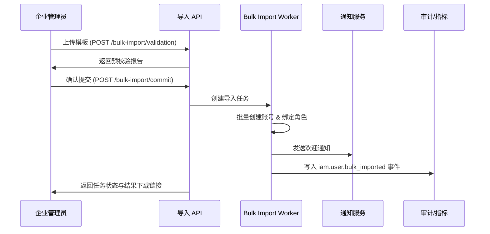

doc_id: UC-IAM-USER-ROLE-IMPORT-001
scn_id: SCN-IAM-USER-ROLE-001
title: 批量导入员工建号
status: Draft
version: v0.1.0
repo_key: powerx
scope: powerx
layer: service
domain: iam
scenario_title: "PowerX 用户与角色管理"
owners:
  - name: Michael Hu
    role: Tech Steward
    contact: tech@artisan-cloud.com
  - name: Matrix-X
    role: Docs Coordinator
    contact: dev@artisan-cloud.com
contributors: []
linked_requirements:
  - SCN-IAM-USER-ROLE-IMPORT-001
code_refs:
  - repo: powerx
    path: internal/transport/http/admin/iam/import_handler.go
    description: 控制台导入向导 API、模板下载、结果查询
  - repo: powerx
    path: internal/service/iam/bulk_import_service.go
    description: 导入校验、批处理调度、账号创建编排
  - repo: powerx
    path: internal/service/iam/default_role_resolver.go
    description: 默认角色映射与租户策略解析
  - repo: powerx
    path: pkg/corex/db/persistence/repository/iam/member_repo.go
    description: 账号写入、重复检测、批量事务支持
  - repo: powerx
    path: pkg/corex/audit
    description: 导入审计事件、指标与告警接入
feature_flags:
  - user-bulk-import
  - iam-directory-v2
  - notify-transactional
  - audit-streaming
last_reviewed_at: 2025-10-30

---

# Usecase Overview

- **业务目标**：帮助企业管理员批量创建员工账号并完成默认角色配置，确保导入准确、可追溯，可在 10 分钟内完成 500 人规模的建号任务。
- **触发角色**：企业管理员（上传模板与发起导入）、Matrix Ops（监控任务）、安全团队（审批高敏感字段）、通知服务与审计团队。
- **成功度量**：导入成功率 ≥ 98%、端到端耗时 ≤ 10 分钟、错误明细覆盖率 100%、失败重试平均耗时 ≤ 5 分钟。
- **场景关联**：支撑主场景 `SCN-IAM-USER-ROLE-001` Stage 1，向目录同步（`UC-IAM-USER-ROLE-DIRECTORY-SYNC-001`）提供基线数据，并为批量授权（`UC-IAM-USER-ROLE-BULK-AUTH-001`）准备成员列表。
- **关键依赖**：Feature Flag `user-bulk-import`、`iam-directory-v2`、`notify-transactional`、`audit-streaming`；依赖对象存储、审批工作流、通知渠道、审计事件总线。

> 摘要：提供自助批量建号能力，从模板上传、预校验、批处理建号到通知与审计闭环，确保导入体验友好、风控合规、记录可追溯。

# Context & Assumptions

- **前置条件**：
  - `docs/_data/docmap.yaml` 中 `UC-IAM-USER-ROLE-IMPORT-001` 的 `scope/layer/domain/repo` 信息与本 Seed 一致。
  - `user-bulk-import`、`iam-directory-v2`、`notify-transactional`、`audit-streaming` Feature Flag 已开启并配置默认值。
  - Admin 控制台已集成导入向导 UI，支持模板下载、拖拽上传、错误预览。
  - 每个租户预先配置默认角色策略（按部门/岗位），导入作业具备访问对象存储、通知服务、审计事件总线的凭证。
  - 批处理队列与异步任务执行器（Cron/Worker）可用，支持重试与幂等。
- **输入/输出**：
  - 输入：导入模板文件（CSV/XLSX）、租户 ID、操作者 ID、默认角色策略、审批备注、是否启用自动欢迎通知。
  - 输出：导入任务 ID、校验报告（错误行、类型、建议）、创建成功的账号列表、默认角色绑定结果、欢迎通知发送状态、`iam.user.bulk_imported` 事件。
- **边界**：
  - 不处理组织结构导入（交由目录同步种子）。
  - 不覆盖插件级细粒度权限，仅设置租户默认角色。
  - 不支持跨租户导入；跨租户共享需在多租户场景中处理。

# Solution Blueprint

## 体系分解

| 层 | 主要组件/模块 | 责任 | 代码入口 |
|----|---------------|------|---------|
| 客户端层 | `apps/admin/iam/bulk-import/` | 模板下载、上传、进度与错误反馈 UI | `repos/powerx/apps/admin/iam/bulk-import/` |
| 接入层 | `internal/transport/http/admin/iam/import_handler.go` | 暴露校验/提交/状态查询 API、鉴权与审计埋点 | `repos/powerx/internal/transport/http/admin/iam/` |
| 应用服务层 | `internal/service/iam/bulk_import_service.go` | 模板解析、规则校验、批处理调度、任务状态管理 | `repos/powerx/internal/service/iam/` |
| 域服务层 | `internal/service/iam/default_role_resolver.go` | 解析租户默认角色策略、冲突处理、审批触发 | `repos/powerx/internal/service/iam/` |
| 持久化层 | `pkg/corex/db/persistence/repository/iam/*` | 账号创建、角色绑定、导入日志写入、幂等控制 | `repos/powerx/pkg/corex/db/persistence/repository/iam/` |
| 审计与通知 | `pkg/corex/audit`, `pkg/event_bus`, `pkg/notify` | 审计事件、导入指标、欢迎通知与异常告警 | `repos/powerx/pkg/corex/audit/`, `repos/powerx/pkg/event_bus/` |

## 流程与时序

1. **Step 1 – 模板上传**：管理员上传模板，接口保存到对象存储并返回文件 ID；同步触发预校验。
2. **Step 2 – 预校验**：应用服务解析模板、执行字段/重复/策略校验，生成报告并支持 UI 预览错误。
3. **Step 3 – 批处理调度**：管理员确认无误后提交导入，服务创建异步任务，写入任务表并推送至队列。
4. **Step 4 – 账号创建**：Worker 批量创建账号、分配默认角色、生成初始密码或 SSO 绑定令牌；对冲突记录执行幂等跳过并写入失败表。
5. **Step 5 – 通知与审批**：根据策略发送欢迎邮件/短信；某些敏感角色需发起审批（可配置），审批通过后补发通知。
6. **Step 6 – 审计与反馈**：导入完成后记录审计事件、更新指标、生成下载报告，并向管理员回传成功/失败清单与重试建议。

# Contracts & Interfaces

- **Inbound APIs / Events**
  - `POST /api/v1/admin/iam/users/bulk-import/validation` — 上传模板并执行预校验，返回错误明细与建议。
  - `POST /api/v1/admin/iam/users/bulk-import/commit` — 提交通过记录，创建导入任务并返回 `task_id`。
  - `GET /api/v1/admin/iam/users/bulk-import/: "task_id` — 查询任务状态、下载成功/失败清单。"
- **Outbound 调用**
  - `storage.PutObject` / `storage.GetObject` — 存储原始模板与导入报告。
  - `workflow.approval.start` — 对敏感角色或角色升级请求触发审批。
  - `notify.SendBulkTransactional` — 批量发送欢迎通知，支持模板变量。
  - `event_bus.Publish("iam.user.bulk_imported")` — 发布导入完成事件与统计数据。
- **配置与脚本**
  - `config/iam-bulk-import.yaml` — 定义批大小、并发度、重试策略、审批白名单。
  - `scripts/ops/bulk-import/retry_failed.sh` — 支持针对失败记录重新导入。
  - `docs/standards/powerx/backend/iam/use_case.md` — 默认角色映射、审批要求与审计字段。

# Implementation Checklist

| 项目 | 描述 | 完成状态 | 负责人 |
|------|------|----------|--------|
| 数据模型 | 设计 `iam_bulk_import_task`、`iam_bulk_import_record` 表结构、状态机、审计字段 | [ ] | |
| 模板解析 | 实现 CSV/XLSX 解析、字段验证、重复检测、错误报告生成 | [ ] | |
| 批处理调度 | 创建异步任务框架、批大小/并发度配置、失败重试机制 | [ ] | |
| 账号创建 | 扩展成员服务支持批量创建、默认角色绑定、初始密码/SSO 令牌生成 | [ ] | |
| 通知与审批 | 集成欢迎通知、审批流程、失败补发与降级策略 | [ ] | |
| 审计与指标 | 埋点 `iam.bulk_import.*` 指标、审计事件、报表导出 | [ ] | |
| 配置与文档 | 发布 Feature Flag、配置模板；更新标准、Runbook、Docmap 链接 | [ ] | |

# Testing Strategy

- **单元测试**：`go test ./internal/service/iam -run TestBulkImport` 覆盖模板解析、字段校验、重复检测、审批触发。
- **集成测试**：`go test ./internal/tests/integration -run BulkImport` 模拟对象存储、通知、审批，验证正向导入、部分失败、重试。
- **端到端验证**：QA 使用 `tests/manual/iam/bulk-import.md`，导入 200 条数据、验证欢迎通知、审计记录、错误报告下载。
- **非功能测试**：压测 1k 记录导入，确保 P95 耗时 ≤ 10 分钟；Chaos 注入对象存储/通知失败验证降级；运行 `npm run test: "workflows -- --suite bulk-import` 汇总指标。"
- **回归检查**：将关键脚本纳入 `npm run lint`（配置校验）与 `npm run docs: "build`（文档链接）管控。"

# Observability & Ops

- **指标**：
  - `iam_bulk_import_duration_seconds{tenant}`（P95 ≤ 600s）
  - `iam_bulk_import_success_total`、`iam_bulk_import_failure_total`
  - `iam_bulk_import_error_ratio`、`iam_bulk_import_retry_total`
  - `iam_bulk_import_notification_latency_seconds`
- **日志**：INFO 级别记录操作人、批次、成功/失败数量；WARN/ERROR 级附错误类型、行号、回滚标识；所有日志带 `trace_id` 与 `task_id`。
- **告警**：
  - 失败率 >5% 连续 3 次触发 PagerDuty（Platform Ops）。
  - 导入耗时 >15 分钟触发 Slack `#iam-alerts` 提醒排查。
  - 审批未在 SLA（30 分钟）内完成自动升级至安全团队。
- **Dashboards**：Grafana `IAM / Bulk Import Overview`、Datadog `iam.bulk_import` 指标组、`reports/iam/bulk-import-summary.csv` 周报。

# Rollback & Failure Handling

- **回滚步骤**：
  - 使用 Argo Rollouts 回滚导入服务与 Worker 镜像到上一版本。
  - 关闭 `user-bulk-import` Feature Flag，将租户切换回手工建号流程。
  - 执行 `scripts/migrations/iam_bulk_import.down.sql`（如需回滚任务相关表）。
- **补救措施**：
  - 对象存储不可用：临时切换到备用存储或启用本地缓存，提示管理员稍后重试。
  - 批处理失败：使用 `scripts/ops/bulk-import/retry_failed.sh` 针对失败记录重试，或在控制台重新提交。
  - 通知失败：调用通知重发接口，或导出失败列表通过邮件补发。
- **数据修复**：
  - 使用 `scripts/db/iam/backfill_import_results.go` 补齐导入日志与账号表。
  - Matrix Ops 与 DBA 协作，校正重复账号绑定、恢复错误状态。

# Follow-ups & Risks

| 风险/事项 | 影响 | 缓解方案 | 负责人 | ETA |
|-----------|------|----------|--------|-----|
| 模板字段扩展节奏与 HR 系统不一致 | 导入失败或字段缺失 | 建立版本协同流程，提供模板版本检测与升级提示 | Li Wei | 2025-11-08 |
| 大批量导入导致队列拥塞 | 导入延迟超 SLA | 实施动态批大小、优先级队列与限流策略 | Matrix Ops | 2025-11-18 |
| 欢迎通知投递失败未补偿 | 员工未收到激活信息 | 引入通知重试与监控阈值，提供手动补发工具 | Matrix Ops | 2025-11-05 |
| 默认角色策略配置缺失 | 导入账号缺少权限 | Admin 控制台在提交前校验策略完整性，并提供策略模板 | Michael Hu | 2025-11-03 |

# References & Links

- 场景文档：`docs/scenarios/iam/SCN-IAM-USER-ROLE-IMPORT-001.md`
- 主场景：`docs/scenarios/iam/SCN-IAM-USER-ROLE-001.md`
- Docmap 配置：`docs/_data/docmap.yaml`
- IAM 标准：`docs/standards/powerx/backend/iam/use_case.md`
- 导入指南：`docs/guides/usecases/generate-usecase-seeds.md`
- 工作流指标脚本：`scripts/qa/workflow-metrics.mjs`
