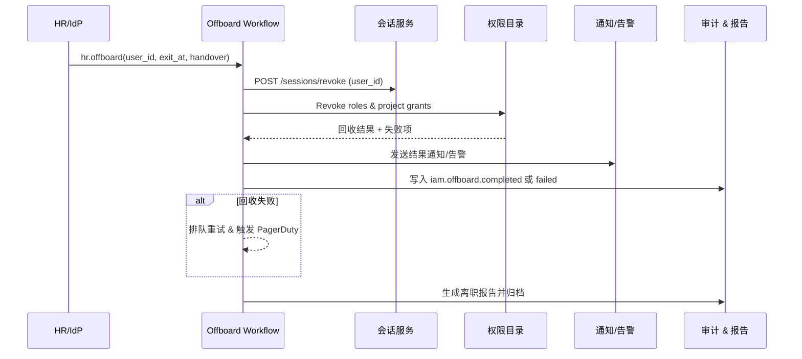

doc_id: UC-IAM-USER-ROLE-OFFBOARD-001
scn_id: SCN-IAM-USER-ROLE-001
title: 离职自动权限回收与审计
status: Draft
version: v0.1.0
repo_key: powerx
scope: powerx
layer: service
domain: iam
scenario_title: "PowerX 用户与角色管理"
owners:
  - name: Michael Hu
    role: Tech Steward
    contact: tech@artisan-cloud.com
  - name: Matrix-X
    role: Docs Coordinator
    contact: dev@artisan-cloud.com
contributors: []
linked_requirements:
  - SCN-IAM-USER-ROLE-OFFBOARD-001
code_refs:
  - repo: powerx
    path: internal/transport/http/admin/iam/member_handler.go
    description: 离职事件入口、手动回收 API 与审计导出
  - repo: powerx
    path: internal/service/iam/offboard_workflow.go
    description: 离职工作流编排、权限回收、重试补偿
  - repo: powerx
    path: internal/service/iam/member_service.go
    description: 账号冻结、会话终止、资产移交辅助函数
  - repo: powerx
    path: pkg/corex/db/persistence/repository/iam/member_assignment_repo.go
    description: 角色/项目绑定回收、幂等写入与审计标记
  - repo: powerx
    path: pkg/corex/audit
    description: `iam.offboard.*` 事件记录、离职报告生成
  - repo: powerx
    path: pkg/event_bus
    description: HR/IdP Webhook 事件消费与回收完成广播
feature_flags:
  - iam-auto-revoke
  - session-force-logout
  - notify-transactional
  - audit-streaming
last_reviewed_at: 2025-10-30

---

# Usecase Overview

- **业务目标**：确保员工离职或账号停用后，PowerX 在合规 SLA 内自动冻结账号、终止会话、回收角色与项目授权，并输出可审计报告。
- **触发角色**：HR/IdP（离职事件提供方）、IAM 自动化工作流、Ops（处理失败重试/兜底）、安全与审计团队（审阅报告、处置异常）。
- **成功度量**：离职事件触发后 2 分钟内完成冻结与回收；回收成功率 ≥ 99%；重试平均耗时 ≤ 5 分钟；告警 MTTA ≤ 10 分钟；报告生成覆盖 100% 离职事件。
- **场景关联**：支撑主场景 `SCN-IAM-USER-ROLE-001` Stage 4，并与批量授权（`UC-IAM-USER-ROLE-BULK-AUTH-001`）共享权限目录、与导入/目录同步场景共享成员基线。
- **关键依赖**：HR/IdP Webhook、会话管理服务、通知系统、审计事件总线以及 Docmap 中 `scope/layer/domain/repo` 字段对应的 powerx 仓库实现。

> 摘要：通过事件驱动的回收工作流，实现离职后的账号冻结、权限回收、资产移交与审计告警闭环，消除人工介入风险。

# Context & Assumptions

- **前置条件**：
  - Feature Flags `iam-auto-revoke`, `session-force-logout`, `notify-transactional`, `audit-streaming` 已开启并配置默认值。
  - HR 系统或 IdP 可通过 Webhook/MQ 推送离职事件（带签名、离职时间、交接人、需保留的资产列表）。
  - 会话管理服务支持批量终止活跃会话与刷新令牌；权限目录可在回收时提供幂等操作。
  - 通知与告警渠道（邮件、Slack/PagerDuty）已配置，审计服务具备 1 年留存能力。
  - Ops Runbook 定义手动兜底流程、脚本与审批要求。
- **输入/输出**：
  - 输入：`hr.offboard`、`iam.user.offboarded`、`session.force_logout` 事件；管理员发起的手动回收请求；资产移交流程结果。
  - 输出：冻结账号状态、终止会话记录、角色/项目授权回收、资产移交任务、通知与告警、`iam.offboard.completed/failed` 审计事件、离职报告（CSV/JSON）。
- **边界**：
  - 不覆盖离职审批（由 HR 负责）及外部 SaaS 账号回收（需在扩展用例处理）。
  - 不包含插件级数据擦除策略；需在插件仓库遵循同一事件。
  - 若离职员工属于多租户跨账号，交叉租户回收由各租户独立执行。

# Solution Blueprint

## 体系分解

| 层 | 主要组件/模块 | 责任 | 代码入口 |
|----|---------------|------|---------|
| 接入层 | `internal/transport/http/admin/iam/member_handler.go` | 暴露 Webhook、手动回收、报告查询 API；校验签名与权限 | `repos/powerx/internal/transport/http/admin/iam/` |
| 工作流层 | `internal/service/iam/offboard_workflow.go` | 编排冻结、会话终止、权限回收、资产移交、重试与告警 | `repos/powerx/internal/service/iam/` |
| 账号与权限层 | `internal/service/iam/member_service.go`, `pkg/corex/db/persistence/repository/iam` | 更新账号状态、解绑角色、回收项目授权、记录审计快照 | `repos/powerx/internal/service/iam/`, `repos/powerx/pkg/corex/db/persistence/repository/iam/` |
| 会话层 | `internal/transport/http/admin/auth/session_handler.go`（或等效服务） | 强制登出、刷新令牌失效、记录会话终止结果 | `repos/powerx/internal/transport/http/admin/auth/` |
| 通知与审计 | `internal/infra/plugin/manager/notify/notify.go`, `pkg/corex/audit`, `pkg/event_bus` | 输出通知、PagerDuty 告警、`iam.offboard.*` 事件、离职报告 | `repos/powerx/internal/infra/plugin/manager/notify/`, `repos/powerx/pkg/corex/audit/`, `repos/powerx/pkg/event_bus/` |

## 流程与时序

1. **Step 1 – 事件接入**：HR/IdP 发送离职事件到 Webhook；系统校验签名、过滤重复并存入回收任务队列。
2. **Step 2 – 冻结与终止**：工作流立即调用账号冻结、会话终止接口，并记录初始审计事件。
3. **Step 3 – 权限回收**：按租户/项目维度解绑角色、撤销权限；对于敏感资产执行移交流程；失败项写入补偿列表。
4. **Step 4 – 通知与告警**：向直属上级、交接人、审计团队发送处理结果；若回收失败，则触发 PagerDuty/Slack 告警。
5. **Step 5 – 重试与闭环**：定时任务重试失败项；最长重试 3 次后升级 Ops；完成后生成离职报告并发布 `iam.offboard.completed`。

# Contracts & Interfaces

- **Inbound APIs / Events**
  - `POST /webhook/hr/offboard` — 离职事件入口；需校验签名、支持 `dry_run`, `handover_contact`, `effective_at`。
  - `POST /api/v1/admin/iam/users/:id/offboard` — 管理员手动触发离职回收或重试失败项。
  - `EVENT iam.user.offboarded` — 上游事件（来自 HR/IdP）；包含员工标识、租户、离职时间、资产移交信息。
- **Outbound 调用**
  - `POST /internal/iam/users/:id/freeze` — 冻结账号并标记不可登录。
  - `POST /internal/sessions/revoke` — 终止活跃会话/令牌，超时 5s，失败重试 3 次。
  - `POST /internal/iam/permissions/revoke` — 回收角色/项目授权；幂等键 `user_id + role_id`。
  - `notify.SendTransactional` — 通知直属上级、交接人、审计团队；失败写入补偿队列。
  - `event_bus.Publish("iam.offboard.*")` — 广播完成/失败事件供审计、Ops 仪表盘消费。
- **配置与脚本**
  - `config/iam-offboard.yaml` — 回收 SLA、重试策略、告警阈值、资产移交模板。
  - `scripts/ops/offboard/retry_failed.sh` — Ops 手动重试失败回收。
  - `scripts/ops/offboard/export_report.sh` — 导出离职报告、推送合规存储。
  - `docs/standards/governance/audit-events.md` — 审计事件字段规范。

# Implementation Checklist

| 项目 | 描述 | 完成状态 | 负责人 |
|------|------|----------|--------|
| 数据模型 | 创建 `iam_offboard_task`、`iam_offboard_attempt` 表（状态/失败原因/重试次数/报告路径） | [ ] | Matrix Ops |
| 工作流编排 | 在 `offboard_workflow` 中实现冻结→回收→通知→报告生成流程 | [ ] | Michael Hu |
| 会话终止 | 集成会话服务强制登出与 Access Token 撤销，返回上下文供审计记录 | [ ] | Michael Hu |
| 权限回收 | 扩展成员、角色、项目仓储支持批量解绑、资产移交处理 | [ ] | Matrix Ops |
| 通知与告警 | 配置通知模板、PagerDuty/Slack 告警规则、失败补偿任务 | [ ] | Matrix Ops |
| 报表输出 | 生成离职报告（CSV/JSON）、归档至 `reports/usecases/iam-offboard/` | [ ] | Michael Hu |
| 文档与配置 | 发布配置样例、更新 Runbook、同步 docmap/站点链接 | [ ] | Michael Hu |

# Testing Strategy

- **单元测试**：`go test ./internal/service/iam -run TestOffboardWorkflow` 覆盖事件去重、回收顺序、失败补偿、通知分支。
- **集成测试**：`go test ./internal/tests/integration -run Offboard` Mock HR Webhook、会话服务、通知与审计，验证正向回收、失败重试、手动兜底。
- **端到端验证**：QA 按 `tests/manual/iam/offboard.md` 操作，触发离职事件、检查会话终止、权限回收、报告下载、告警触发。
- **非功能测试**：压测 100 并发离职事件（峰值 >50 RPS），确保 P95 回收时间 ≤ 120 秒；Chaos 注入会话或通知失败确认降级策略；运行 `npm run test:workflows -- --suite offboard` 汇总指标。
- **回归检查**：纳入 `npm run lint`（配置校验）、`npm run docs:build`（文档链接）以及 `node scripts/qa/workflow-metrics.mjs` 续测离职 SLA。

# Observability & Ops

- **指标**：
  - `iam_offboard_trigger_total`, `iam_offboard_completed_total`, `iam_offboard_failed_total`
  - `iam_offboard_revoke_latency_seconds`（P95 ≤ 120s）
  - `iam_offboard_retry_total`, `iam_offboard_asset_transfer_pending`
  - `session_force_logout_latency_seconds`
- **日志**：INFO 级别记录用户、租户、触发源、回收清单、资产移交情况；WARN/ERROR 级附 `error_code`、重试次数、告警 ID；所有日志包含 TraceID。
- **告警**：
  - 回收耗时 > 3 分钟或失败率 >1%/天 → PagerDuty P1；
  - 连续 3 次重试仍失败 → Slack `#iam-alerts` + Ops Runbook 入口；
  - 会话终止失败或资产移交超时 → PagerDuty P0；
  - 报告生成失败 → 邮件通知审计团队 + Ops 复核。
- **Dashboards**：Grafana `IAM / Offboarding Automation`、Datadog `iam.offboard` 命名空间、`reports/iam/offboard-dashboard.csv`。

# Rollback & Failure Handling

- **回滚步骤**：
  - 回滚离职工作流与相关服务部署；关闭 `iam-auto-revoke`、`session-force-logout` Feature Flag 退回手动流程。
  - 停止重试任务，防止在回滚期间重复执行；通知 Ops 使用 Runbook 手动回收关键权限。
  - 对已冻结的账号执行批量校正脚本确保状态一致。
- **补救措施**：
  - 会话终止失败：运行 `scripts/ops/offboard/force-logout.sh --user <ID>` 或在会话服务控制台执行。
  - 权限未回收：调用 `POST /api/v1/admin/iam/users/:id/offboard?retry=true` 或脚本手动解绑角色。
  - 告警/通知失败：通过通知服务后台补发，并在审计中记录补救措施。
- **数据修复**：
  - 使用 `scripts/ops/offboard/rebuild-report.sh --user <ID>` 重新生成离职报告。
  - DBA 依据 `iam_offboard_task` 记录校正状态，并在 `tenant_lifecycle_log` 中补记事件。
  - 所有修复需 Matrix Ops 审批并更新审计说明。

# Follow-ups & Risks

| 风险/事项 | 影响 | 缓解方案 | 负责人 | ETA |
|-----------|------|----------|--------|-----|
| 外部 SaaS 连接器权限回收缺失 | 留下权限风险 | 将离职事件同步到连接器列表，统一纳入工作流 & 监控 | Matrix Ops | 2025-11-25 |
| 离职报告需满足多区域合规格式 | 报告无法在海外使用 | 与法务/本地化确认模板，扩展多语言与区域字段 | Li Wei | 2025-11-30 |
| 大批量离职（裁员）可能导致队列堆积 | SLA 受影响 | 扩展工作流并发、引入优先级队列，强化告警 | Matrix Ops | 2025-11-12 |
| 会话服务不可用导致冻结无效 | 未能及时阻断访问 | 建立降级策略：关闭登录 + 审计提醒人工介入 | Michael Hu | 2025-11-05 |

# References & Links

- 场景文档：`docs/scenarios/iam/SCN-IAM-USER-ROLE-OFFBOARD-001.md`
- 主场景：`docs/scenarios/iam/SCN-IAM-USER-ROLE-001.md`
- Docmap 配置：`docs/_data/docmap.yaml`
- 审计规范：`docs/standards/governance/audit-events.md`
- 离职事件字段：`docs/iam/events/offboard.yaml`
- 工作流指标脚本：`scripts/qa/workflow-metrics.mjs`
