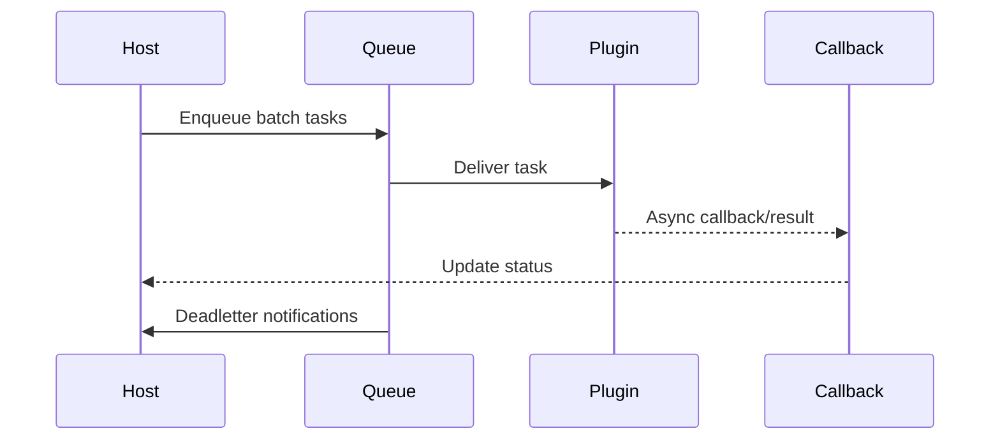

# Executive Summary

> 面向批量与长耗时任务，宿主需要异步管道：任务拆分、队列/EventBus 投递、插件回调、结果聚合与状态查询/取消。目标是任务吞吐可扩展、回调成功率 ≥99%、死信率 <0.5%，并支持超时/取消/补偿。

# Scope & Guardrails

- **In Scope**：任务拆分、队列/EventBus、插件异步执行、回调 API、状态查询、超时/取消、死信/补偿、批量结果聚合。
- **Out of Scope**：同步调用（ENTRY/TENANT/RESILIENCE 已覆盖）、插件内部队列实现。
- **Environment & Flags**：`PX_HOST_ASYNC_TASK`, `PX_HOST_EVENT_PIPELINE`, `PX_HOST_TASK_CANCEL`; 依赖 Task Queue、EventBus、Notification Center、Observability。

# End-to-End Flow

1. 宿主将批量任务拆分为消息（含租户/Trace/批次 ID），写入队列/EventBus。
2. 插件消费任务、异步处理并回调宿主，或写入结果存储。
3. 宿主聚合结果、更新业务状态，并提供 `GET /tasks/:id` 查询与 `POST /tasks/:id/cancel`。
4. 失败/超时任务进入死信或补偿队列。

# Key Interactions & Contracts

- `POST /host/plugins/tasks` — 批量任务提交；返回 `batch_id`.
- `GET /host/plugins/tasks/:id`、`POST /host/plugins/tasks/:id/cancel`.
- `POST /host/plugins/callback` — 插件回调。
- `GET /host/plugins/tasks/deadletters`、`POST /host/plugins/tasks/replay`.
- Configs：`async_task_pipeline.yaml`, `callback_endpoints.yaml`, `deadletter_policies.yaml`.

# Usecase Links

- `UC-INT-HOST-CALL-ASYNC-001`.

# Acceptance Criteria

1. 任务投递可靠，死信率 <0.5%，回调签名成功率 ≥99%。
2. 状态查询/取消接口返回实时结果，聚合完成时间符合 SLA。
3. 死信/补偿脚本可在 5 分钟内恢复任务。

# Telemetry & Ops

- 指标：`host.plugin.async.throughput`, `host.plugin.async.backlog`, `host.plugin.callback.success_rate`, `host.plugin.deadletter.count`.
- 告警：积压深度 > 阈值、回调成功率 <99%、死信堆积、补偿失败。

# Open Issues & Follow-ups

| 风险/事项 | 影响 | 负责人 | ETA |
|-----------|------|--------|-----|
| 任务取消 API 尚未接入工作流权限 | 安全性 | Orchestration Squad | 2025-02-27 |
| 死信重放脚本缺少多租户过滤 | 运维效率 | SRE Squad | 2025-03-03 |
