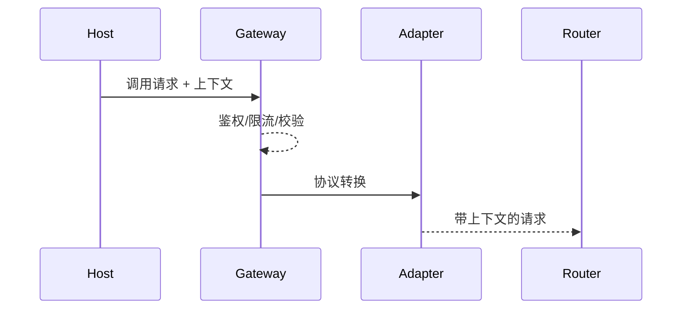

# Executive Summary

> 宿主调用入口需要提供统一的网关/SDK 能力，负责鉴权、限流、参数校验、协议转换与 Trace/租户上下文生成，确保插件接入一致且可观测。目标是入口响应 <50ms、协议转换幂等、上下文字段完整。

# Scope & Guardrails

- **In Scope**：入口 SDK/Gateway、鉴权、限流、参数校验、协议适配（REST ↔ gRPC/MCP/HTTP）、上下文字段、Trace 注入、审计。
- **Out of Scope**：租户策略路由、韧性策略、异步队列（其他子场景覆盖）。
- **Environment & Flags**：`PX_HOST_PLUGIN_GATEWAY`, `PX_HOST_PROTOCOL_ADAPTER`, `PX_HOST_TRACE_BRIDGE`；依赖 API Gateway、Service Mesh、IAM、Audit Ledger。

# Participants & Responsibilities

| Scope | Repository | Layer | 责任与交付物 |
|-------|------------|-------|--------------|
| Invocation Gateway | powerx | service | 统一入口、鉴权、限流、参数/Schema 校验、协议转换 |
| SDK / Agent Bridge | powerx | service | 提供宿主内调用 SDK/Agent 插件调用器、上下文注入 |
| Audit & Trace | powerx | ops | 记录调用上下文、Trace/Span、错误审计、指标 |

# End-to-End Flow

1. **Request Preparation**：宿主编排服务根据任务生成调用请求，附带 Trace/租户/插件能力 ID。
2. **Gateway Enforcement**：统一入口执行鉴权、限流、参数 Schema 校验，失败直接阻断。
3. **Protocol Adaptation**：根据插件声明的协议进行序列化/头部映射，确保幂等，写入 Trace。
4. **Forward to Router**：合规请求交给 Service Mesh/插件网关继续路由。

# Key Interactions & Contracts

- `POST /host/plugins/call` — 参数：`plugin_id`, `capability`, `protocol`, `payload`, `trace_id`, `tenant_uuid`.
- `POST /host/plugins/call/schema/validate` — 可选预检。
- Configs：`host_plugin_gateway.yaml`, `protocol_mapping.json`.
- Audit：`host.plugin.entry.audit`（含租户/插件/trace/status）。

# Usecase Links

- `UC-INT-HOST-CALL-ENTRY-001` — 统一入口、鉴权、协议编排、审计。

# Acceptance Criteria

1. 支持 HTTP/gRPC/MCP 至少三种协议转换，并保证幂等。
2. 鉴权/限流/参数校验失败直接阻断且写入审计。
3. Trace/上下文字段在入口完成注入，后续链路可观测。

# Telemetry & Ops

- 指标：`host.plugin.entry.latency`, `host.plugin.entry.qps`, `host.plugin.entry.auth_fail`, `host.plugin.entry.protocol_errors`.
- 告警：鉴权失败率 >1%（P1）、协议转换失败 >0.5%（P2）、入口延迟 >80ms（P1）。
- Dashboard：`Host→Plugin Entry`.

# Open Issues & Follow-ups

| 风险/事项 | 影响 | 负责人 | ETA |
|-----------|------|--------|-----|
| Gateway 暂不支持 MCP 流式调用 | 实时插件接入 | Core Platform Squad | 2025-03-01 |
| Schema 校验缺少缓存策略 | 高 QPS 性能 | Orchestration Squad | 2025-02-28 |
