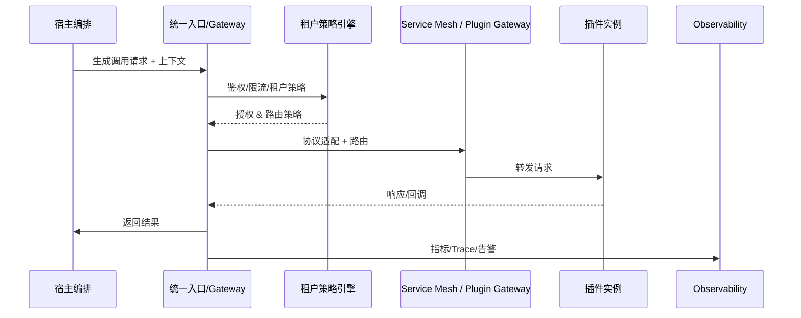

# Positioning & Goals

宿主需要以统一、可治理的方式消费插件能力。本场景梳理“宿主调用插件”的全链路：从调用入口、协议编排、租户策略、可观测与韧性到异步批量任务。目标：

- 统一入口延迟 p95 < 50ms，支持 gRPC/HTTP/MCP 等协议；
- 未授权租户调用 100% 被拦截，限流/地域策略即时生效；
- 自动重试成功率 ≥ 85%、熔断恢复 ≤ 2 分钟、MTTR < 15 分钟；
- 异步/批量任务具备至少一次送达、回调成功率 ≥ 99%。

# Scope & Guardrails

- **In Scope**：宿主调用入口、协议适配、租户策略、限流与隔离、可观测/重试/熔断/降级、异步批量任务编排。
- **Out of Scope**：插件能力注册审批、插件内部实现、宿主公共 API 对外治理、插件主动调用宿主（见 `SCN-INT-PLUGIN-CALL-HOST-001`）。
- **Environment & Flags**：`PX_HOST_PLUGIN_GATEWAY`, `PX_HOST_TENANT_POLICY`, `PX_HOST_CALL_RESILIENCE`, `PX_HOST_ASYNC_TASK`; 依赖 Orchestrator、IAM、Service Mesh、EventBus、Observability Stack。

# Core Capabilities

1. **Unified Invocation Entry**：统一网关/SDK，完成鉴权、限流、协议适配与上下文生成。
2. **Tenant-aware Routing & Isolation**：依据租户策略/地域/配额选择插件实例池，注入租户隔离 Header，并记录租户级指标。
3. **Resilience & Observability**：Chain tracing、指标、日志、自动重试/熔断/降级、告警、快速恢复。
4. **Async & Batch Orchestration**：任务队列、EventBus、回调/状态查询、长任务取消与补偿。

# Participants & Responsibilities

| Scope | Repository | Layer | 责任与交付物 | Owners |
|-------|------------|-------|--------------|--------|
| Invocation Orchestrator | powerx | service | 入口 SDK/Gateway、协议适配、Trace/上下文注入 | Core Platform Squad |
| Tenant Policy Engine | powerx | security | 租户授权、限流、地域/实例路由策略、隔离告警 | IAM & Governance Squad |
| Observability & Resilience | powerx | ops | 重试/熔断/降级、指标、告警、任务/事件编排 | Platform SRE Squad |

# End-to-End Flow

1. **Stage 1 – Unified Entry & Protocol**：宿主解析任务 → 统一入口鉴权、限流 → 根据插件协议做序列化并生成 Trace/租户上下文。
2. **Stage 2 – Tenant Policy & Routing**：策略引擎校验授权、限流、地域策略 → Service Mesh/Plugin Gateway 路由到目标实例。
3. **Stage 3 – Observability & Resilience**：调用过程中采集指标与 Trace，遇到失败执行重试/熔断/降级并告警。
4. **Stage 4 – Async & Batch**：对需要批量/长耗时任务，拆分为消息或事件，插件异步回调，宿主聚合并更新业务状态。

# Key Interactions & Contracts

- **APIs**：`POST /host/plugins/call`, `POST /host/plugins/call/batch`, `GET /host/plugins/tasks/:id`, `POST /host/plugins/callback`.
- **Headers/Context**：`tenant_uuid`, `x-user-id`, `x-plugin-id`, `x-trace-id`, `x-route-policy`, `x-region`.
- **Events**：`host.plugin.call.retry`, `host.plugin.circuit.open`, `host.plugin.batch.completed`.
- **Configs**：`host_plugin_gateway.yaml`, `tenant_route_policy.yaml`, `resilience_policies.yaml`, `async_task_pipeline.yaml`.

# Validation Workflow

1. **入口/协议**：正逆向 gRPC/HTTP 调用、错误协议/参数校验、上下文传递。
2. **租户策略**：授权/未授权、限流、地域路由、实例不可用降级。
3. **韧性**：重试/熔断/降级、告警、熔断恢复、MTTR。
4. **异步批量**：任务拆分、消息投递、回调、状态查询/取消、死信处理。

# Related Links

- `SCN-INT-PLUGIN-CALL-HOST-001`（插件调用宿主）；
- `SCN-INT-PLUGIN-CAPABILITY-001`（能力注册）；
- 子场景：`SCN-INT-HOST-CALL-ENTRY-001`, `SCN-INT-HOST-CALL-TENANT-001`, `SCN-INT-HOST-CALL-RESILIENCE-001`, `SCN-INT-HOST-CALL-ASYNC-001`.

# Acceptance Criteria

1. 统一入口完成鉴权/限流/协议转换，p95 < 50ms，Trace/租户上下文完整。
2. 租户策略即时生效：未授权调用 100% 阻断，限流/地域路由可配置并观测。
3. 调用可观测：Trace/日志/指标齐备，重试/熔断/降级策略可配置且受监控，MTTR < 15m。
4. 异步批量任务具备至少一次送达、回调成功率 ≥ 99%，可查询/取消并支持补偿。

# Telemetry & Ops

- 指标：`host.plugin.entry.latency`, `host.plugin.auth.failure_rate`, `host.plugin.tenant.rate_limit`, `host.plugin.retry.success_rate`, `host.plugin.circuit.count`, `host.plugin.async.backlog`.
- 告警：鉴权失败率 >1%（P1）、跨租访问放行（P0）、熔断持续 >5 分钟（P1）、异步积压 >100（P1）。
- 观测来源：`Host→Plugin Call Hub` Grafana、Trace Explorer、`reports/_state/host-call-plugin.json`。

# Architecture Diagram

# Open Issues & Follow-ups

| 风险/事项 | 影响范围 | 负责人 | ETA |
|-----------|----------|--------|-----|
| `host_plugin_gateway.yaml` 尚未覆盖 MCP/WebSocket 协议 | 新协议接入 | Core Platform Squad | 2025-03-01 |
| 策略缓存缺少版本回滚，易导致租户误阻断 | 租户体验 | IAM Squad | 2025-02-26 |
| 异步任务队列缺少死信重放脚本 | 运维恢复 | SRE Squad | 2025-03-03 |
