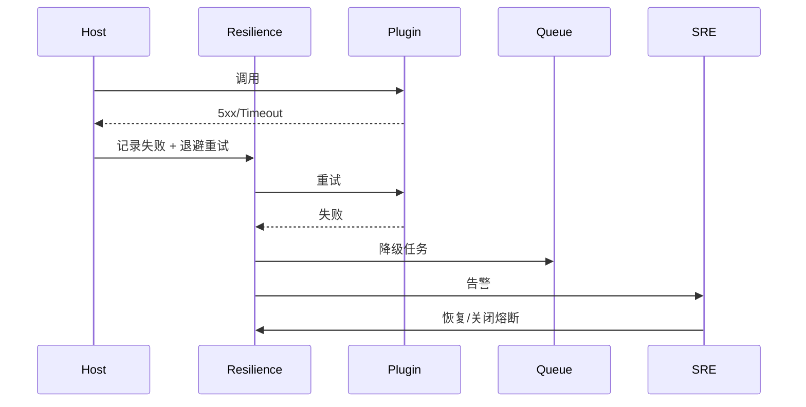

# Executive Summary

> 该子场景建立宿主→插件调用的可观测与韧性能力：全链路 Trace、指标、重试、熔断、降级与 SRE 告警，确保自动重试成功率 ≥85%、熔断恢复 ≤2 分钟、MTTR <15 分钟。

# Scope & Guardrails

- **In Scope**：Trace/Span、日志、指标、重试策略、熔断、降级（缓存/延迟队列）、告警、Runbook、失败事件上报。
- **Out of Scope**：调用入口/租户策略/异步队列（其它子场景覆盖）。
- **Environment & Flags**：`PX_HOST_CALL_RESILIENCE`, `PX_HOST_FAILOVER_QUEUE`, `PX_HOST_CIRCUIT_BREAKER`；依赖 Observability Stack、Alertmanager、Workflow Engine。

# End-to-End Flow

1. 调用被 Trace/Logging 注入 Span/Trace ID。
2. 若返回 5xx/超时，按 `resilience_policies` 重试（退避+最大次数）。
3. 重试失败触发熔断，执行降级（缓存响应、延迟队列、人工任务）。
4. 失败事件写入监控、触发告警；SRE 执行 Runbook 并关闭熔断。

# Key Interactions & Contracts

- 配置：`resilience_policies.yaml`（per capability SLA、重试次数、熔断阈值、降级策略）。
- API：`POST /host/plugins/failures`, `POST /host/plugins/failover`, `POST /host/plugins/recover`.
- 事件：`host.plugin.call.retry`, `host.plugin.circuit.open`, `host.plugin.degrade.executed`.

# Usecase Links

- `UC-INT-HOST-CALL-RESILIENCE-001`.

# Acceptance Criteria

1. Trace/指标覆盖 100%，失败可定位到插件实例。
2. 自动重试成功率 ≥85%，熔断恢复时间 ≤2 分钟。
3. 降级/补偿任务记录审计，MTTR <15 分钟。

# Telemetry & Ops

- 指标：`host.plugin.retry.count`, `host.plugin.retry.success_rate`, `host.plugin.circuit.state`, `host.plugin.degrade.count`, `host.plugin.mttr`.
- 告警：失败率 >5%、熔断持续 >5m、降级任务堆积、审计写入失败。

# Open Issues & Follow-ups

| 风险/事项 | 影响 | 负责人 | ETA |
|-----------|------|--------|-----|
| Failover 队列缺少租户维度 | 高流量租户影响其他租户 | SRE Squad | 2025-02-28 |
| Runbook 尚未覆盖 MCP 插件 | 新协议恢复 | Platform Ops Squad | 2025-03-03 |
