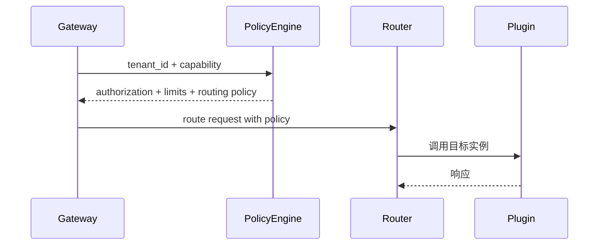

# Executive Summary

> 宿主必须根据租户与用户策略准确地挑选插件实例、控制配额并隔离数据。本子场景确保租户授权、限流、地域/环境路由即时生效，未授权调用 100% 阻断，限流触发可追踪，降级方案可控。

# Scope & Guardrails

- **In Scope**：租户授权校验、限流配额、地域/环境策略、实例选择、租户隔离 Header/Token 注入、租户级指标与审计。
- **Out of Scope**：入口鉴权（ENTRY 子场景）、韧性策略（RESILIENCE 子场景）、异步队列（ASYNC 子场景）。
- **Environment & Flags**：`PX_HOST_TENANT_POLICY`, `PX_HOST_TENANT_ROUTER`, `PX_HOST_LIMIT_GUARD`; 依赖 IAM、Policy Engine、Service Mesh/Plugin Gateway。

# End-to-End Flow

1. 调用上下文携带 `tenant_id`, `user_roles`, `business_tag`。
2. 策略引擎校验租户授权与限流、地域策略，返回实例池与配额。
3. 路由层根据策略选择 Plugin 实例（同城/跨区/生产/测试），注入租户隔离 Header。
4. 调用完成后写入租户级指标、限流计数与审计。

# Key Interactions & Contracts

- `POST /tenant-policy/authorize` — 输入：`tenant_id`, `capability`, `region`, `context`; 输出：`allowed`, `limits`, `route_selector`.
- `POST /tenant-policy/limits/report` — 记录使用量/限流命中。
- Configs：`tenant_route_policy.yaml`, `tenant_limit_matrix.yaml`.
- Header：`x-tenant-token`, `x-route-policy`, `x-data-domain`.
- Audit：`host.plugin.tenant.blocked`, `host.plugin.tenant.limited`.

# Usecase Links

- `UC-INT-HOST-CALL-TENANT-001` — 授权校验、限流、地域路由、降级。

# Acceptance Criteria

1. 未授权租户调用拦截率 100%，错误返回 403 并写审计。
2. 限流策略配置后即时生效，日志包含租户/策略 ID。
3. 地域/环境路由准确（如测试租户→测试实例，跨区容灾可控）。

# Telemetry & Ops

- 指标：`host.plugin.tenant.auth_fail`, `host.plugin.tenant.rate_limit`, `host.plugin.tenant.degrade`, `host.plugin.tenant.route_switch`.
- 告警：授权缓存失效、限流配置无法下发、路由失败/降级率 >5%。
- Dashboard：`Tenant Policy & Routing`.

# Open Issues & Follow-ups

| 风险/事项 | 影响 | 负责人 | ETA |
|-----------|------|--------|-----|
| 策略缓存缺少版本回滚 | 误判导致租户阻断 | IAM Squad | 2025-02-26 |
| 路由层未支持跨云实例标签 | 多 Region 支持 | Platform Routing Squad | 2025-03-05 |
