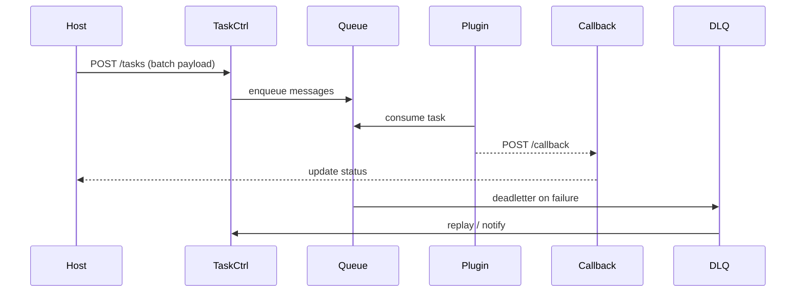

doc_id: UC-INT-HOST-CALL-ASYNC-001
scn_id: SCN-INT-HOST-CALL-PLUGIN-001
title: 宿主异步任务与批量调用编排（service/integration）
status: Draft
version: v0.1.0
repo_key: powerx
scope: powerx
layer: service
domain: integration
scenario_title: "宿主调用插件"
owners:
  - name: Michael Hu
    role: Plugin Tech Lead
    contact: tech@artisan-cloud.com
contributors:
  - name: Grace Lin
    role: Security & Compliance Lead
    contact: compliance@artisan-cloud.com
  - name: Leo Zhang
    role: Platform Event Lead
    contact: event@artisan-cloud.com
linked_requirements:
  - id: SCN-INT-HOST-CALL-ASYNC-001
    description: 子场景《异步任务与批量调用编排》
code_refs:
  - repo: powerx
    path: services/host/async/task_controller.ts
    description: 批量任务提交/拆分、状态查询、取消
  - repo: powerx
    path: services/host/async/callback_handler.ts
    description: 插件回调签名校验、状态聚合、补偿入口
  - repo: powerx
    path: services/host/async/deadletter_service.ts
    description: 死信队列、监控、重放
  - repo: powerx
    path: scripts/ops/host-async-replay.mjs
    description: 死信重放/补偿脚本
feature_flags:
  - PX_HOST_ASYNC_TASK
  - PX_HOST_EVENT_PIPELINE
  - PX_HOST_TASK_CANCEL
optional: false
last_reviewed_at: 2025-02-20

---

# Usecase Overview

- **业务目标**：支撑宿主对插件的大批量或长耗时调用，提供任务拆分、队列/EventBus 投递、回调聚合、状态查询与取消、死信补偿，确保至少一次送达、回调成功率 ≥99%、死信率 <0.5%。
- **成功度量**：
  - `host.plugin.async.throughput ≥ 1000 tasks/min`（峰值）
  - `host.plugin.callback.success_rate ≥ 99%`
  - `host.plugin.deadletter.rate < 0.5%`
  - 死信任务 5 分钟内可自动或手动重放
- **场景关联**：服务于 `SCN-INT-HOST-CALL-PLUGIN-001` Stage 4（Async & Batch），与 ENTRY/TENANT/RESILIENCE 子场景共享上下文与监控策略。

# Context & Assumptions

- **前置条件**
  - Feature Flags `PX_HOST_ASYNC_TASK`, `PX_HOST_EVENT_PIPELINE`, `PX_HOST_TASK_CANCEL` 已启用。
  - Task Queue/EventBus（如 Kafka、SQS、RabbitMQ）与 Callback Handler 在同一租户网络可达。
  - 插件已注册回调端点并配置签名/幂等策略。
  - Observability Stack 支持队列深度、回调成功率、死信监控。
- **输入/输出**
  - 输入：批量任务、租户/Trace 上下文、回调 URL、超时/取消策略。
  - 输出：队列消息、回调确认、状态查询响应、死信记录、补偿结果。
- **边界**
  - 不覆盖同步调用；不负责插件内部的任务并行/事务；插件主动推送宿主的逻辑在 `SCN-INT-PLUGIN-CALL-HOST-001`。

# Solution Blueprint

## 体系分解

| 层 | 主要组件/模块 | 责任 | 代码入口 |
|----|---------------|------|---------|
| Task Controller | `services/host/async/task_controller.ts` | 接收批量任务、拆分、写入队列、返回 batch_id、提供状态查询/取消 | powerx |
| Event/Queue Pipeline | `services/host/async/pipeline_worker.ts` | 处理队列投递、幂等、重试、优先级 | powerx |
| Callback Handler | `services/host/async/callback_handler.ts` | 校验回调签名、聚合结果、更新业务状态、触发补偿 | powerx |
| Deadletter Service | `services/host/async/deadletter_service.ts` | 死信监控、查询、重放、告警 | powerx |

## 流程与时序

1. **Submit & Split**：宿主调用 `POST /host/plugins/tasks` 提交批次任务，Task Controller 拆分成消息并写入队列，返回 `batch_id`。
2. **Deliver & Execute**：插件消费消息、处理任务，完成后回调宿主或写入结果存储。
3. **Callback & Aggregation**：Callback Handler 校验签名、幂等，更新任务状态、聚合结果，若全部完成则通知业务流程。
4. **Deadletter & Replay**：消息/回调失败进入死信队列，触发告警，运维可通过 `host-async-replay.mjs` 重放或人工补偿。

# Contracts & Interfaces

- `POST /host/plugins/tasks` — Body：`batch_id?`, `tasks[]`, `tenant_uuid`, `callback_url`, `timeout`, `cancel_token`.
- `GET /host/plugins/tasks/:id` — 返回进度、成功/失败列表、回调状态。
- `POST /host/plugins/tasks/:id/cancel` — 取消或暂停批次。
- `POST /host/plugins/callback` — 插件回调（Header: `x-signature`, `x-batch-id`, `x-task-id`）。
- `GET /host/plugins/tasks/deadletters`、`POST /host/plugins/tasks/replay`.
- Configs：`async_task_pipeline.yaml`, `callback_endpoints.yaml`, `deadletter_policies.yaml`.

# Implementation Checklist

| 项目 | 描述 | 完成状态 | 负责人 |
|------|------|----------|--------|
| Task Controller API | 批量提交/拆分、状态存储、查询/取消接口 | [ ] | Orchestration Squad |
| Pipeline Worker | 队列消费、幂等、优先级调度、批量控制 | [ ] | Platform Event Squad |
| Callback Handler | 签名校验、幂等、聚合、补偿触发 | [ ] | Platform Event Squad |
| Deadletter Service | 死信持久化、Dashboard、重放、告警 | [ ] | SRE Squad |
| Tooling | `host-async-replay.mjs`, 压测脚本、Runbook | [ ] | SRE Squad |

# Testing Strategy

- **单元测试**：任务拆分、幂等键、状态机、回调签名、死信逻辑。
- **集成测试**：
  - 正向批量任务（50/500/5000 条），观测吞吐与状态查询；
  - 回调签名错误/延迟，验证重试与死信；
  - 取消/超时场景，确保任务停止并回滚。
- **端到端**：
  - 批量提交→插件异步处理→回调→聚合→业务完成；
  - 死信→告警→手动重放→状态恢复；
  - 多租户混合任务，确认隔离。
- **非功能**：队列积压大于阈值时自动扩容、回调风暴下的稳定性。

# Observability & Ops

- **指标**：`host.plugin.async.throughput`, `host.plugin.async.backlog`, `host.plugin.callback.success_rate`, `host.plugin.deadletter.count`, `host.plugin.task.cancel_rate`.
- **日志**：Task/Callback/DLQ 日志需打 `batch_id`, `task_id`, `tenant_uuid`, `trace_id`, `status`.
- **告警**：积压深度 > 阈值（P1）、回调成功率 <99%（P1）、死信 >100（P1）、取消失败（P2）。
- **Dashboards**：`Host↔Plugin Async Hub`, DLQ 面板、`reports/_state/host-call-plugin.json`.

# Rollback & Failure Handling

- 提供 `px host plugin tasks replay --batch <id>` 复原失败批次。
- 死信可按租户/批次筛选重放；重放前需通过 IAM 审批。
- 回调端点不可用时自动退化为宿主轮询模式，并警告插件团队。
- 批量任务取消失败时，触发人工介入并在审计中记录。

# Follow-ups & Risks

| 风险/事项 | 影响 | 缓解方案 | 负责人 | ETA |
|-----------|------|----------|--------|-----|
| 任务取消 API 尚未接入工作流权限 | 安全与审计 | Orchestration Squad | 2025-02-27 |
| 死信重放脚本未区分多租户 | 运维效率 | SRE Squad | 2025-03-03 |
| 高吞吐任务缺少优先级队列 | 易造成重要任务延迟 | Platform Event Squad | 2025-03-05 |

# References & Links

- 场景：`docs/scenarios/integration/SCN-INT-HOST-CALL-PLUGIN-001.md`
- 子场景：`docs/scenarios/integration/SCN-INT-HOST-CALL-ASYNC-001.md`
- 配置：`async_task_pipeline.yaml`, `callback_endpoints.yaml`, `deadletter_policies.yaml`
- 脚本：`scripts/ops/host-async-replay.mjs`
- 发布指引：`npm run publish:usecases -- --scn-id SCN-INT-HOST-CALL-PLUGIN-001 --validate-only`
