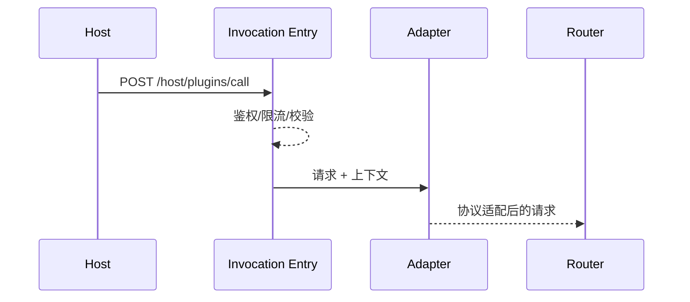

doc_id: UC-INT-HOST-CALL-ENTRY-001
scn_id: SCN-INT-HOST-CALL-PLUGIN-001
title: 宿主调用入口与协议编排（service/integration）
status: Draft
version: v0.1.0
repo_key: powerx
scope: powerx
layer: service
domain: integration
scenario_title: "宿主调用插件"
owners:
  - name: Michael Hu
    role: Plugin Tech Lead
    contact: tech@artisan-cloud.com
contributors:
  - name: Grace Lin
    role: Security & Compliance Lead
    contact: compliance@artisan-cloud.com
  - name: Irene Zhao
    role: API Gateway PM
    contact: gateway@artisan-cloud.com
linked_requirements:
  - id: SCN-INT-HOST-CALL-ENTRY-001
    description: 子场景《调用入口统一与协议编排》
code_refs:
  - repo: powerx
    path: services/host/gateway/invocation_entry.ts
    description: 宿主调用统一入口、鉴权、限流、请求校验
  - repo: powerx
    path: services/host/gateway/protocol_adapter.ts
    description: HTTP/gRPC/MCP 协议转换、Header/上下文注入
  - repo: powerx
    path: services/host/gateway/audit_logger.ts
    description: 调用上下文审计、Trace/Span 记录、错误分析
feature_flags:
  - PX_HOST_PLUGIN_GATEWAY
  - PX_HOST_PROTOCOL_ADAPTER
  - PX_HOST_TRACE_BRIDGE
optional: false
last_reviewed_at: 2025-02-20

---

# Usecase Overview

- **业务目标**：提供统一的宿主→插件调用入口，完成鉴权、限流、参数校验与协议转换，生成 Trace/租户上下文，保证入口延迟 p95 < 50ms、鉴权成功率 ≥99%、协议转换幂等且可观测。
- **成功度量**：`host.plugin.entry.latency_p95 < 50ms`、`host.plugin.entry.auth_failure_rate < 1%`、协议转换失败率 <0.5%、Trace 覆盖率 100%。
- **场景关联**：作为 `SCN-INT-HOST-CALL-PLUGIN-001` Stage 1 的核心能力，并为 TENANT/RESILIENCE/ASYNC 提供上下文与 Trace。

# Context & Assumptions

- **前置条件**
  - Feature Flags `PX_HOST_PLUGIN_GATEWAY`, `PX_HOST_PROTOCOL_ADAPTER`, `PX_HOST_TRACE_BRIDGE` 已开启。
  - 宿主拥有统一 API Gateway / SDK，能访问 IAM、Schema Registry、Audit Ledger。
  - 插件在能力注册场景中声明协议、入参 Schema、认证方式。
- Trace/Logging 平台可接收 `trace_id`, `span_id`, `tenant_uuid`.
- **输入/输出**
  - 输入：宿主工作流/Agent 生成的调用上下文（租户、用户、Trace、插件能力）、请求 payload。
  - 输出：经鉴权/限流/协议转换后的请求（交给 Router）、审计日志、错误响应。
- **边界**
  - 租户策略、韧性、异步编排另有子场景负责；此处不处理插件内部逻辑。

# Solution Blueprint

## 体系分解

| 层 | 主要组件/模块 | 责任 | 代码入口 |
|----|---------------|------|---------|
| Invocation Entry | `services/host/gateway/invocation_entry.ts` | 接收宿主请求、鉴权、限流、参数校验、上下文生成 | powerx |
| Protocol Adapter | `services/host/gateway/protocol_adapter.ts` | 将请求转换为插件声明的协议（HTTP/gRPC/MCP）、Header/Trace 注入 | powerx |
| Audit & Trace | `services/host/gateway/audit_logger.ts` | 写入审计日志、Trace/Span、错误事件 | powerx |

## 流程与时序

1. **Receive & Validate**：宿主编排服务调用 `POST /host/plugins/call`，入口校验租户/能力/参数 Schema。
2. **Auth & Rate Limit**：入口调用 IAM/Gateway 执行鉴权与限流，失败即返回 401/403/429。
3. **Protocol Adapt & Trace**：根据插件协议进行序列化、Header 映射、Trace/上下文注入。
4. **Forward**：结果交给 Service Mesh/Plugin Gateway 继续路由；入口记录审计与指标。

# Contracts & Interfaces

- `POST /host/plugins/call` — Body: `plugin_id`, `capability`, `protocol`, `payload`, `tenant_uuid`, `trace_id`, `user_ctx`.
- `POST /host/plugins/call/validate` — 可选 Schema 预检。
- Header/Context：`tenant_uuid`, `x-user-id`, `x-plugin-id`, `x-trace-id`, `x-request-id`.
- Configs：`host_plugin_gateway.yaml`, `protocol_mapping.json`, `schema_registry`.
- Audit Events：`host.plugin.entry.auth_failure`, `host.plugin.entry.protocol_error`.

# Implementation Checklist

| 项目 | 描述 | 完成状态 | 负责人 |
|------|------|----------|--------|
| Entry Gateway | 完成鉴权/限流/参数校验、错误文案、审计 | [ ] | Orchestration Squad |
| Protocol Adapter | 支持 HTTP↔gRPC/MCP、头部映射、幂等校验 | [ ] | Orchestration Squad |
| Schema Registry | 能够校验能力入参 Schema，并提供缓存 | [ ] | Platform Infra Squad |
| Audit & Trace | Trace/Span 注入、日志格式、指标上报 | [ ] | Observability Squad |
| Tooling | 压测脚本、Mock 插件协议转换工具 | [ ] | QA/DevX |

# Testing Strategy

- **单元测试**：参数校验、鉴权逻辑、协议转换函数、上下文注入。
- **集成测试**：
  - 正向 gRPC/HTTP 调用（成功/失败）；
  - 逆向：缺少上下文字段、未授权、限流、错误协议；
  - Schema 校验缓存生效测试。
- **端到端**：宿主工作流 → 调用入口 → Service Mesh → 插件，Trace 完整；错误协议/参数阻断。
- **非功能**：入口并发压测（>5k QPS）、限流策略、日志/Trace 采样性能。

# Observability & Ops

- 指标：`host.plugin.entry.latency_ms`, `host.plugin.entry.qps`, `host.plugin.entry.auth_failures`, `host.plugin.entry.protocol_errors`.
- 日志：需包含 `tenant_uuid`, `plugin_id`, `capability`, `protocol`, `trace_id`, `status`.
- 告警：鉴权失败率 >1%（P1）、协议错误 >0.5%（P2）、入口延迟 p95 >80ms（P1）、审计写入失败（P0）。
- Dashboard：`Host→Plugin Entry`, Trace Explorer。

# Rollback & Failure Handling

- 入口配置错误时，可回滚 `host_plugin_gateway.yaml` 并重启无状态网关。
- 协议转换异常：切换默认协议或启用兼容模式；记录审计。
- 限流策略误触：回滚限流配置并重放被拒请求（若需要）。

# Follow-ups & Risks

| 风险/事项 | 影响 | 负责人 | ETA |
|-----------|------|--------|-----|
| 未支持 MCP/WebSocket 协议 | 新协议插件接入受阻 | Core Platform Squad | 2025-03-01 |
| Schema 校验缓存缺少版本回滚 | 可能阻断合法请求 | Orchestration Squad | 2025-02-28 |
| Trace 注入缺少多租户标签 | 可观测性不足 | Observability Squad | 2025-02-25 |

# References & Links

- 场景：`docs/scenarios/integration/SCN-INT-HOST-CALL-PLUGIN-001.md`
- 子场景：`docs/scenarios/integration/SCN-INT-HOST-CALL-ENTRY-001.md`
- 配置：`host_plugin_gateway.yaml`, `protocol_mapping.json`
- 脚本：`scripts/qa/mock_host_plugin_entry.mjs`
- 发布指引：`npm run publish:usecases -- --scn-id SCN-INT-HOST-CALL-PLUGIN-001 --validate-only`
