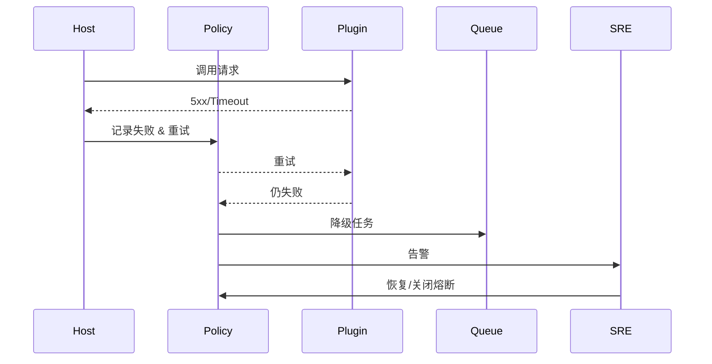

doc_id: UC-INT-HOST-CALL-RESILIENCE-001
scn_id: SCN-INT-HOST-CALL-PLUGIN-001
title: 宿主调用可观测与韧性治理（ops/integration）
status: Draft
version: v0.1.0
repo_key: powerx
scope: powerx
layer: ops
domain: integration
scenario_title: "宿主调用插件"
owners:
  - name: Michael Hu
    role: Plugin Tech Lead
    contact: tech@artisan-cloud.com
contributors:
  - name: Grace Lin
    role: Security & Compliance Lead
    contact: compliance@artisan-cloud.com
  - name: Leo Zhang
    role: Platform SRE Lead
    contact: sre@artisan-cloud.com
linked_requirements:
  - id: SCN-INT-HOST-CALL-RESILIENCE-001
    description: 子场景《调用链路可观测与重试熔断》
code_refs:
  - repo: powerx
    path: services/host/resilience/policy_manager.ts
    description: SLA/重试/熔断/降级策略引擎
  - repo: powerx
    path: services/host/resilience/telemetry_service.ts
    description: Trace/指标/日志采集、失败事件上报、告警
  - repo: powerx
    path: services/host/resilience/failover_queue.ts
    description: 降级任务、延迟队列、人工补偿编排
  - repo: powerx
    path: scripts/ops/host-call-resilience.mjs
    description: 故障注入、熔断恢复与补偿工具
feature_flags:
  - PX_HOST_CALL_RESILIENCE
  - PX_HOST_FAILOVER_QUEUE
  - PX_HOST_CIRCUIT_BREAKER
optional: false
last_reviewed_at: 2025-02-20

---

# Usecase Overview

- **业务目标**：对宿主→插件调用注入 Trace/指标/日志，自动执行重试、熔断、降级与补偿，告警并指导 SRE 恢复，确保自动重试成功率 ≥85%、熔断恢复 ≤2 分钟、MTTR <15 分钟。
- **成功度量**：`host.plugin.retry.success_rate ≥ 85%`、`host.plugin.circuit.recover_time ≤ 2m`、`host.plugin.mttr < 15m`、降级任务 100% 审计。
- **场景关联**：支撑 `SCN-INT-HOST-CALL-PLUGIN-001` Stage 3，可与 ENTRY 提供的上下文、TENANT 的策略以及 ASYNC 的任务管道联动。

# Context & Assumptions

- **前置条件**
  - Feature Flags `PX_HOST_CALL_RESILIENCE`, `PX_HOST_FAILOVER_QUEUE`, `PX_HOST_CIRCUIT_BREAKER` 已启用。
  - Observability Stack（Tracing + Metrics + Logging）、Alertmanager、Task Queue 可用。
  - 插件能力在注册时声明 SLA，策略引擎可读取。
  - Runbook/Scripts（`host-call-resilience.mjs`）可执行恢复与重放。
- **输入/输出**
  - 输入：调用请求及 SLA、策略配置；失败事件与状态码。
  - 输出：Trace/Span、指标、重试/熔断/降级状态、Failover 任务、告警、审计记录。
- **边界**
  - 不处理入口/租户策略/异步任务；插件内部错误处理由插件团队负责。

# Solution Blueprint

## 体系分解

| 层 | 主要组件/模块 | 责任 | 代码入口 |
|----|---------------|------|---------|
| Resilience Policy Manager | `services/host/resilience/policy_manager.ts` | 解析策略、执行超时/重试/熔断/降级 | powerx |
| Telemetry Service | `services/host/resilience/telemetry_service.ts` | 记录 Trace/指标/日志，触发告警 | powerx |
| Failover Queue | `services/host/resilience/failover_queue.ts` | 降级任务、延迟队列、补偿、人工接管 | powerx |

## 流程与时序

1. **Trace & Metrics**：宿主入口为调用生成 Trace/Span，并记录初始指标。
2. **Retry & Circuit**：失败/超时后，Policy Manager 根据策略执行退避重试；仍失败则触发熔断并调用降级方案。
3. **Degrade & Queue**：降级结果（缓存、延迟队列、人工补偿）写入 `failover_queue`，附带审计信息。
4. **Alert & Recovery**：Telemetry Service 上报失败事件与告警，SRE 根据 Runbook 处理并关闭熔断。

# Contracts & Interfaces

- Config：`resilience_policies.yaml`（SLA、timeout、retry、circuit、degrade）。
- API：`POST /host/plugins/failures`, `POST /host/plugins/failover`, `POST /host/plugins/recover`.
- Events：`host.plugin.call.retry`, `host.plugin.circuit.open`, `host.plugin.degrade.executed`.

# Implementation Checklist

| 项目 | 描述 | 完成状态 | 负责人 |
|------|------|----------|--------|
| Policy Manager | 支持 per capability 策略、租户 override、热更新 | [ ] | Orchestration Squad |
| Telemetry/Alerting | Trace/指标/日志、告警、MTTR 计算 | [ ] | Observability Squad |
| Failover Queue | 降级/补偿队列、人工任务、审计 | [ ] | SRE Squad |
| Tooling & Runbooks | 故障注入、熔断恢复、补偿脚本 | [ ] | SRE Squad |

# Testing Strategy

- **单元测试**：退避算法、熔断状态机、降级策略、队列操作。
- **集成测试**：
  - 注入 5xx/Timeout，观察重试/熔断/降级；
  - Failover 任务自动处理、人工补偿；
  - Trace/指标/告警是否完整。
- **端到端**：
  - 正向：一次失败后重试成功；
  - 逆向：连续失败触发熔断，2 分钟后恢复；
  - Failover 队列→补偿→审计。
- **非功能**：策略热更新、批量失败下的稳定性。

# Observability & Ops

- 指标：`host.plugin.retry.count`, `host.plugin.retry.success_rate`, `host.plugin.circuit.state`, `host.plugin.degrade.count`, `host.plugin.failover.queue_depth`, `host.plugin.mttr`.
- 日志：包含 `tenant_id`, `plugin_id`, `capability`, `trace_id`, `policy_id`, `decision`.
- 告警：失败率 >5%、熔断持续 >5m、降级任务堆积、审计未记录。
- Dashboard：`Host→Plugin Resilience`、Runbook 链接。

# Rollback & Failure Handling

- 提供 CLI/接口关闭或强制打开熔断（`px host plugin circuit --close <capability>`）。
- Failover 任务可手动重放/删除，全部操作需审计。
- 策略配置错误时回滚 `resilience_policies.yaml` 并重新下发；SDK/入口支持热更新。
- 重大故障可切换到默认降级响应，并广播通知租户。

# Follow-ups & Risks

| 风险/事项 | 影响 | 负责人 | ETA |
|-----------|------|--------|-----|
| Failover 队列缺少租户维度 | 高流量租户影响他人 | SRE Squad | 2025-02-28 |
| Runbook 不覆盖 MCP 插件 | 新协议恢复风险 | Platform Ops Squad | 2025-03-03 |
| 自动重试缺少租户优先级 | 优先级控制不足 | Orchestration Squad | 2025-03-05 |

# References & Links

- 场景：`docs/scenarios/integration/SCN-INT-HOST-CALL-PLUGIN-001.md`
- 子场景：`docs/scenarios/integration/SCN-INT-HOST-CALL-RESILIENCE-001.md`
- 配置：`resilience_policies.yaml`, `failover_queue.yaml`
- 脚本：`scripts/ops/host-call-resilience.mjs`
- 发布指引：`npm run publish:usecases -- --scn-id SCN-INT-HOST-CALL-PLUGIN-001 --validate-only`
