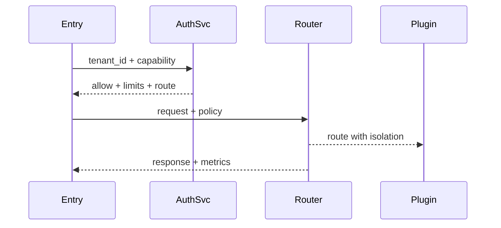

doc_id: UC-INT-HOST-CALL-TENANT-001
scn_id: SCN-INT-HOST-CALL-PLUGIN-001
title: 多租户策略路由与隔离（security/integration）
status: Draft
version: v0.1.0
repo_key: powerx
scope: powerx
layer: security
domain: integration
scenario_title: "宿主调用插件"
owners:
  - name: Grace Lin
    role: Security & Compliance Lead
    contact: compliance@artisan-cloud.com
contributors:
  - name: Michael Hu
    role: Plugin Tech Lead
    contact: tech@artisan-cloud.com
  - name: Irene Zhao
    role: IAM Policy PM
    contact: iam@artisan-cloud.com
linked_requirements:
  - id: SCN-INT-HOST-CALL-TENANT-001
    description: 子场景《多租户策略路由与隔离》
code_refs:
  - repo: powerx
    path: services/host/tenant_policy/authorization_service.ts
    description: 租户授权校验、策略缓存、限流/地域配置
  - repo: powerx
    path: services/host/tenant_policy/router_controller.ts
    description: 基于策略的实例选择、隔离 Header 注入、降级策略
  - repo: powerx
    path: services/host/tenant_policy/audit_logger.ts
    description: 租户调用审计、限流命中、阻断事件
feature_flags:
  - PX_HOST_TENANT_POLICY
  - PX_HOST_TENANT_ROUTER
  - PX_HOST_LIMIT_GUARD
optional: false
last_reviewed_at: 2025-02-20

---

# Usecase Overview

- **业务目标**：确保宿主调用插件时严格执行租户授权、限流、地域/环境策略，未授权调用 100% 阻断、限流策略即时生效、路由准确，提供降级与审计能力。
- **成功度量**：`host.plugin.tenant.auth_block_rate = 100%`（无漏放）、限流延迟 < 1s、租户路由准确率 100%、降级事件可追踪。
- **场景关联**：承接 `SCN-INT-HOST-CALL-PLUGIN-001` Stage 2，与 ENTRY/RESILIENCE/ASYNC 共用上下文与监控。

# Context & Assumptions

- **前置条件**
  - Feature Flags `PX_HOST_TENANT_POLICY`, `PX_HOST_TENANT_ROUTER`, `PX_HOST_LIMIT_GUARD` 已启用。
  - IAM/Policy Engine 存在最新的租户授权、限流、地域策略；服务 Mesh/插件网关可按策略路由。
  - 投产环境区分测试/生产实例池；审计系统可写入租户级日志。
  - Entry 子场景提供完整上下文（`tenant_id`, `plugin_id`, `capability`）。
- **输入/输出**
  - 输入：调用上下文（租户、用户、标签）、策略配置（授权、限流、地域、配额）、实例注册信息。
  - 输出：授权结果、限流/拒绝响应、路由指令、隔离 Header/Token、租户级指标与审计记录。
- **边界**
  - 不负责入口鉴权/协议转换（ENTRY 子场景）。
  - 不处理韧性策略（RESILIENCE 子场景）或异步任务（ASYNC 子场景）。
  - 插件内部租户隔离由插件负责，但宿主需注入必要 Header。

# Solution Blueprint

## 体系分解

| 层 | 模块 | 责任 | 代码入口 |
|----|------|------|---------|
| Authorization Service | 校验租户授权、限流、地域策略、缓存/回滚 | `services/host/tenant_policy/authorization_service.ts` |
| Routing Controller | 根据策略选择实例池、注入隔离 Header、降级处理 | `services/host/tenant_policy/router_controller.ts` |
| Audit & Metrics | 记录授权/限流结果、租户指标、告警 | `services/host/tenant_policy/audit_logger.ts` |

## 流程与时序

1. **Policy Lookup**：Entry 传入 `tenant_id + capability`，授权服务检查策略（缓存→权威源），返回 `allowed`, `limits`, `route`.
2. **Rate Limit & Isolation**：根据租户限流/配额执行限流；注入 `x-tenant-token`, `x-route-policy`, `x-region`.
3. **Routing**：Router 将请求发送到策略匹配的实例池（地域/环境/租户隔离），若目标不可用触发降级（备用实例或 mock）。
4. **Audit**：所有授权/限流/路由决策写入审计与指标。

# Contracts & Interfaces

- `POST /tenant-policy/authorize` — Body：`tenant_id`, `plugin_id`, `capability`, `region`, `context`.
- `POST /tenant-policy/limits/report` — 汇报限流命中/使用量。
- `POST /tenant-policy/route/override` — 手动切换实例池（紧急）。
- Configs：`tenant_route_policy.yaml`, `tenant_limit_matrix.yaml`, `tenant_region_mapping.yaml`.
- Audit events：`host.plugin.tenant.blocked`, `host.plugin.tenant.rate_limit`, `host.plugin.tenant.route_switch`.

# Implementation Checklist

| 项目 | 描述 | 完成状态 | 负责人 |
|------|------|----------|--------|
| 授权服务 | 缓存+权威源回退、策略版本管理、限流配置推送 | [ ] | IAM Squad |
| 路由控制器 | 实例池选择、隔离 Header 注入、降级/备用策略 | [ ] | Orchestration Squad |
| Audit/Telemetry | 租户级指标、日志、告警、可视化 | [ ] | Observability Squad |
| Config Tooling | `tenant_route_policy.yaml` 编辑/校验/回滚工具 | [ ] | DevEx Squad |

# Testing Strategy

- **单元测试**：授权逻辑、限流阈值、路由选择、降级分支。
- **集成测试**：
  - 授权通过/拒绝；
  - 限流触发、配额重置；
  - 路由策略（地域/测试环境）；
  - 策略缓存回退至权威源。
- **端到端**：
  - 正向：授权租户→成功调用；
  - 逆向：未授权→403；
  - 限流→429；
  - 目标实例故障→备用实例/降级。
- **非功能**：策略热更新、缓存回滚性能。

# Observability & Ops

- 指标：`host.plugin.tenant.auth_fail`, `host.plugin.tenant.rate_limit_hits`, `host.plugin.tenant.degrade_count`, `host.plugin.tenant.route_switch`.
- 告警：授权失败率异常、限流策略无法下发、路由失败、降级率 >5%。
- Dashboard：`Tenant Policy & Routing`。

# Rollback & Failure Handling

- 策略配置错误：回滚到上一个版本，清空缓存并重新加载。
- 授权服务不可用：入口回退到“只读缓存”模式并发出告警，限定时长。
- 目标实例不可用：触发降级/备用实例、记录审计并通知插件团队。

# Follow-ups & Risks

| 风险/事项 | 影响 | 负责人 | ETA |
|-----------|------|--------|-----|
| 策略缓存缺少版本回滚 | 租户误阻断 | IAM Squad | 2025-02-26 |
| 路由层未支持跨云标签 | 多 Region 拓展受限 | Platform Routing Squad | 2025-03-05 |
| 降级缺少租户级审计 ID | 难以追踪 | Observability Squad | 2025-02-25 |

# References & Links

- 场景：`docs/scenarios/integration/SCN-INT-HOST-CALL-PLUGIN-001.md`
- 子场景：`docs/scenarios/integration/SCN-INT-HOST-CALL-TENANT-001.md`
- 配置：`tenant_route_policy.yaml`, `tenant_limit_matrix.yaml`
- 脚本：`scripts/ops/tenant-policy-sync.mjs`
- 发布指引：`npm run publish:usecases -- --scn-id SCN-INT-HOST-CALL-PLUGIN-001 --validate-only`
